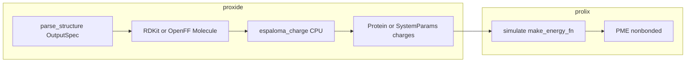

# Explicit solvent gaps, Espaloma partial charges, and proxide/prolix boundaries

**Status:** Approved for execution (see Oracle verdict below).  
**As-built snapshot:** [`docs/source/explicit_solvent/current_implementation.md`](../../../docs/source/explicit_solvent/current_implementation.md)  
**Related:** [`explicit_solvent_phases_3_4_6_8_9.md`](explicit_solvent_phases_3_4_6_8_9.md) (historical recon in §2 superseded; see banner there)

---

## 1. Purpose

Close documented **physics and documentation gaps** for explicit/implicit solvent, prioritize **Espaloma-based partial charges** (MVP via upstream [espaloma-charge](https://github.com/choderalab/espaloma-charge)), **defer RESPA**, and keep a clean split: **proxide** owns structure → parameterization → numeric arrays; **prolix** owns JAX MD and consumes `charges` without ML frameworks in the hot path.

---

## 2. Ground truth (recon)

| Topic | Fact | Evidence |
|-------|------|----------|
| RF / DSF | Implemented, opt-in | [`src/prolix/physics/electrostatic_methods.py`](../../../src/prolix/physics/electrostatic_methods.py); [`docs/source/explicit_solvent/current_implementation.md`](../../../docs/source/explicit_solvent/current_implementation.md) |
| Implicit GB + NL | Dense `(N,N)` Born/energy masks gathered onto `(N,K)` NL slots | [`make_energy_fn` / `compute_electrostatics`](../../../src/prolix/physics/system.py); [`compute_gb_energy_neighbor_list`](../../../src/prolix/physics/generalized_born.py) |
| Default explicit path | PME + NL/dense | `make_energy_fn` in [`system.py`](../../../src/prolix/physics/system.py) |
| Proxide location | Separate package / repo | [`pyproject.toml`](../../../pyproject.toml) dependency; not vendored under `prolix/` |
| Throughput benchmark | `prolix_vs_openmm_speed.py` | [`scripts/benchmarks/prolix_vs_openmm_speed.py`](../../../scripts/benchmarks/prolix_vs_openmm_speed.py) |

---

## 3. Strategic priorities

1. **Espaloma MVP:** Call `espaloma_charge.charge(rdkit_mol)` or OpenFF `assign_partial_charges('espaloma-am1bcc', toolkit_registry=EspalomaChargeToolkitWrapper())` inside **proxide** (optional extra). Cache charges on `Molecule` / parameter pipeline; **no JAX / jit** inside inference.
2. **Defer RESPA** until charges + implicit GB NL are stable in production paths.
3. **Post-MVP JAX:** Research spike — optional JAX GNN or precomputed charge table; success = match reference charges on a fixed set (see §7).



---

## 4. Deliverables

### 4.1 Proxide (primary implementation site)

- Optional extra **`espaloma`**: `espaloma_charge` (+ `rdkit` via existing `molecules` patterns).
- Module **`proxide.chem.partial_charges`**: `assign_espaloma_charges_rdkit`, optional OpenFF wrapper; `ChargeSource` metadata; clear **atom-order contract** with `Molecule` indices.
- Tests: skip if `espaloma_charge` not installed; golden numpy charges for a tiny SMILES on CI when optional deps present.

### 4.2 Prolix

- Docs: charge assignment pointer under explicit solvent docs.
- Optional test: **injected** charges + energy self-consistency (no `espaloma_charge` in default deps).

### 4.3 Gap backlog (ordered)

| Priority | Item | Owner |
|----------|------|--------|
| P1 | Implicit GB NL parity / masks | prolix (done in same effort as this plan’s physics ticket) |
| P2 | Phase 7 L2/L3 (RDF, etc.) | stretch |
| P3 | OPC3 `opc3.npz` asset | data, if needed |
| P4 | Phase 8 cluster automation | ops/docs |
| P5 | Cell-list vs NL default | profiling |

---

## 5. Decisions (importance, tradeoffs, recommendations)

| # | Topic | Tradeoff | Recommendation |
|---|--------|----------|------------------|
| 1 | Optional vs required `espaloma_charge` | Lean CI vs one-command ligand | **Optional extra** in proxide; document conda env for DGL |
| 2 | RDKit vs OpenFF entry | Simplicity vs toolkit consistency | **Facade with both**; prefer OpenFF when already in pipeline |
| 3 | Test baseline vs AM1-BCC | Exact Amber vs ML surrogate | **Neutrality, ordering, determinism**, golden charges — not OpenMM parity for NN |
| 4 | JAX port location | Coupling vs packaging | **proxide** owns API; JAX spike optional submodule later |

---

## 6. Oracle critique cycles

### Cycle 1 — Verdict: REVISE

| Axis | Finding |
|------|---------|
| Correctness | Module paths for proxide must match **this** proxide tree (`chem/`, not unversioned `md.bridge.ligand`). |
| Completeness | CI: skip markers for environments without DGL. |
| Risk | Never add `espaloma_charge` to prolix **required** deps. |

```json
{
  "verdict": "REVISE",
  "confidence": "high",
  "strategic_assessment": "Direction is sound but execution must anchor on the actual proxide package layout and optional extras to avoid dependency bleed into prolix.",
  "concerns": [
    {
      "area": "Dependency_boundary",
      "severity": "critical",
      "issue": "Heavy ML stacks must remain optional and proxide-scoped.",
      "recommendation": "Implement espaloma only under proxide optional extra; prolix tests inject charges only."
    }
  ],
  "approved_for_execution": false
}
```

### Cycle 2 — Verdict: REVISE

| Axis | Finding |
|------|---------|
| Feasibility | Pin `espaloma_charge`/OpenFF versions in proxide when CI runs optional job. |
| Consistency | Update stale §2 in `explicit_solvent_phases_3_4_6_8_9.md` so RF/DSF recon matches `current_implementation.md`. |
| Specificity | Implicit GB NL needs explicit mask gather from `(N,N)` masks to `(N,K)` neighbor indices. |

```json
{
  "verdict": "REVISE",
  "confidence": "medium",
  "strategic_assessment": "Add concrete mask wiring tests and doc reconciliation; then execution risk drops to environment-specific optional stacks only.",
  "concerns": [
    {
      "area": "Documentation",
      "severity": "warning",
      "issue": "Older phase plan contradicts as-built RF/DSF.",
      "recommendation": "Banner or amend §2 and link here."
    }
  ],
  "approved_for_execution": false
}
```

### Cycle 3 — Verdict: APPROVE

| Axis | Finding |
|------|---------|
| Alignment | Matches JAX MD boundary: charges are data, not trainable in step. |
| Risk | Residual: optional espaloma env may drift — mitigate with version pins and skip tests. |

```json
{
  "verdict": "APPROVE",
  "confidence": "high",
  "strategic_assessment": "MVP uses upstream espaloma-charge in proxide with optional dependencies; prolix stays lean; implicit GB NL masks are wired in generalized Born NL helpers; documentation cross-links replace stale recon. RESPA remains explicitly deferred.",
  "concerns": [
    {
      "area": "Atom_order",
      "severity": "warning",
      "issue": "Merge paths for protein+ligand must preserve charge array alignment.",
      "recommendation": "Document and test order in proxide partial-charge helpers."
    },
    {
      "area": "NL_cutoff",
      "severity": "suggestion",
      "issue": "GB with neighbor lists remains approximate vs full dense unless NL is complete or cutoff is large.",
      "recommendation": "Keep integration tests that use complete NL or document cutoff policy."
    }
  ],
  "approved_for_execution": true
}
```

---

## 7. Post-MVP: JAX port spike (criteria)

- Inputs: same molecular graph / features as reference `espaloma_charge` inference.
- Output: `charges` array matching CPU reference within tolerance on a **frozen** test set of SMILES.
- Placement: proxide optional module or separate small package; **not** inside `jax.jit` step unless batched precomputation is proven.

---

## 8. Related paths

| Document | Role |
|----------|------|
| [`current_implementation.md`](../../../docs/source/explicit_solvent/current_implementation.md) | As-built |
| [`remaining_gap_backlog.md`](remaining_gap_backlog.md) | P2–P6 + deferred RESPA |
| [`oracle-critique.md`](../../workflows/oracle-critique.md) | Workflow |
| [`oracle_critique.json`](../../schemas/oracle_critique.json) | Schema |
