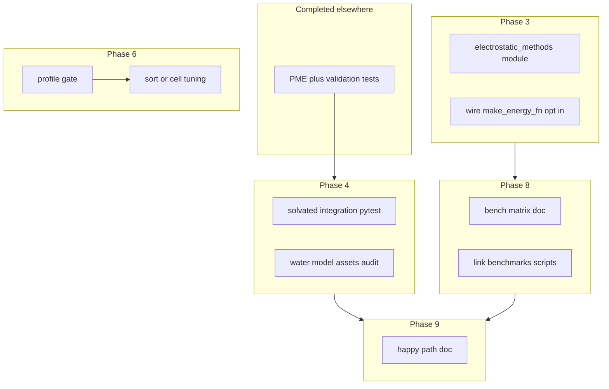

# Explicit solvent: Phases 3, 4, 6, 8, 9 — formal plan

**Status:** Approved for execution (see Oracle verdict below).  
**As-built snapshot:** [`docs/source/explicit_solvent/current_implementation.md`](../../../docs/source/explicit_solvent/current_implementation.md)  
**Design reference:** [`docs/source/explicit_solvent/explicit_solvent_implementation_plan.md`](../../../docs/source/explicit_solvent/explicit_solvent_implementation_plan.md)

**Note:** §2 “recon” rows for RF/DSF and `electrostatic_methods` reflected the repo **before** those modules landed. For current facts, use [`current_implementation.md`](../../../docs/source/explicit_solvent/current_implementation.md) and the gap/Espaloma plan [`explicit_solvent_gaps_and_espaloma_charges.md`](explicit_solvent_gaps_and_espaloma_charges.md).

---

## 1. Purpose

Sequence and scope implementation work for **reaction-field / DSF-style electrostatic alternatives** (Phase 3), **solvation pipeline closure** (Phase 4), **spatial sorting / tuning** (Phase 6), **benchmarking** (Phase 8), and **production integration** (Phase 9), without duplicating completed PME validation or mis-stating existing SETTLE support.

---

## 2. Codebase ground truth (recon)

| Topic | Fact | Evidence |
|-------|------|----------|
| Default explicit energy path | PME + direct space + NL or dense; shared corrections | [`src/prolix/physics/system.py`](../../../src/prolix/physics/system.py) `make_energy_fn`; [`src/prolix/physics/explicit_corrections.py`](../../../src/prolix/physics/explicit_corrections.py) |
| Flash / padded path | Aligned PME + corrections | [`src/prolix/physics/flash_explicit.py`](../../../src/prolix/physics/flash_explicit.py); [`src/prolix/batched_energy.py`](../../../src/prolix/batched_energy.py) |
| Solvation merge | `solvate_protein`, `MergedTopology`, `pad_solvated_system` | [`src/prolix/physics/solvation.py`](../../../src/prolix/physics/solvation.py); [`topology_merger.py`](../../../src/prolix/physics/topology_merger.py); [`padding.py`](../../../src/prolix/padding.py) |
| Explicit Langevin + SETTLE | **Implemented** — BAOAB, constraints, SETTLE, `single_padded_force` / explicit | [`make_langevin_step_explicit`](../../../src/prolix/batched_simulate.py) (from ~L1940; docstring lists SETTLE + flash forces) |
| RF / DSF module | **Present (opt-in)** | [`src/prolix/physics/electrostatic_methods.py`](../../../src/prolix/physics/electrostatic_methods.py); default remains PME |
| Morton / spatial sort | **Not present** in `src/prolix` | Grep has no morton hits |
| Phase 8 matrix | Not unified | Ad hoc scripts in repo root [`benchmarks/`](../../../benchmarks/); design references `scripts/benchmarks/explicit_solvent_bench.py` (missing) |
| Implicit GB + NL | Incomplete | `TODO(implicit_GB_NL)` in [`system.py`](../../../src/prolix/physics/system.py) |

---

## 3. External grounding (electrostatics validation)

- OpenMM exposes multiple nonbonded methods (`NoCutoff`, `CutoffPeriodic`, `Ewald`, `PME`, etc.) and separate controls for switching, dispersion correction, and (where applicable) reaction-field dielectric semantics — see [NonbondedForce Python API](https://docs.openmm.org/latest/api-python/generated/openmm.openmm.NonbondedForce.html). Custom pairwise electrostatics for RF-like schemes often use **`CustomNonbondedForce`** ([User guide — Custom forces](http://docs.openmm.org/latest/userguide/theory/03_custom_forces.html)).
- **Cross-engine caveat:** reaction-field formulas and constants are **not** bit-identical across MD codes; published and issue-tracker discussions note discrepancies when comparing implementations (e.g. OpenMM vs GROMACS RF). Prolix validation should **pin one reference** (recommended: OpenMM) and document any second reference as a stretch goal.

---

## 4. Phased deliverables and dependencies



| Phase | Deliverable | Out of scope |
|-------|-------------|--------------|
| **3** | `ElectrostaticMethod`-style enum + RF/DSF kernels; `make_energy_fn` / `SimulationSpec` wiring; default remains **PME** | Rewriting PME; cell-list-only RF unless needed |
| **4** | Integration test: small solvated system → `PaddedSystem` → explicit energy (finite; optional NL vs dense if affordable). Audit OPC/TIP assets vs `water_models.py`. Update `current_implementation.md` SETTLE wording — **implementation exists** in `make_langevin_step_explicit` | Full Phase 7 L2 (100 ps RDF, etc.) |
| **6** | **Profiling artifact** naming bottleneck; then optional Morton / sort for PME scatter **or** cell occupancy — not both without measurement | Blind optimization |
| **8** | Document local smoke vs cluster matrix; link `benchmarks/*.py`; optional SLURM template (from design doc) | Running cluster jobs inside CI |
| **9** | Happy-path doc: structure → `SimulationSpec` → minimize / explicit Langevin; clarify error cases | Mandatory new CLI (unless product asks) |

---

## 5. Oracle critique cycles (multi-axis)

### Cycle 1 — Verdict: REVISE

| Axis | Finding |
|------|---------|
| Correctness | Draft plans that say “wire SETTLE for Phase 4” are **wrong** — [`make_langevin_step_explicit`](../../../src/prolix/batched_simulate.py) already includes SETTLE and explicit forces. |
| Completeness | Phase 3 needs explicit **test strategy** against one reference engine; RF is not interchangeable across GROMACS/OpenMM without formula IDs. |
| Risk | Opt-in electrostatics must not change default `pme_alpha` / grid behavior used by [`test_openmm_explicit_anchor.py`](../../../tests/physics/test_openmm_explicit_anchor.py). |
| Alignment | Matches [`current_implementation.md`](../../../docs/source/explicit_solvent/current_implementation.md) roadmap section. |

**Gap addressed before Cycle 2:** Reframe Phase 4 around **integration tests and assets**, not integrator features already present.

### Cycle 2 — Verdict: REVISE

| Axis | Finding |
|------|---------|
| Feasibility | Phase 6 **without** profiling duplicates risk from architecture doc (scatter vs cell list). Add hard **profile gate**. |
| Redundancy | Phase 4 integration test must not duplicate **protein NL parity** tests — different target (solvated **merged** topology end-to-end). |
| Consistency | Phase 8 “unified script” can remain **documentation + inventory** until kernels stabilize; avoids dead `explicit_solvent_bench.py` churn. |

**Gap addressed before Cycle 3:** Explicitly sequence **Phase 4 integration** before **Phase 9** narrative; keep Phase 3 parallelizable.

### Cycle 3 — Verdict: APPROVE

| Axis | Finding |
|------|---------|
| Specificity | Phases have concrete artifacts (files, tests, docs). |
| Risk | Residual: cluster benchmarks environment-dependent — acceptable if doc states “local smoke” vs “cluster matrix.” |
| Consistency | SETTLE recon, wire points, and validation strategy are coherent. |

**Final verdict: APPROVE** for documentation-driven execution; implementation tickets can be split per phase.

---

## 6. Structured oracle output (schema)

```json
{
  "verdict": "APPROVE",
  "confidence": "medium",
  "strategic_assessment": "The plan aligns with the repository: PME and parity tests are mature; Phase 4 should emphasize solvated integration and assets because SETTLE is already in make_langevin_step_explicit. Phase 3 RF/DSF must stay opt-in with OpenMM-pinned tests. Phase 6 requires profiling before sort work. Phase 8 is documentation-first; Phase 9 is runbook and config clarity.",
  "concerns": [
    {
      "area": "Phase3_RF_Reference",
      "severity": "warning",
      "issue": "Cross-engine RF formulas differ; without a pinned reference, tests can pass locally but disagree with production target.",
      "recommendation": "Validate Phase 3 against OpenMM CustomNonbondedForce or documented analytic two-body limits; document constants."
    },
    {
      "area": "Phase4_Scope",
      "severity": "suggestion",
      "issue": "solvate_protein can be expensive in CI; test system size must be bounded.",
      "recommendation": "Use small box / few waters + pytest slow marker."
    },
    {
      "area": "Phase8_Cluster",
      "severity": "suggestion",
      "issue": "SLURM partitions and GPU types are site-specific.",
      "recommendation": "Keep template generic; parameterize partition/GPU in doc examples."
    }
  ],
  "approved_for_execution": true
}
```

---

## 7. Decisions (importance, tradeoffs, recommendations)

1. **Phase 3 reference engine (high)**  
   - **a)** OpenMM-first (CustomNonbondedForce or NonbondedForce subset).  
   - **b)** GROMACS-matched RF.  
   - **Tradeoff:** (b) helps force-field portability for some CG models; (a) matches existing Prolix OpenMM tests.  
   - **Recommendation:** **(a)**; add (b) only with explicit project need.

2. **Phase 4 test size (high)**  
   - **a)** Minimal solvated system (`slow`).  
   - **b)** Large pre-solvated PDB only.  
   - **Recommendation:** **(a)** primary; **(b)** optional.

3. **Phase 6 trigger (medium)**  
   - **a)** Profiling required before code.  
   - **b)** Implement sorting preemptively.  
   - **Recommendation:** **(a)**.

4. **Phase 8 deliverable form (medium)**  
   - **a)** Markdown matrix + links to `benchmarks/`.  
   - **b)** New `scripts/benchmarks/explicit_solvent_bench.py` immediately.  
   - **Recommendation:** **(a)** now; **(b)** when stable.

5. **Phase 9 depth (medium)**  
   - **a)** Docs + examples only.  
   - **b)** New CLI.  
   - **Recommendation:** **(a)** unless product mandates **(b)**.

---

## 8. Suggested implementation checklist (tracking)

- [ ] Phase 4: adjust [`current_implementation.md`](../../../docs/source/explicit_solvent/current_implementation.md) Phase 4 bullets — SETTLE **present** in `make_langevin_step_explicit`.  
- [ ] Phase 4: add `slow` integration test (small solvated → energy).  
- [ ] Phase 3: `electrostatic_methods` + `system` wiring + tests (default PME unchanged).  
- [ ] Phase 6: profile + one-page decision.  
- [ ] Phase 8: `docs/...` or `.agent/docs` bench matrix + SLURM template snippet.  
- [ ] Phase 9: explicit solvent happy-path page under `docs/source/explicit_solvent/`.

---

## 9. Related paths

| Document | Role |
|----------|------|
| [`docs/source/explicit_solvent/current_implementation.md`](../../../docs/source/explicit_solvent/current_implementation.md) | As-built snapshot |
| [`docs/source/explicit_solvent/explicit_solvent_implementation_plan.md`](../../../docs/source/explicit_solvent/explicit_solvent_implementation_plan.md) | Original phase definitions |
| [`docs/source/explicit_solvent/explicit_solvent_progress.md`](../../../docs/source/explicit_solvent/explicit_solvent_progress.md) | Chronological status |
| [`.agent/workflows/oracle-critique.md`](../../workflows/oracle-critique.md) | Oracle workflow |
| [`.agent/schemas/oracle_critique.json`](../../schemas/oracle_critique.json) | Critique JSON schema |
