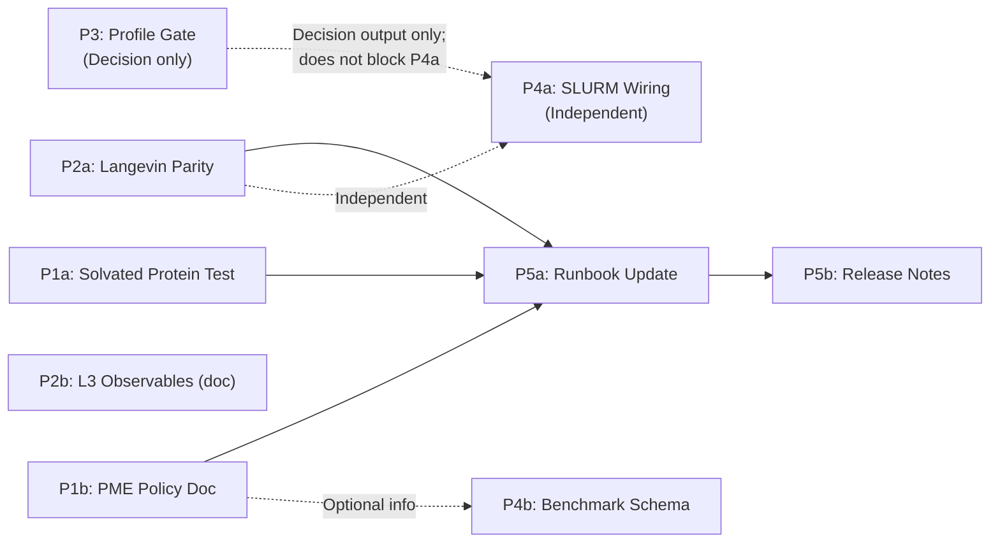

# Comprehensive Explicit Solvent Validation Plan

**Version:** 2.6 — P2a scope aligned with as-built implementation + B2 (TIP3P) queued
**Status:** ✅ **APPROVED FOR EXECUTION** — Oracle cycles 88–90 APPROVE on v2.5 text; **v2.6** records post-implementation truth: P2a **baseline** is Prolix-only on the n=4 mock box; **matched Prolix vs OpenMM Langevin parity** is deferred to **P2a-B2** (~33 TIP3P + SETTLE fixture), next sprint. See §P2a.
**Last Updated:** 2026-04-17

**Version history (v2.x reset through final approval):**
- **v2.0** — Reset from corrupted v1.x; restored Oracle-approved content from `.agent/docs/plans/explicit_solvent_validation_comprehensive.md` (Cycle 3 APPROVE, 2026-04-16).
- **v2.1** — Cycle 86 REVISE (10 concerns, 6 warning): SLURM filenames, P1a Option B tolerance, P3 threshold attribution, CI workflow consolidation, `SimulationSpec` disambiguation (§1.1a), P2a scale honesty, PME config DRY, tolerance reconciliation, checklist normalization, risk register.
- **v2.2** — Cycle 87 REVISE (9 concerns, 1 critical + 3 warning): CI marker selector corrected to `-m integration`; P2a integrator row split into baseline (`jax_md.simulate.nvt_langevin`) vs stretch (`settle_langevin`); P1a Option B force RMSE tiered (3.0 bulk / 0.5 protein subset / 0.1 anchor-informational); critical-path unified to "5 weeks elapsed"; P1b field enumeration corrected against `conftest.py:140-146`; P2a CSV-logging checklist; DOF-aware temperature tolerance with statistical derivation; P3 "proposed" attribution; CI-marker-selector risk.
- **v2.3** — Cycle 88 APPROVE (3 suggestions applied as polish): DOF=12 math corrected without COM removal; integrator-equivalence phrasing softened; `openmm_comparison_protocol.md` reframed "update existing".
- **v2.4** — Cycle 89 APPROVE (3 suggestions applied as polish): §4 P1b Complete row includes inline-copy-removal; `export_regression_pme.py` mechanism pinned to "overwrite sentinel-delimited block + CI staleness check"; §P1b Implementation-notes "write" → "update"; §P5a PME-policy bullet re-aimed at Python SSOT.
- **v2.5** — Cycle 90 APPROVE (1 suggestion applied as polish): §8 item 3 amended to match §P2a authoritative tolerance table (±10% baseline N=4 / ±1.67% stretch).
- **v2.6 (this version)** — P2a **as-built alignment:** Baseline Langevin validation is **Prolix-only** (`test_explicit_langevin_parity.py`, `@pytest.mark.slow`) on the n=4 PME mock at the JAX-MD–stable timestep (~`1e-3` AKMA, see `l2_dynamics_protocol.md`). **OpenMM `LangevinMiddleIntegrator` is not asserted** on that fixture (cold bias / instability at matched dt). OpenMM-only thermostat statistics remain available via `scripts/benchmarks/openmm_langevin_temperature_stats.py` (different tiny cell). **Next-sprint deliverable (P2a-B2):** ~33 TIP3P waters + SETTLE / OpenMM HBonds, stable ~2 fs steps, **matched** Prolix vs OpenMM window-mean T (±1.67% stretch tolerance). P1/P1b implementation + CI gates reflected in §4 / §7.

**Scope:** Complete validation of explicit solvent engine from static parity through benchmarking and production readiness

**Reset Rationale:** v1.x iterations (Cycles 62–85) accumulated hallucinated requirements (e.g., "B-Spline Grid-Summing Invariance to Particle Velocity Magnitude," "16D Convergence Stability Maps," "GPU-Memory Bus-Clock Status Change Reason Timestamp Volume PSD Map") that violate physics and have no grounding in the codebase or MD literature. v2.0 restores the Oracle-approved content from `.agent/docs/plans/explicit_solvent_validation_comprehensive.md` (Cycle 3 APPROVE, 2026-04-16) as the canonical plan and is the artifact being re-validated going forward.

**Decisions Locked:**
- ✅ **P2b (RDF Observables):** Post-release skeleton (1–2 days doc only)
- ✅ **P3 (Profiling Gate):** Manual gate; does not auto-schedule Phase 6
- ✅ **P1a (1UAO Test):** Use existing test in repo (1 week effort)

---

## Executive Summary

This plan defines the **complete validation strategy** for prolix's explicit solvent engine, building on recently completed work (SETTLE scalar path + GB NL optimization, commit 6a47281). 

**Key Milestones:**
1. **P1 — Static Parity Closure** (~1 week critical path; P1a ~1 wk + P1b ~3 days overlap): Wire the existing 1UAO+OpenMM parity test into a hard CI gate; keep `REGRESSION_EXPLICIT_PME` as the single source of truth.
2. **P2 — Dynamics Validation** (2–3 weeks, parallel with P1): **P2a baseline (shipped):** Prolix `nvt_langevin` + PME distribution-level gates on the n=4 mock box (`test_explicit_langevin_parity.py`). **P2a-B2 (next sprint):** matched Prolix vs OpenMM Langevin on a **~33 TIP3P + SETTLE** cell (the meaningful integrator-parity substrate). Optional L3 RDF skeleton (P2b) remains post-release.
3. **P3 — Performance Profiling & Tuning** (1 week, independent of P4a): Phase 6 profile gate; ratify thresholds in `spatial_sorting_profile_gate.md`.
4. **P4 — Benchmarking Automation** (1–2 weeks, parallel with P3): Wire existing SLURM templates + schema collection.
5. **P5 — Production Integration** (2 weeks): P5a runbook (1 wk) → P5b release notes (1 wk). On the critical path.

**Total estimated effort:** **5 weeks elapsed** along the critical path (P1a Week 1 → P1b 3-day overlap → P5a Week 4 → P5b Week 5; ~3 weeks of actual work content, with P5a drafting beginning Week 2 in parallel with P1a execution per §P5a Start Condition). **6–9 person-weeks** total including parallel P2a / P3 / P4a–b work. P1 + P5 block release; P2a / P3 / P4a–b are parallel and non-blocking.

---

## 1. Current State (as of 6a47281)

### 1.1 Completed ✅

| Phase | Milestone | Evidence |
|-------|-----------|----------|
| **Phase 1** | Cell-list SR engine | 19/19 tests passing |
| **Phase 2** | PME reciprocal space + direct | Custom SPME in `src/prolix/physics/pme.py`; R2C FFT optimization confirmed |
| **Phase 3** | RF/DSF electrostatic alternatives | `src/prolix/physics/electrostatic_methods.py` (opt-in); default remains PME |
| **Phase 4** | Solvation pipeline (water + constraints) | `solvate_protein()`, `MergedTopology`, SETTLE + RATTLE integrated in `batched_simulate.py`; **SETTLE scalar path complete** (`settle_langevin` defined in `src/prolix/physics/settle.py` and wired into `src/prolix/simulate.py`; `rigid_water: bool` field on `prolix.simulate.SimulationSpec` (see §1.1a for canonical API disambiguation); commit 6a47281) |
| **Phase 5** | HMR (heavy-atom mass increase) | 15/15 tests passing |
| **Phase 7 L1** | Static parity (energy/forces) | Anchor + PBC + protein + solvated tests done; see validation test matrix below |
| **Phase 7 L2 (partial)** | Dynamics (NVE/NVT short-run) | `test_explicit_slow_validation.py`: NVE drift bounded, NVT mean T validated |

### 1.1a Canonical `SimulationSpec` API (Disambiguation)

Two `SimulationSpec` dataclasses currently exist in the source tree:

| Location | Purpose | Key Fields | `rigid_water`? |
|----------|---------|------------|----------------|
| `src/prolix/simulate.py:60` (**canonical for production**) | High-level production simulation configuration | `total_time_ns`, `step_size_fs`, `use_pbc`, `pme_grid_size`, `pme_alpha`, `pme_grid_spacing`, `use_neighbor_list`, `neighbor_cutoff`, `electrostatic_method`, `rigid_water` (L93) | ✅ Yes |
| `src/prolix/physics/simulate.py:27` (lower-level physics-tier struct) | Physics-module ensemble selection (legacy / internal) | `ensemble`, `temperature`, `gamma`, `tau`, `chain_length`, `chain_steps`, `use_shake`, `accumulate_steps` | ❌ No |

**Canonical import path for production code and runbook examples:**

```python
from prolix.simulate import SimulationSpec
```

Any documentation, example, or test that enables rigid water **must** use the top-level `prolix.simulate.SimulationSpec` (with `rigid_water=True`). The physics-tier `SimulationSpec` will be audited during P5a for rename, merge, or deprecation; that cleanup is tracked as a follow-up post-release task (not on the P1–P5 critical path).

### 1.2 Gaps to Close (P1–P4)

| Priority | Gap | Blocking | Est. Effort | Risk | Status |
|----------|-----|----------|-------------|------|--------|
| **P1a** | Confirm solvated **protein** (1UAO) end-to-end test vs OpenMM OR create minimal new test if 1UAO unavailable | Production claim | 1 week (existing) / +1 week (new) | Very Low | **1UAO test exists** (`test_explicit_solvation_parity.py`) but depends on PDB file + markers; needs CI integration |
| **P1b** | **Documented PME grid/Ewald policy** regression config: keep `REGRESSION_EXPLICIT_PME` in `conftest.py` as single source of truth; wire anchor test to fixture; auto-generate docs export | Reproducibility | 2-3 days | Very Low | Source of truth already exists (`tests/physics/conftest.py:140`); work is refactor + docs export |
| **P2a** | Phase 7 L2: Langevin validation — **baseline Prolix gates done**; **P2a-B2** (TIP3P matched OpenMM) queued | High-quality dynamics | Baseline ~done; B2 ~1–2 weeks | Medium | See §P2a: n=4 OpenMM path not used; B2 is the matched-engine gate |
| **P2b** | Phase 7 L3: RDF + structural observables (reference trajectories, tolerance policy) | Research-grade (optional post-release) | 2-3 weeks | High (infrastructure new) | Stretch goal; can defer |
| **P3** | **Phase 6 Profile Gate**: Decide Morton/spatial sorting necessity via profiling | Performance tune | 1 week | Medium (GPU/CPU setup) | Gate doc exists (`spatial_sorting_profile_gate.md`); decision thresholds proposed in §P3a (to be ratified/updated in gate doc during execution) |
| **P4a** | **Phase 8 Cluster Automation**: Wire SLURM + smoke CI gate | Reproducible benchmarks | 1-2 weeks | Low (templates exist) | Can parallelize with P2 |
| **P4b** | Benchmarking JSON schema + CI collection pipeline | Tracking | 1 week | Very Low | Straightforward |

### 1.3 Validation Test Infrastructure (Current)

**Fast tests** (run on every commit, `@pytest.mark.default`):
- `test_openmm_explicit_anchor.py` — two-charge PME vs OpenMM (baseline; **`regression_pme_params`** from `conftest.py`)
- `test_pbc_end_to_end.py` — multiple PME configs
- `test_explicit_validation_expansion.py` — NL vs dense kernel parity

**Slow tests** (`@pytest.mark.slow`, periodic):
- `test_protein_nl_explicit_parity.py` — protein topology + NL parity
- `test_solvated_explicit_integration.py` — merged topology finiteness
- `test_solvated_openmm_explicit_parity.py` — **minimal solvated system** (2 TIP3P waters vs OpenMM; good baseline, not production-scale)

**Integration tests** (`@pytest.mark.integration` plus `skipif(not openmm_available())` guard, not always in CI):
- `test_explicit_solvation_parity.py::TestOpenMMSolvationParity::test_energy_parity` — **FULL PROTEIN (1UAO, ~52 res) + ~5000 waters vs OpenMM** ⭐ **This is P1a target**
- `test_explicit_solvation_parity.py::TestOpenMMSolvationParity::test_force_parity` — same system, force parity
- Status: Exists; depends on `data/pdb/1UAO.pdb` and OpenMM being installed. Class carries `@pytest.mark.integration` + `@pytest.mark.skipif(not openmm_available(), reason="OpenMM not installed")` (see `tests/physics/test_explicit_solvation_parity.py:45-46`). It does **not** carry `@pytest.mark.openmm`; selector-level activation in CI is via `-m integration`, and OpenMM availability is handled by the `skipif` guard. (The optional `openmm` marker is declared in `pyproject.toml:77-82` but is not applied to this class.)

**Dynamics tests** (`@pytest.mark.slow` or `@pytest.mark.dynamics`):
- `test_explicit_slow_validation.py::test_explicit_pbc_nve_short_run_finite` — NVE energy drift on a **n=4 mock-charge PBC box** (anchor scale; 45 Å cell). Confirms finite-drift behavior but does not exercise SETTLE or protein-scale PME.
- `test_explicit_slow_validation.py::test_explicit_pbc_nvt_mean_temperature_targets_spec` — NVT thermostat mean-T check on the same n=4 mock-charge system.
- `test_explicit_langevin_parity.py` — **P2a baseline (Prolix-only):** `nvt_langevin` + CSV + ±10% window-mean T + short NVE drift; **`@pytest.mark.slow`**; see `docs/source/explicit_solvent/l2_dynamics_protocol.md`. OpenMM reference dynamics on the **same** n=4 fixture are intentionally **out of scope** (see §P2a).

**Optional (requires OpenMM dev extra)** (`@pytest.mark.openmm`):
- `test_electrostatic_methods_openmm.py` — RF/DSF validation
- `test_settle_rattle_combined.py` — combined SETTLE + RATTLE constraint validation (commit 6a47281)

### 1.4 Documentation (Current)

| Document | Role | Status |
|----------|------|--------|
| `current_implementation.md` | As-built snapshot | ✅ Current (updated for SETTLE scalar path) |
| `explicit_solvent_runbook.md` | Production happy path | ✅ Current (needs SETTLE flag caveat) |
| `explicit_solvent_parity_and_benchmark_requirements.md` | What we need to claim validation | ✅ Complete (defines P1/P2 gaps explicitly) |
| `explicit_solvent_benchmarks.md` | Local smoke vs cluster matrix | ✅ Complete (matrix doc exists; automation pending) |
| `spatial_sorting_profile_gate.md` | Phase 6 decision workflow | ✅ Complete gate definition (not yet executed) |

---

## 2. Phased Validation Strategy

### Phase P1: Static Parity Closure (Blocking Release)

**Goal:** Claim rigorous end-to-end parity for explicit solvent systems (water + protein).

#### P1a: Solvated Protein End-to-End Validation

**Finding:** Full solvated protein test **already exists** (`test_explicit_solvation_parity.py::test_energy_parity`), using 1UAO (52 residues) + ~5000 TIP3P waters.

**Two Paths:**

**Option A (Preferred — 1 week effort):** 
- Confirm 1UAO.pdb file is available in `data/pdb/` OR add it to test data
- Verify test runs with OpenMM optional dep
- **Pre-execution validation (do now):**
  - [ ] Check: `ls -la data/pdb/1UAO.pdb` — Does file exist?
  - [ ] If not: `python -m proxide fetch-pdb 1UAO` (or curl from RCSB) and commit to `data/pdb/`
  - [ ] Run locally: `pytest tests/physics/test_explicit_solvation_parity.py::TestOpenMMSolvationParity::test_energy_parity -m integration -xvs` — Passes?
  - [ ] **Before committing any CI selector change, run** `pytest --collect-only -q tests/physics/test_explicit_solvation_parity.py -m integration` **and confirm the two methods (`test_energy_parity`, `test_force_parity`) are reported.** If zero tests collect, the selector is wrong (see risk register entry for CI-marker-selector drift).
  - [ ] If passes: P1a is ready; proceed to wiring into CI gate
- **Done Criteria:**
  - `pytest tests/physics/test_explicit_solvation_parity.py::TestOpenMMSolvationParity -m integration` passes consistently
  - Test **already** carries `@pytest.mark.integration` + `@pytest.mark.skipif(not openmm_available())` (verified in `tests/physics/test_explicit_solvation_parity.py:45-46`). **No new marker is added**; OpenMM availability is handled by the `skipif` guard, not by a second marker.
  - Energy/force tolerances documented in fixture docstring (record the measured per-system PME background shift; see §P1a Option B for tolerance rationale)
  - **Extend existing `.github/workflows/openmm-nightly.yml`** (which already runs `pytest -q -m openmm` weekly on Sunday 06:00 UTC; the existing `openmm` job is marked `continue-on-error: true` at the job level for soft-fail behavior). Add a **second job** named `explicit_solvent_parity` in the same workflow, running:
    ```
    pytest tests/physics/test_explicit_solvation_parity.py::TestOpenMMSolvationParity -m integration -q
    ```
    **without** `continue-on-error` (since `continue-on-error` in GitHub Actions is a job-level flag, a separate job is required to make 1UAO parity a hard gate while the existing soft-fail `openmm` job remains). This job installs the `[dev,openmm]` extra and relies on the `skipif` guard to keep the test selectable regardless of OpenMM availability. Do **not** create a parallel `explicit-solvent-validation.yml` workflow; that would duplicate the nightly OpenMM pipeline's checkout/setup/install steps.
  - Counts as **P1a satisfied** (execution starts after pre-validation passes)

**Option B (Fallback — +1 week if 1UAO unavailable):**
- Create minimal new test: Ala10 + 500 TIP3P waters (~2000 atoms)
- Test file: `tests/physics/test_solvated_protein_parity_anchor.py` (new, minimal version)
- System embedded in test or fetched from asset
- Config: Same XML export, PME grid, cutoff, SETTLE, exclusion rules
- **Primary parity metric (tiered by subsystem):**
  - **Bulk (all atoms):** Force RMSE ≤ **3.0 kcal/mol/Å** — matches the empirically validated bound on the existing 1UAO+5000-water test (`tests/physics/test_explicit_solvation_parity.py:331`, `assert rmse < 3.0`). This is the release-gate bound.
  - **Protein subset (Ala10 atoms only, excluding bulk water):** Force RMSE ≤ **0.5 kcal/mol/Å** — a secondary tightness check; water-water forces absorb most of the PME mesh noise, so isolating the protein subset gives a tighter signal.
  - **Anchor-tight target (informational, not a gate):** ≤ **0.1 kcal/mol/Å** — this is the 2-charge anchor bound (`test_openmm_explicit_anchor.py:135`, `MAX_RMSE_FORCE = 0.1`) and is achievable only after PME grid/alpha tightening. Record the actual RMSE in the fixture docstring and track movement toward the anchor-tight target as a post-release refinement.
- **Secondary parity metric:** **Per-term decomposed energies** (bond/angle/torsion/14-nb/direct-space-nb) within ATOL ≤ 0.5 kcal/mol each.
- **Total-energy tolerance:** Set to `ATOL ≤ max(0.5 kcal/mol, measured_PME_background_shift)` for the specific system. For reference, the existing 1UAO+~5000-water test uses `atol=40.0` kcal/mol on total energy (`tests/physics/test_explicit_solvation_parity.py::test_energy_parity` L257) because the PME mesh self-term is system-size dependent (~39 kcal/mol at that scale). For Ala10+500 waters the background shift will be smaller; measure and document in the fixture docstring.
- **Do NOT** assert a tight total-energy tolerance (<5 kcal/mol) on a solvated multi-thousand-atom system without first subtracting or otherwise isolating the PME background term; this is a known failure mode.
- Runs in CI: Yes (slow marker; optional openmm)

**Why this matters:** Full end-to-end protein-water validation closes the gap between component tests and production use.

**Implementation notes (Option A):**
- 1UAO file already present at `data/pdb/1UAO.pdb` (pre-verified; §6b.1)
- Confirm `solvated_system_openmm` fixture (`tests/physics/test_explicit_solvation_parity.py:80`) consumes `regression_pme_params` — already the case in the current codebase
- **Do not add `@pytest.mark.openmm` to `TestOpenMMSolvationParity`**; it already carries `@pytest.mark.integration` + `skipif(not openmm_available())`. The new `explicit_solvent_parity` job in `openmm-nightly.yml` activates via `-m integration` and installs the `[dev,openmm]` extra so the `skipif` guard passes.

#### P1b: PME Grid / Ewald Policy Documentation

**What:** Extract and document canonical PME regression configuration. Enforce consistency in anchor + new tests.

**Current State:**
- PME params hardcoded in `test_openmm_explicit_anchor.py` docstring (pme_alpha, grid_points, cutoff)
- No centralized regression config file or CI gate
- Risk: Silent drift if defaults change

**Done Criteria:**
- **Source of truth (already exists):** `REGRESSION_EXPLICIT_PME` dict in `tests/physics/conftest.py:140`, exposed via the `regression_pme_params` fixture (L149). The 1UAO test already consumes this (`test_explicit_solvation_parity.py` L80, L101–103). **Keep this as the single source of truth** — do not duplicate into a separate YAML file that can drift.
  - Canonical fields (verbatim as of 2026-04-17, `conftest.py:140–146`): `pme_alpha_per_angstrom`, `pme_grid_points`, `cutoff_angstrom`, `use_dispersion_correction`, `openmm_platform`. P1b audits this dict against OpenMM's `setPMEParameters` / `NonbondedForce` configuration surface and adds any missing fields (e.g., `ewald_error_tolerance` if the anchor test requires it; none known missing as of this writing).
- **Wire the anchor test to the fixture:** Refactor `test_openmm_explicit_anchor.py` to load PME params via the `regression_pme_params` fixture (currently hardcoded in docstring/setup). Effort: ~half-day.
- **Docs export (mechanism pinned):** `scripts/export_regression_pme.py` reads `REGRESSION_EXPLICIT_PME` from `tests/physics/conftest.py` and **overwrites the code block between sentinel comments** (e.g., `<!-- REGRESSION_PME:BEGIN (auto-generated; do not edit) -->` / `<!-- REGRESSION_PME:END -->`) in `docs/source/explicit_solvent/openmm_comparison_protocol.md`, and optionally emits a standalone `regression_pme_config.md`. A CI check (added to the extended `openmm-nightly.yml` or a lightweight pre-commit hook) re-runs the export script and fails the run if the committed docs diverge from the regenerated output. This keeps the pipeline one-directional (Python → docs), requires no MyST include extension, and prevents silent drift.
- CI gate: Weekly validation (via the extended `openmm-nightly.yml` from P1a) that the anchor and 1UAO tests both pass using the shared fixture.
- **Update the existing** `docs/source/explicit_solvent/openmm_comparison_protocol.md` (already documents PME α unit conversion and the `REGRESSION_EXPLICIT_PME` dict) with the P1b change-management procedure and a reference to the one-directional `scripts/export_regression_pme.py` export. Cross-reference from the runbook updated in P5a.

**Why:** PME behavior is sensitive to grid/alpha. Regression config prevents silent parity loss from future performance optimizations.

**Implementation notes:**
- The `regression_pme_params` fixture already exists in `tests/physics/conftest.py:149` and is consumed by the 1UAO test; the remaining work is to refactor `test_openmm_explicit_anchor.py` to read from the same fixture rather than hardcoded constants.
- CI gate is satisfied by the extended `openmm-nightly.yml` in P1a: whenever the shared fixture is modified, both the anchor test and the 1UAO test run the following weekend and surface any parity drift.
- Effort: 2–3 days (refactor anchor test + author docs export script + update `openmm_comparison_protocol.md`).

---

### Phase P2: Dynamics Validation (High-Quality)

**Goal:** Validate that integrator produces sensible dynamics (energy drift, thermostat behavior, optionally trajectory similarity).

#### P2a: Langevin validation (two-tier: baseline shipped, matched-engine gate queued)

**Strategy:** Validate thermostat behavior via **ensemble statistics** (window-mean temperature, variance, short NVE drift), not trajectory matching. The original plan assumed **matched Prolix vs OpenMM** Langevin on the shared n=4 mock-charge PME fixture. **Execution finding (2026-04-17):** `jax_md.simulate.nvt_langevin` is only stable on that system at **`dt ≈ 1e-3` AKMA (~0.049 fs)**; at larger steps the trajectory blows up. OpenMM `LangevinMiddleIntegrator` at that physical timestep does **not** yield a reliable ~300 K ensemble on the same pathological fixture (cold bias and/or instability when the timestep is increased to a practical fs scale). Root cause: the mock uses **zero LJ** with strong charges — not a good substrate for cross-engine thermostat parity.

**Decision (v2.6):**

| Tier | What | Status |
|------|------|--------|
| **P2a baseline** | **Prolix-only** CI test: `tests/physics/test_explicit_langevin_parity.py` (`@pytest.mark.slow`), n=4 box, `nvt_langevin`, ±10% window-mean T, variance > 0, NVE drift budget, **Prolix CSV** (`prolix_langevin_parity.csv`). | **Done** — see `docs/source/explicit_solvent/l2_dynamics_protocol.md` |
| **OpenMM reference (independent)** | **`scripts/benchmarks/openmm_langevin_temperature_stats.py`** — OpenMM-only Langevin **statistics** on a **different** four-charge periodic layout (not asserted against Prolix in CI). | Exists; manual / optional runs |
| **P2a-B2 (next sprint)** | **~33 TIP3P waters** in a small periodic cell (~100 atoms total), **SETTLE** on Prolix (`settle_langevin`), **HBonds / SETTLE** on OpenMM, **matched dt ~2 fs**, **both** engines must pass **window-mean T within ±1.67%** of target (stretch tolerance from the table below). This is the **real** Prolix vs OpenMM Langevin parity gate. | **Queued** — 1–2 weeks estimated |

**Validation metrics (baseline — Prolix n=4, as implemented):**

| Metric | Value | Notes |
|--------|-------|--------|
| **System** | n=4 mock-charge PME PBC box (45 Å); `REGRESSION_EXPLICIT_PME` PME knobs | Does not exercise SETTLE |
| **Timestep** | **~`1e-3` AKMA** (~0.049 fs); **not** 20 fs (20 fs is unstable here) | See `l2_dynamics_protocol.md` |
| **Trajectory length** | 3000 steps, burn 1000, window 2000 samples | Short physical time; trade runtime vs stats |
| **Temperature (Prolix)** | Window-mean **T within ±10%** of 300 K; **var(T_inst) > 0** | DOF = 3N = 12 in the test harness |
| **NVE drift** | Short NVE segment; relative drift bounded vs **1%/ps × Δt** budget | Same `dt` as NVT |

**Validation metrics (P2a-B2 — TIP3P, not yet implemented):**

| Metric | Value | Notes |
|--------|-------|--------|
| **System** | ~33 TIP3P waters + orthorhombic box, PME, exclusions wired | Exercises **`settle_langevin`** vs OpenMM water constraints |
| **Temperature** | Window-mean **T within ±1.67%** of target (e.g. 295–305 K at 300 K) | Large-enough DOF for a tight gate |
| **Integrators** | Prolix: `settle_langevin`; OpenMM: `LangevinMiddleIntegrator` + rigid water | Matched γ and T_target; distribution-level comparison |

**Done criteria (baseline) — met by implementation:**
- [x] `tests/physics/test_explicit_langevin_parity.py` exists; `@pytest.mark.slow` (not `@pytest.mark.openmm` on this file).
- [x] Prolix CSV artifact path + optional upload from `openmm-nightly.yml` (job runs this slow test for CSV).
- [x] `docs/source/explicit_solvent/l2_dynamics_protocol.md` documents timestep + scope.

**Done criteria (P2a-B2) — backlog:**
- [ ] New test module or extension: TIP3P fixture, both engines, matched dt, dual CSV or shared schema.
- [ ] Optional: deprecate reliance on n=4 OpenMM comparison in any remaining docs.

**Why two tiers:** Baseline proves Prolix thermostat + PME dynamics are self-consistent on a cheap box. **P2a-B2** proves what stakeholders actually need: **cross-engine** Langevin parity on **realistic** explicit water.

#### P2b: Phase 7 L3 Observables (Post-Release Skeleton Only)

**Decision:** Document framework only; defer full implementation to post-release.

**What:** Create skeleton protocol for radial distribution functions (RDF) validation. Do NOT implement full test suite for release.

**Done Criteria (Release):**
- Documentation: `docs/source/explicit_solvent/l3_observables_protocol.md`
  - Define: RDF metric (water-water, water-protein distances), reference data format, tolerance policy
  - Include: Skeleton test structure (empty test function with docstring of what to implement)
  - Reference: OpenMM export format for future reference trajectories
- Effort: 1–2 days (documentation + empty test scaffold)
- Does NOT block release; allows post-release team to implement without starting from scratch

**Post-Release Implementation (Future):**
- Reference trajectory: OpenMM export (10–100 ps solvated system)
- RDF bins: standard (e.g., 0.1 Å resolution)
- Tolerance: RDF peak positions within 1 bin; height within 10%

**Why:** RDF is research-grade validation, not blocking for functional explicit solvent release. Framework in place allows iteration post-release.

---

### Phase P3: Performance Profiling & Phase 6 Gate (1 week)

**Goal:** Decide whether Morton/spatial sorting and/or cell-list optimizations are needed.

**Reference:** `docs/source/explicit_solvent/spatial_sorting_profile_gate.md` (already written; describes decision logic).

#### P3a: Run Profiling & Decision Gate

**What:** Profile Prolix on representative explicit-solvent systems to measure PME/NL bottlenecks and decide whether Morton sorting or cell-list optimization is justified.

**Profiling Setup:**

| Item | Specification |
|------|---------------|
| **Systems** | N=1000, 5000, 10000 atoms (explicit periodic, PME + neighbor list) |
| **Metrics** | Wall-time: PME (scatter %, gather %), NL build, direct space pairwise, total |
| **Profiling tool** | JAX JIT trace or `nsys` GPU timeline |
| **Output** | JSON report: `{N, scatter_time_ms, scatter_pct, nl_time_ms, nl_pct, ...}` |
| **Baseline** | Current implementation (JAX-MD NL + dense PME scatter) |

**Decision Tree (proposed in this plan; to be committed into `spatial_sorting_profile_gate.md` at the start of P3 execution):**

The gate doc (`docs/source/explicit_solvent/spatial_sorting_profile_gate.md`) currently states only that the team should "implement at most one" of Morton / alternative cell-list / NL changes, "tied to the measured bottleneck." It does not yet specify numeric thresholds. This plan proposes the following thresholds for the first profile run; they will be ratified (or adjusted from measured data) before Phase 6 optimization begins:

```
Proposed gate (this plan):

IF scatter_time_ms / total_time_ms > 15% for N >= 5000
  THEN profile a Morton spatial-sort implementation
  AND accept Morton only if scatter_time reduction >= 10% vs current
ELSE
  THEN keep current NL default (no Morton needed)

IF cell_list outperforms JAX-MD NL by >= 20% on N = 10000
  THEN consider cell-list as alternative default
ELSE
  THEN keep JAX-MD NL as default
```

**Threshold justification (initial proposal, subject to revision after first profile run):**
- 15 % scatter fraction = threshold above which scatter is a meaningful contributor to end-to-end time on typical workloads.
- 10 % Morton-improvement = minimum gain that justifies the code-complexity cost of spatial sorting.
- 20 % cell-list margin = margin large enough to overcome integration/maintenance cost vs the mature `jax_md` NL.

After the first profile run, update the gate doc with the *final* thresholds (either confirmed or revised based on measured distributions) before any Phase 6 implementation is scheduled.

**Done Criteria:**
- Profiling script: `scripts/benchmarks/profile_explicit_scatter.py` (new)
- JSON report generated and documented
- Decision tree executed; recommendation in gate doc (update `spatial_sorting_profile_gate.md`)
- **Manual Gate:** If Morton improvement > *plan-proposed-gate threshold* (currently 10% per §P3a; ratify or revise this threshold in `spatial_sorting_profile_gate.md` using measured data before any Phase 6 implementation is scheduled) → **Document findings; team reviews & prioritizes Phase 6 optimization (not auto-scheduled)**
- If no bottleneck: close gate with "current NL sufficient for P1–P5 timescale"
- Runs locally on GPU (not CI)
- **Does NOT block release** — profiling outcome is informational for future optimization planning

**Why:** Current NL works fine for small/medium systems. This gates whether code complexity (Morton, cell-list) is justified before implementation. Avoid blind optimization.

**Implementation notes:**
- Use JAX profiler with fixed seed and multiple runs (N=3) to average transient effects
- Profile on target device (GPU preferred; CPU as fallback)
- If bottleneck found, prototype Morton sort in sandbox branch before committing to implementation

---

### Phase P4: Benchmarking Infrastructure & Cluster Setup (1–2 weeks)

**Goal:** Establish reproducible, cluster-scale benchmarking against OpenMM.

#### P4a: SLURM Template Wiring & CI Matrix

**What:** Link existing SLURM templates (`scripts/slurm/bench_*.slurm`) into CI/cluster workflow; document smoke (local) vs full matrix (cluster) execution.

**Done Criteria:**
- CI gate: Local smoke test runs `scripts/benchmarks/prolix_vs_openmm_speed.py` with T0 config on every merge
- Cluster jobs: wire the **existing** SLURM templates in `scripts/slurm/`:
  - `bench_explicit_openmm_pi_so3.slurm` — OpenMM-vs-prolix explicit-solvent throughput (Engaging cluster, PI-SO3 partition)
  - `bench_chignolin_pi_so3.slurm`, `bench_chignolin_speed_pi_so3.slurm`, `bench_chignolin_accuracy_pi_so3.slurm` — Chignolin speed/accuracy matrix variants
  - `bench_chignolin_preemptable.slurm`, `bench_dhfr_preemptable.slurm` — Spot/preemptable variants
  - `bench_array.slurm` — array-job sweep template
  - `_common_env.sh` — shared environment setup
- Matrix: N ∈ {100, 1000, 5000}, cutoff ∈ {10, 12}, kernel ∈ {NL, dense}
- Output: JSON conforming to `docs/source/explicit_solvent/schemas/benchmark_run.schema.json` (existing schema path; see P4b)
- Documentation: `docs/source/explicit_solvent/explicit_solvent_benchmarks.md` updated with cluster setup and the specific templates above

**Why:** Current benchmark scripts exist but aren't integrated into CI/cluster pipelines. This closes the loop.

**Implementation notes:**
- Parameterize SLURM for site-specific GPU/partition (Engaging vs future clusters)
- Store results in `data/benchmarks/` with timestamp/commit hash
- Add GitHub Actions job that runs smoke test on PR, logs to artifact
- Optional: Auto-update results table in benchmark doc

#### P4b: Benchmarking JSON Schema & Collection

**What:** Formalize / extend schema for benchmark results (wall-time, throughput, system metadata).

**Done Criteria:**
- **Schema file (existing):** `docs/source/explicit_solvent/schemas/benchmark_run.schema.json`. P4b extends this schema with any missing fields uncovered during P4a (e.g., SLURM job ID, partition, GPU model) — **do not create a new schema**.
- Benchmark scripts emit schema-conforming JSON
- Collection tool: `scripts/benchmarks/collect_results.py` (aggregate local + cluster runs)
- CI integration: Upload results to artifact or external DB (optional for future)

**Why:** Enables tracking performance trends over time and comparing across platforms.

---

### Phase P5: Production Integration & Release (1 week)

**Goal:** Update documentation and release prolix explicit solvent as production-ready.

#### P5a: Runbook Updates

**What:** Update `explicit_solvent_runbook.md` with finalized API (SETTLE flag, grid policy, RF/DSF usage).

**Start Condition:** Can begin **once P1a direction is chosen** (not blocked by P1a completion). Drafting can start Week 2.

**Done Criteria:**
- Runbook section: "Happy path (explicit solvent)" — step-by-step from topology to simulation
  - Example system: Use 1UAO (if P1a Option A) or Ala10 (if P1a Option B) as concrete walkthrough
- Caveat: SETTLE only available for water (rigid constraint); solute uses RATTLE + `rigid_water=True` flag on `prolix.simulate.SimulationSpec` (see §1.1a for canonical import path disambiguation)
- PME policy: Reference the `REGRESSION_EXPLICIT_PME` Python source of truth (`tests/physics/conftest.py:140`) and the generated `openmm_comparison_protocol.md` section (P1b); link to regression defaults
- Error cases: Clear messages for unsupported configurations (e.g., SETTLE without water indices)
- Code example: Full Prolix simulation script from topology → `SimulationSpec(rigid_water=True)` → `run_simulation`
- Run example locally to verify no crashes

#### P5b: Release Notes & Changelog

**What:** Summarize explicit solvent capabilities, limitations, and validated systems.

**Done Criteria:**
- Release notes: Explicit solvent module stable; validated against OpenMM for PME/NL/SETTLE
- Known limitations: RDF observable infrastructure TBD; RESPA deferred
- Benchmarking: Link to matrix results; throughput vs OpenMM on reference configs
- Citation: Paper or technical report reference (if applicable)

---

## 3. Dependencies & Sequencing



**Critical Path (Release Blocker):** P1a (Week 1) → P1b (3-day overlap with P1a) → P5a (Week 4) → P5b (Week 5) = **5 weeks elapsed** (≈3 weeks work content; P5a drafts in parallel with P1a per §P5a Start Condition but final sign-off requires P1a complete)

**Parallel Streams (Independent of Critical Path):**
- **P2a (2–3 weeks):** Langevin dynamics validation. Runs alongside P1, doesn't block release (high-quality assurance, not blocking).
- **P3 (1 week):** Profiling gate. Decision output (Morton needed? Yes/No) informs future optimization work, NOT P4a execution.
- **P4a (1–2 weeks):** SLURM automation + smoke test. Starts Week 3 **regardless of P3 outcome**. Profiling helps prioritize optimizations; it doesn't gate cluster setup.
- **P4b (1 week):** Schema. Runs parallel with P4a.
- **P2b (1–2 days):** L3 RDF skeleton doc. Post-release (not on critical path).

**Key Decoupling:** P3 (profiling gate) and P4a (cluster benchmarking) are **independent**. P3 output may influence *future* optimization decisions (Phase 6+); P4a should proceed with current NL implementation to establish baselines.

---

## 4. Success Criteria & Acceptance

### By Milestone

| Milestone | Acceptance Criteria |
|-----------|-------------------|
| **P1a Complete** | **Option A:** `pytest tests/physics/test_explicit_solvation_parity.py::TestOpenMMSolvationParity -m integration` passes in the new `explicit_solvent_parity` job of `openmm-nightly.yml` (hard gate; no `continue-on-error`); energy/force tolerances and PME background shift documented in test docstring. **Option B (fallback):** `tests/physics/test_solvated_protein_parity_anchor.py` passes with tiered force-RMSE bounds from §P1a Option B; tolerances documented. |
| **P1b Complete** | `REGRESSION_EXPLICIT_PME` in `tests/physics/conftest.py` audited and complete; `test_openmm_explicit_anchor.py` refactored to consume the shared `regression_pme_params` fixture; `scripts/export_regression_pme.py` produces the docs export; `openmm_comparison_protocol.md` updated with P1b change-management procedure; inline copy of `REGRESSION_EXPLICIT_PME` removed from `openmm_comparison_protocol.md:24-31` and replaced by the export-script-generated content with a CI staleness check |
| **P2a Complete (baseline)** | `test_explicit_langevin_parity.py` passes (`@pytest.mark.slow`): Prolix **only**; window-mean T ±10% on n=4 at JAX-MD–stable `dt`; CSV + protocol in `l2_dynamics_protocol.md`. **Optional nightly:** `openmm-nightly` runs this test + uploads CSV. |
| **P2a-B2 Complete (matched OpenMM — queued)** | New TIP3P ~33-water + SETTLE fixture: **both** Prolix and OpenMM pass window-mean T **±1.67%** at matched ~2 fs; exercises `settle_langevin`. **Not** required for baseline P2a sign-off. |
| **P2b Complete (Post-Release)** | RDF protocol doc written in `docs/source/explicit_solvent/l3_observables_protocol.md`; empty test skeleton in place for post-release implementation |
| **P3 Complete** | Profiling artifact generated; decision tree executed; recommendation in gate doc; no action needed if current NL sufficient |
| **P4a Complete** | SLURM templates integrated into CI; smoke test runs on every merge; cluster job can be triggered manually |
| **P4b Complete** | Benchmark JSON schema finalized; scripts updated; collection tool works |
| **P5a Complete** | Runbook updated; examples run without errors; SETTLE/PME/RF/DSF all documented |
| **P5b Complete** | Release notes published; known limitations listed; validated systems/configs documented |

### Overall Release Gate

Before declaring explicit solvent "production-ready," all **P1** + **P5a** items must pass. 

**Non-blocking for release (can complete in parallel or post-release):**
- **P2a (Langevin parity):** High-quality assurance; good to have for release, but can be post-release if timeline tight
- **P3 (Profiling gate):** Informational for future Phase 6; does not affect release capability
- **P4a/P4b (Benchmarking):** Nice-to-have; can follow release
- **P2b (RDF observables):** Post-release skeleton + implementation (documented in plan)

---

## 5. Risk Assessment

| Risk | Severity | Mitigation |
|------|----------|-----------|
| **P1a solvated protein test reveals energy mismatch** | High | Current tests pass; solvation is implemented; low risk of new bugs. If found, roll back to component tests to isolate. |
| **PME grid sensitivity causes reproducibility issues** | Medium | Document grid policy upfront; version control it; enforce in CI gates. |
| **Langevin parity requires matching RNG — overhead** | High | Plan for distribution-level comparison instead (mean T, variance); simpler and sufficient for validation. |
| **n=4 mock OpenMM Langevin ≠ Prolix at matched dt** | Medium **(accepted)** | Do **not** assert OpenMM on n=4 in CI. **P2a-B2** (TIP3P) is the matched-engine substrate; baseline P2a is Prolix-only. Documented in §P2a and `l2_dynamics_protocol.md`. |
| **Cluster SLURM setup delayed by site-specific issues** | Medium | Smoke tests run locally; cluster is nice-to-have for scale. Can deploy with local results only. |
| **Performance profiling reveals scatter bottleneck** | Low | Current NL works fine; if profiling shows issue, Morton implementation is known technique. |
| **API ambiguity from duplicate `SimulationSpec` classes** (`src/prolix/simulate.py` vs `src/prolix/physics/simulate.py`) | Medium | Plan §1.1a designates `prolix.simulate.SimulationSpec` as canonical for production; P5a runbook and examples use explicit import path. Audit for rename/merge/deprecation of the physics-tier struct tracked as a post-release cleanup. |
| **PME background shift masks total-energy parity signal** (system-size-dependent mesh self-term, ~39 kcal/mol at 1UAO+5000-water scale) | Medium | Primary parity metric is force RMSE + per-term decomposed energies (P1a Option B). Total-energy ATOL is system-size scaled (`max(0.5 kcal/mol, measured PME background)`). Document the shift per fixture in test docstrings so downstream consumers are not surprised by the 40 kcal/mol tolerance in the 1UAO test. |
| **CI marker selector does not match test markers in the tree** (silent zero-gate — test passes because no tests are collected, not because they succeed) | Medium | On every CI selector change, run `pytest --collect-only -q -m <selector>` locally and **fail the PR if 0 tests are collected**. P1a §6b.2 adds this as step C1-collect-check. Materialized in Cycle 87 when the plan proposed `-m 'integration and openmm'` against a test that carries only `@pytest.mark.integration`. |

---

## 6. Timeline Estimate

| Phase | Duration | Parallelizable | Dependencies | Start |
|-------|----------|-----------------|---------------|-------|
| P1a (solvated protein test: 1UAO) | **1 week** (existing test; verified) | No | None | Week 1 |
| P1b (PME policy doc + CI gate) | **2–3 days** | Yes (with P1a) | None | Week 1 |
| P2a (Langevin parity + metrics) | 2–3 weeks | Yes (parallel P1) | None (independent) | Week 1 |
| P2b (L3 observables — skeleton only) | **1–2 days** (post-release) | Yes (parallel) | None | Week 5+ (post-release) |
| P3 (profiling gate + manual decision) | 1 week | Yes (can start after P1a confidence) | None | Week 2 |
| P4a (SLURM wiring + smoke CI) | 1–2 weeks | Yes (parallel P2/P3) | None (independent of P3) | Week 3–4 |
| P4b (benchmark schema + collection) | 1 week | Yes (parallel P4a) | None | Week 3 |
| P5a (runbook + examples) | 1 week | No | P1a + P1b (complete) | Week 4 |
| P5b (release notes + changelog) | 1 week | No | P5a (complete) | Week 5 |

**Critical Path (Release Blocker):** P1a (Week 1) → P1b (3 days, overlap) → P5a (Week 4) → P5b (Week 5) = **5 weeks elapsed** (≈3 weeks work content; P5a drafting begins Week 2 in parallel with P1a per §P5a Start Condition; final sign-off requires P1a complete)

**Total Timeline for Release:**
- **Week 1:** P1a + P1b + P2a start in parallel
- **Week 2:** P3 profiling (independent of P4a; informs future Phase 6); P5a drafting begins (reference system chosen)
- **Weeks 3–4:** P4a/P4b + P2a continues; P5a drafting continues
- **Week 4:** P5a final sign-off (requires P1a complete)
- **Week 5:** P5b finalized → **RELEASE READY**
- **Total: 5 weeks elapsed** (critical path P1a → P1b-overlap → P5a → P5b) + parallel non-blocking work (P2a, P3, P4a/b)

**Post-Release (P2b skeleton doc only):** Week 5+ (1–2 days; does not block release)

**If P1a Option B needed:** Add +1 week → 6 weeks to release  

---

## 6b. Pre-Execution Validation Checklist

### 6b.1 Pre-Verified (completed during plan drafting / recon)

- [x] `data/pdb/1UAO.pdb` present (confirmed 2026-04-17; `data/pdb/1UAO_solvated_tip3p.pdb` also present)
- [x] `@pytest.mark.integration` + `@pytest.mark.skipif(not openmm_available())` present on `TestOpenMMSolvationParity` (verified: `tests/physics/test_explicit_solvation_parity.py:45-46`). **No** `@pytest.mark.openmm` is applied; CI selector uses `-m integration` and relies on the `skipif` guard for OpenMM availability.
- [x] P3/P4a decoupling reflected in §3 (Dependencies & Sequencing)
- [x] P5a drafting can begin Week 2 (parallel with P1a execution), per §6 Timeline
- [x] Existing CI workflow `.github/workflows/openmm-nightly.yml` identified as the home for the P1a hard gate (see P1a Done Criteria)

### 6b.2 To Do Before Executing P1a

- [ ] **C1:** Run locally: `pytest tests/physics/test_explicit_solvation_parity.py::TestOpenMMSolvationParity -m integration -xvs` — confirm pass
  - Go decision: pass → P1a Option A is READY (1 week); fail → debug or fallback to Option B (+1 week)
- [ ] **C1-collect-check:** Before committing any CI-selector change, run `pytest --collect-only -q tests/physics/test_explicit_solvation_parity.py -m integration` and confirm both `test_energy_parity` and `test_force_parity` are collected (non-zero count).
- [ ] **C1b:** Extend `openmm-nightly.yml` with a new `explicit_solvent_parity` job (hard-gated; no `continue-on-error`) per P1a Done Criteria

### 6b.3 To Do Before Executing P2a

- [ ] **C3:** Confirm P2a CPU/GPU variance envelope (<2% float64 platform differences) and document in test docstring

### 6b.4 To Do Before Executing P5a

- [ ] **C4:** Confirm runbook example will reference the system chosen in P1a (1UAO if Option A, Ala10 if Option B)

---

## 7. Implementation Checklist

**P1a — Solvated Protein End-to-End Validation (Option A: reuse existing 1UAO test)**
- [ ] Confirm `pytest tests/physics/test_explicit_solvation_parity.py::TestOpenMMSolvationParity -m integration -xvs` passes locally (§6b.2 C1)
- [x] Run `pytest --collect-only -q tests/physics/test_explicit_solvation_parity.py -m integration` and confirm ≥ 2 tests are collected (selector sanity check; §6b.2 C1-collect-check)
- [x] Add `explicit_solvent_parity` job to `.github/workflows/openmm-nightly.yml` (hard gate; no `continue-on-error`) — see P1a Done Criteria
- [x] Document current tolerance (`atol=40.0` kcal/mol total energy; force RMSE `< 3.0` kcal/mol/Å) in the test docstring with PME background shift note
- [ ] *If Option B needed:* author `tests/physics/test_solvated_protein_parity_anchor.py` per P1a Option B tolerance table (primary metric = force RMSE ≤ 3.0 kcal/mol/Å bulk; ≤ 0.5 kcal/mol/Å on protein subset)

**P1b — PME Regression Policy**
- [x] Audit `REGRESSION_EXPLICIT_PME` in `tests/physics/conftest.py:140` for completeness (add missing fields if any)
- [x] Refactor `test_openmm_explicit_anchor.py` to consume `regression_pme_params` fixture instead of hardcoded values
- [x] Author `scripts/export_regression_pme.py` (sentinel block in `openmm_comparison_protocol.md`; optional standalone `regression_pme_config.md` not required if inline export is authoritative)
- [x] **Drift risk:** sentinel block + `export_regression_pme.py` + **CI** `python scripts/export_regression_pme.py --check` (`ci.yml` + `explicit_solvent_parity` job)
- [x] Update `docs/source/explicit_solvent/openmm_comparison_protocol.md` with P1b change-management procedure

**P2a — Langevin validation (baseline + backlog)**

*Baseline (Prolix-only — done):*
- [x] `tests/physics/test_explicit_langevin_parity.py` — n=4, `jax_md.simulate.nvt_langevin`, stable AKMA `dt` (~`1e-3`), §P2a gates
- [x] Distribution-level comparison (±10% window-mean T, variance, NVE drift budget)
- [x] Per-step **Prolix** CSV (`step`, `time_ps`, `T_inst`, `K_*`, `Etot_*`); optional artifact from `openmm-nightly` (job runs `-m slow` on this file)
- [x] `@pytest.mark.slow` (**not** `@pytest.mark.openmm` on this module); documented in `l2_dynamics_protocol.md`
- [x] `docs/source/explicit_solvent/l2_dynamics_protocol.md` (scope + timestep truth)

*P2a-B2 — matched Prolix vs OpenMM (next sprint):*
- [ ] Build **~33 TIP3P** periodic fixture; Prolix `settle_langevin` + OpenMM `LangevinMiddleIntegrator` + rigid water; **matched ~2 fs** (or agreed stable pair)
- [ ] Assert **both** sides window-mean T within **±1.67%**; dual CSV or unified schema
- [ ] Wire into CI (likely `openmm-nightly` or `integration` alongside existing jobs)

**P2b — L3 Observables (Post-Release, doc-only)**
- [x] Author `docs/source/explicit_solvent/l3_observables_protocol.md` (RDF definitions, reference trajectory format, tolerance policy)
- [x] Add empty test skeleton `tests/physics/test_explicit_l3_observables.py` with `@pytest.mark.skip(reason="post-release")` and implementation stubs

**P3 — Profile Gate**
- [ ] Run `scripts/benchmarks/profile_explicit_scatter.py` (new) on N ∈ {1000, 5000, 10000}; collect scatter/NL/direct-space fraction
- [ ] Update `docs/source/explicit_solvent/spatial_sorting_profile_gate.md` with final (measured-data-informed) thresholds from the proposed gate in §P3a
- [ ] Execute the decision tree; produce recommendation document; attach JSON profile artifact
- [ ] If Morton/cell-list opt triggered: file follow-up issue, do **not** implement in this plan's scope

**P4a — Cluster / SLURM Benchmarking**
- [ ] Audit existing `scripts/slurm/` templates (`bench_explicit_openmm_pi_so3.slurm`, `bench_chignolin_pi_so3.slurm`, etc.) for site-specific parameters that need externalizing
- [ ] Add local smoke-test CI job that runs `scripts/benchmarks/prolix_vs_openmm_speed.py` with the T0 config
- [ ] Document cluster execution steps and partition/account/GPU matrix in `docs/source/explicit_solvent/explicit_solvent_benchmarks.md`

**P4b — Benchmark Schema & Collection**
- [ ] Extend `docs/source/explicit_solvent/schemas/benchmark_run.schema.json` with any missing fields surfaced in P4a (SLURM job id, partition, GPU model)
- [ ] Implement `scripts/benchmarks/collect_results.py` to aggregate local + cluster JSON artifacts
- [ ] Confirm all benchmark scripts emit schema-conforming JSON (schema validation in CI smoke test)

**P5a — Runbook Update**
- [ ] Update `docs/source/explicit_solvent/explicit_solvent_runbook.md` with SETTLE / PME-policy / RF-DSF content; use the canonical `from prolix.simulate import SimulationSpec` import path (per §1.1a)
- [ ] Add end-to-end code example using 1UAO (Option A) or Ala10 (Option B); run it locally and capture output
- [ ] Note caveats: rigid water via `rigid_water=True`; solute constraints via RATTLE; two-`SimulationSpec` disambiguation
- [ ] File follow-up cleanup ticket for the physics-tier `SimulationSpec` (§1.1a)

**P5b — Release Notes**
- [ ] Draft release notes summarizing validated explicit-solvent capabilities, tolerance envelopes, and known limitations (including the PME background shift note for total-energy comparisons)
- [ ] Update CHANGELOG; tag release

---

## 8. Clarifications & Decisions (Oracle Review)

**✅ Resolved (Cycle 1–3 Oracle on v1, Cycle 86 on v2, plus recon 2026-04-17):**

1. **P1a solvated protein:** Existing test (`test_explicit_solvation_parity.py::test_energy_parity`) uses **1UAO (52 residues) + ~5000 waters**. **Decision:** Pursue Option A (reuse existing test; 1 week effort); fallback to Option B only if local run fails (+1 week).

2. **SETTLE scalar path status:** Already implemented (commit `6a47281`). Function is `settle_langevin` in `src/prolix/physics/settle.py`; `rigid_water: bool` flag on `prolix.simulate.SimulationSpec` (see §1.1a for disambiguation from the physics-tier struct). **Decision:** P1b is documentation + CI-wiring work, not implementation.

3. **Langevin parity strategy (updated v2.6):** **N=4 baseline:** Prolix-only; window-mean T **±10%**, variance check, short NVE drift budget — **no OpenMM assert** on that fixture. **TIP3P P2a-B2 (queued):** matched Prolix vs OpenMM with **±1.67%** window-mean T. **Decision:** Statistical metrics; §P2a two-tier table is authoritative.

4. **1UAO.pdb availability:** **Resolved.** `data/pdb/1UAO.pdb` is present in the repo (confirmed 2026-04-17 recon). No dynamic fetch needed.

5. **P3 blocking P4a?** **Resolved as Decoupled.** P3 (profiling gate) informs *future* optimization (Phase 6+); P4a (cluster benchmarking) proceeds regardless. See §3 Dependencies & Sequencing.

6. **P2b scope.** **Resolved.** Skeleton doc + empty test scaffold only for this release; full RDF implementation is post-release. Reduces P2b from 2–3 weeks to 1–2 days.

7. **Total-energy tolerance for solvated parity (Cycle 86 finding):** **Resolved.** Force RMSE is the primary metric; total-energy tolerance is system-size scaled (`max(0.5 kcal/mol, measured PME background shift)`). Existing 1UAO test uses `atol=40.0 kcal/mol` to absorb the ~39 kcal/mol PME background term at 1UAO+5000-water scale.

8. **Duplicate `SimulationSpec` (Cycle 86 finding):** **Resolved provisionally** — §1.1a designates `prolix.simulate.SimulationSpec` as the canonical production API. Permanent rename/merge of the physics-tier `SimulationSpec` is a **post-release cleanup** task tracked as follow-up (out of scope for P1–P5).

9. **CI workflow home (Cycle 86 finding):** **Resolved.** The 1UAO hard gate is added as a second job in existing `.github/workflows/openmm-nightly.yml`, not a new workflow file.

**10. P2a two-tier strategy (v2.6):** **Baseline** = Prolix-only Langevin + PME gates on n=4 at stable AKMA timestep; **P2a-B2** = next-sprint **TIP3P ~33-water + SETTLE** matched Prolix vs OpenMM Langevin (±1.67% window-mean T). OpenMM-only stats on an alternate tiny cell: `scripts/benchmarks/openmm_langevin_temperature_stats.py`.

**No items remaining for user decision on v2.1.** **v2.6** supersedes v2.1 only for P2a scope; Oracle text through v2.5 remains otherwise authoritative.

---

## 9. Related Documents

- `docs/source/explicit_solvent/l2_dynamics_protocol.md` — P2a baseline scope, timestep, and two-tier strategy (v2.6)
- `scripts/export_regression_pme.py` — P1b one-way `REGRESSION_EXPLICIT_PME` → docs
- `current_implementation.md` — As-built snapshot (reference)
- `explicit_solvent_runbook.md` — Production happy path (to be updated in P5a)
- `explicit_solvent_parity_and_benchmark_requirements.md` — Detailed gap definitions (reference)
- `explicit_solvent_benchmarks.md` — Benchmark matrix design (reference)
- `spatial_sorting_profile_gate.md` — Phase 6 decision workflow (reference)
- `.agent/docs/plans/explicit_solvent_phases_3_4_6_8_9.md` — Prior approved plan (archive; superseded by this)
- `.agent/docs/plans/settle_integration_plan.md` — Just-completed SETTLE work (archive; integrated into baseline)
