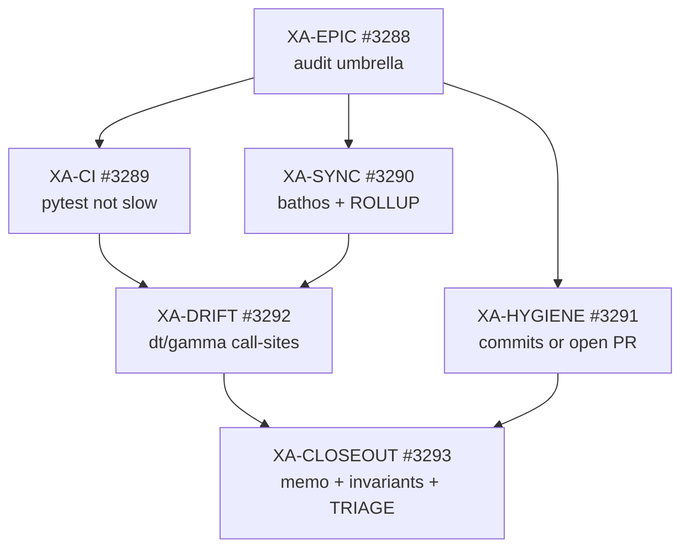

# Backlog DAG — XA-* epic audit (XR-EPIC closeout)

**task_id:** `260710_epic-audit_xtrax-rewire`  
**date:** 2026-07-10  
**registry:** `.praxia/backlog.jsonl` (canonical)  
**praxia DB:** sync **failed** (`insert_backlog` / `insert_staging`) — same outage as XR promotion; daemon/MCP queue will not see these until DB is fixed  
**sprint TOML:** not created (human request)

## Graph

## Edges (`depends_on`)

| ID | praxia_id | depends_on | category | difficulty | status |
|----|-----------|------------|----------|------------|--------|
| XA-EPIC | 3288 | — | audit | standard | ready |
| XA-CI | 3289 | — | testing | standard | ready |
| XA-SYNC | 3290 | — | research | quick | ready |
| XA-HYGIENE | 3291 | — | debt | standard | ready |
| XA-DRIFT | 3292 | 3289, 3290 | audit | standard | ready |
| XA-CLOSEOUT | 3293 | 3292, 3291 | audit | standard | ready |

Parallel ready set: **XA-CI ∥ XA-SYNC ∥ XA-HYGIENE**.

## Spec / design links

| Artifact | Path |
|----------|------|
| Spec (confirmed) | `.praxia/docs/specs/260710_xtrax-rewire_audit_spec.md` |
| Research memo | `.praxia/docs/research/260710_xtrax-rewire_audit.md` |
| Staff design | `.praxia/docs/designs/260710_xtrax-rewire_audit_design.md` |
| Adversarial | `.praxia/docs/audits/260710_xtrax-rewire_audit_adversarial.md` |
| Closed epic | XR-EPIC / `#3270` / `260709_xtrax_rewire` |

## Execution note

Leaves are **ready** for manual or loop TRIAGE pickup. Do not wait on sprint emit. Mark `completed` in `backlog.jsonl` when each track finishes; write closeout memo under XA-CLOSEOUT.
