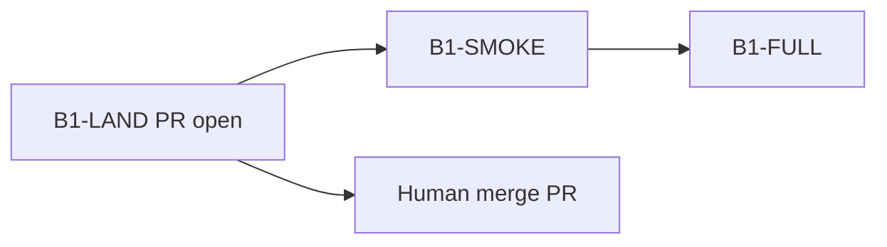

# Next steps — after B1-LAND (PR open)

**date:** 2026-07-11  
**branch:** `audit/xtrax-rewire-xa`  
**PR:** https://github.com/maraxen/prolix/pull/2  
**next epic:** `260528_b1-full`  
**invariants:** `.praxia/loop_priorities.toml`

## Where we are

| Leaf | Status | Gate |
|------|--------|------|
| XA-* audit | **completed** | VERIFY PASS |
| TRIAGE | **completed** | next = B1-full |
| **B1-LAND** | **completed** | push + PR #2 (merge still human) |
| B1-SMOKE | **ready** | B=4 mixed EnsemblePlan |
| B1-FULL | **ready** | B=64 `bth run` |
| XA-NL-DEBT | **ready** | not on B1 critical path |

## Immediate

1. **Human:** review + merge PR #2 when CI is green (agent will not merge).
2. **B1-SMOKE** — B=4 mixed EnsemblePlan regression (prereg).
3. **B1-FULL** — B=64 Claim-1 campaign via `bth run`.

## Callouts

- Cite OMM-WATER via `gate_pass` / JSON, not bathos `outcome`.
- Honor VACUUM-DT + `exception_*` invariants.
