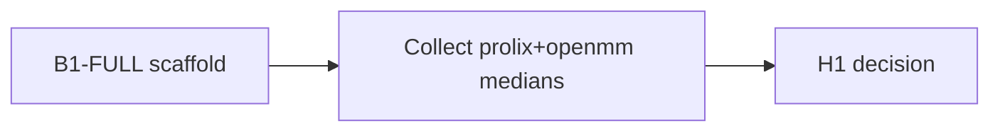

# Next steps — after B1-FULL scaffold

**date:** 2026-07-11  
**branch:** `b1/full`  
**campaign:** `2115b4dd` (`b1-full`, confirmation)  
**PR landed:** https://github.com/maraxen/prolix/pull/2 (merged)  
**next epic:** still `260528_b1-full` until headline medians land  
**invariants:** `.praxia/loop_priorities.toml`

## Where we are

| Leaf | Status | Gate |
|------|--------|------|
| XA-* audit | **completed** | VERIFY PASS |
| TRIAGE | **completed** | next = B1-full |
| B1-LAND | **completed** | PR #2 merged (admin) |
| B1-SMOKE | **completed** | AOT-ratio `< 0.5` |
| **B1-FULL** | **completed** (scaffold + dry-run + campaign + prolix wave queued) | local `--smoke` via `bth run` exit 0; campaign `2115b4dd`; SLURM `17704429_[0-2]` |
| XA-NL-DEBT | **ready** | not on Claim-1 critical path |



## Cluster

**Campaign id:** `2115b4dd`

**Prolix wave (first test):** `FOOTPRINT=l40s` — B=8, 1 ps, chunked scan (peak VRAM ~ chunk).  
Not the Claim-1 headline; `prereg`/`h200` tiers are later. Spec: `.praxia/docs/specs/260712_b1-full-shrink-gpu-footprint-profiles-fi.md`

```bash
export CAMPAIGN_ID=2115b4dd
# First L40S measure (default FOOTPRINT=l40s)
sbatch --array=0-2%3 --export=ALL,CAMPAIGN_ID,FOOTPRINT=l40s \
  scripts/slurm/b1_init_exec.slurm
# Later tiers (gres tag only):
sbatch --gres=gpu:h200:1 --array=0-2%3 --export=ALL,CAMPAIGN_ID,FOOTPRINT=h200 \
  scripts/slurm/b1_init_exec.slurm
sbatch -p mit_preemptable --gres=gpu:a100:1 --array=0-2%3 \
  --export=ALL,CAMPAIGN_ID,FOOTPRINT=a100 scripts/slurm/b1_init_exec.slurm
```

**Local dry-run (green):**
```bash
uv run bth run python scripts/benchmarks/b1_init_exec.py \
  --tag smoke --out tmp/b1_smoke_full.json -- --smoke
```

**Artifacts:** `scripts/benchmarks/b1_init_exec.py` + `.bth.toml`, `scripts/slurm/b1_init_exec.slurm`, `data/pdb/1AKE.pdb`, `data/pdb/4water.pdb`, CSV append `outputs/bench/b1_full.csv`.

## Immediate next

1. Wait for `17704429` → pull results (`bth sync engaging --pull` or rsync catalog).
2. Submit OpenMM array `3-5` when CUDA OpenMM ok on partition.
3. Aggregate median `t_total` prolix vs openmm; check `aot_ratio < 0.5`; decide H1.

## Callouts

- Cite OMM-WATER via `gate_pass` / JSON, not bathos `outcome`.
- Honor VACUUM-DT (`gamma=50` in harness) + `exception_*` invariants.
- Cluster jaxlib may reject prereg triton XLA flag — slurm sets `B1_XLA_TRITON_FLAG=1`; unset if import fails.
