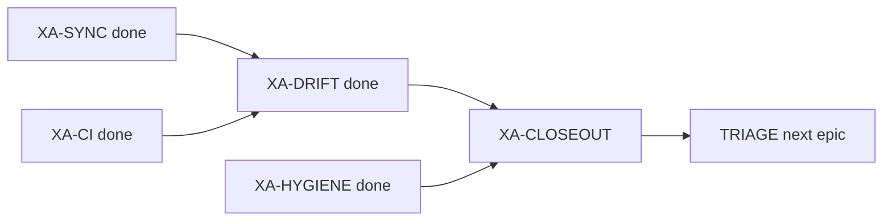

# Next steps — after XA-CI green + Titanix SYNC

**date:** 2026-07-10  
**task_id:** `260710_epic-audit_xtrax-rewire`  
**branch:** `audit/xtrax-rewire-xa`  
**bathos postmortem:** `scripts/experiments/xr_parity_omm_tip3p.py.dfa001bf-….bth.postmortem.toml`

## Where we are

| Leaf | Status | Gate |
|------|--------|------|
| XA-SYNC | **completed** | AC5 PASS (Titanix `dfa001bf`, gate_pass=1) |
| XA-HYGIENE | **completed** | commits on branch (no push/PR yet) |
| XA-CI | **completed** | `not (slow\|integration\|dynamics)` exit 0 — 570 passed, 0 fail (`tmp/xa_ci_junit_final.xml`) |
| XA-DRIFT | **completed** | AC4 call-site audit + freeze invariants (below) |
| XA-CLOSEOUT | **ready** (unblocked) | closeout memo + `loop_priorities.toml` + TRIAGE |

## XA-CI evidence (2026-07-10)

- Command: `uv run pytest -m "not (slow or integration or dynamics)" --timeout=45`
- Result: **570 passed**, 16 skipped, 571 deselected, 0 failures/errors
- Product fixes: `project_momenta` import path; `IntegratorState` `warn_counts`/`rng`/`momenta`; multi-term pad-safe dihedrals; OpenMM bench path; `flash_explicit` `key=` for RFF
- Deselects (→ slow / later TRIAGE): EFA force suites, NPT/SETTLE long trajectories, OpenMM parity modules, LFMiddle, GB multi-protein, replica-exchange API drift, etc.

## XA-DRIFT evidence (2026-07-10)

### Call-site inventory (AC4)

| Class | Sites |
|-------|--------|
| **fs-ok** | `test_ensemble_plan`, `test_api_contract`, `test_b1_smoke`, V3/V4/V5/V6, claim2 W1/W2/W3, `test_xr_vacuum_dt` (default path), `_b1_paramize`, `export_run` EnsemblePlan-backed helpers |
| **akma-escape** | V1 parity (`dt_unit="akma"` vs `settle_langevin`); vacuum escape-hatch test with `dt_fs_to_akma(0.5)` |
| **bug (fixed)** | `make_smoke_diagnostics_fn` / browser W4 path labeled `dt_fs` but passed raw `dt` + `gamma=10` into `settle_langevin` without conversion — now matches EnsemblePlan (fs / ps⁻¹ → AKMA) |
| **docs-only** | `export_run` / `browser_demo` module docs; V1 comment clarifying AKMA escape |

Contract: `uv run pytest tests/api/test_xr_vacuum_dt.py tests/api/test_v1_ensemble_plan_parity.py tests/api/test_claim2_w4_browser_smoke.py -m "not slow"` → exit 0.

### Frozen next-epic invariants (for XA-CLOSEOUT → `loop_priorities.toml`)

1. **VACUUM-DT**
   - `EnsemblePlan.run(dt=)` is **femtoseconds** by default; AKMA only via `dt_unit="akma"`.
   - `EnsemblePlan.run(gamma=)` is **ps⁻¹** (default `10`); converted via `gamma_ps_to_akma`.
   - Vacuum proteins without H-constraints: `gamma >= 50` at `dt=0.5` fs (or smaller dt @ γ=10).
   - Same fs / ps⁻¹ contract applies to `make_single_trajectory_fn`, `make_hetero_trajectory_fn`, and `make_smoke_diagnostics_fn`.
   - Gate: `tests/api/test_xr_vacuum_dt.py`.

2. **exception_*** (AMBER 1-4)
   - `MolecularBundle.exception_{pairs,sigmas,epsilons,chargeprods,mask}` must flow into `energy_fn_from_bundle` ([`src/prolix/api/bundle_md.py`](../../src/prolix/api/bundle_md.py)).
   - Gate: `tests/physics/test_xr_parity_omm_protein.py`.

Do **not** invent additional unit conventions in the next epic without updating these invariants and the vacuum contract test.

## Immediate (P0) — XA-CLOSEOUT

Closeout memo, pin the two invariants above into `loop_priorities.toml` `[invariants]`, backlog epic status, TRIAGE handoff. No push/PR unless requested.

Optional later (not CLOSEOUT-blocking): re-home cheap API-drift fixes (`position` vs `positions`, `key` vs `rng`) deselected under XA-CI.
