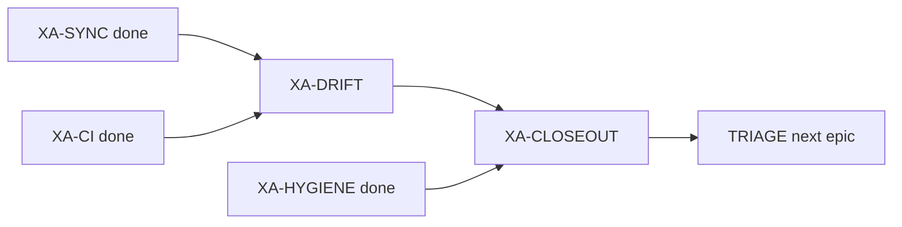

# Next steps — after XA-CI green + Titanix SYNC

**date:** 2026-07-10  
**task_id:** `260710_epic-audit_xtrax-rewire`  
**branch:** `audit/xtrax-rewire-xa`  
**bathos postmortem:** `scripts/experiments/xr_parity_omm_tip3p.py.dfa001bf-….bth.postmortem.toml`

## Where we are

| Leaf | Status | Gate |
|------|--------|------|
| XA-SYNC | **completed** | AC5 PASS (Titanix `dfa001bf`, gate_pass=1) |
| XA-HYGIENE | **completed** | commits on branch (no push/PR yet) |
| XA-CI | **completed** | `not (slow\|integration\|dynamics)` exit 0 — 570 passed, 0 fail (`tmp/xa_ci_junit_final.xml`) |
| XA-DRIFT | **ready** (unblocked) | dt/gamma call-site audit |
| XA-CLOSEOUT | blocked on DRIFT | closeout memo + invariants + TRIAGE |

## XA-CI evidence (2026-07-10)

- Command: `uv run pytest -m "not (slow or integration or dynamics)" --timeout=45`
- Result: **570 passed**, 16 skipped, 571 deselected, 0 failures/errors
- Product fixes: `project_momenta` import path; `IntegratorState` `warn_counts`/`rng`/`momenta`; multi-term pad-safe dihedrals; OpenMM bench path; `flash_explicit` `key=` for RFF
- Deselects (→ XA-DRIFT / slow): EFA force suites, NPT/SETTLE long trajectories, OpenMM parity modules, LFMiddle, GB multi-protein, replica-exchange API drift, etc.

## Immediate (P0) — XA-DRIFT

1. `rg` `EnsemblePlan.run(dt=` / `gamma=` call sites — no silent AKMA.
2. Freeze VACUUM-DT + `exception_*` invariants for next epic.
3. Optionally re-home cheap API-drift fixes (`position` vs `positions`, `key` vs `rng`) that were deselected under XA-CI.

## Then XA-CLOSEOUT

Closeout memo, backlog epic status, TRIAGE handoff. No push/PR unless requested.
