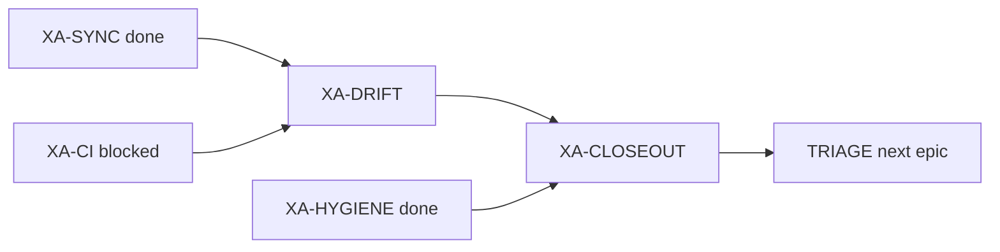

# Next steps — after XA-SYNC Titanix confirm + epic-audit mid-point

**date:** 2026-07-10  
**task_id:** `260710_epic-audit_xtrax-rewire`  
**branch:** `audit/xtrax-rewire-xa`  
**bathos postmortem:** `scripts/experiments/xr_parity_omm_tip3p.py.dfa001bf-….bth.postmortem.toml`

## Where we are

| Leaf | Status | Gate |
|------|--------|------|
| XA-SYNC | **completed** | AC5 PASS (Titanix `dfa001bf`, gate_pass=1) |
| XA-HYGIENE | **completed** | commits on branch (no push/PR yet) |
| XA-CI | **blocked** | default suite not exit-0 (wave1 40 fail + settle hang); XR subset green; EnsemblePlan dt fix landed |
| XA-DRIFT | blocked on CI | dt/gamma call-site audit |
| XA-CLOSEOUT | blocked on DRIFT+HYGIENE | closeout memo + invariants + TRIAGE |

## Immediate (P0) — unblock XA-CI

1. **Triage the wave-1 failure classes** (`tmp/xa_ci_failures.txt`):
   - Already fixed this audit: EnsemblePlan `float(dt)` concretization + V1 `dt_unit=akma`.
   - Likely pre-existing / out of XR scope: `project_momenta` ImportError, OpenMM bench, EFA TypeErrors, bridge bond-length zeros.
   - Hang: `test_settle_preserves_water_geometry` (JAX compile) — mark `slow`/`dynamics` or raise timeout in CI policy; do not block XR closeout on it if GitHub CI already excludes it.
2. **Re-run GitHub-faithful marker** until exit 0 *or* document an explicit allowlist of non-XR failures with xfail/skip policy (prefer fix or deselect, not silent ignore).
3. Mark `XA-CI` completed only on exit 0 (audit AC1).

## Next (P1) — XA-DRIFT then XA-CLOSEOUT

**XA-DRIFT**
- `rg` EnsemblePlan / vacuum callers for AKMA `dt` without `dt_unit="akma"`.
- Freeze invariants for next epic: VACUUM-DT (dt=fs, γ=ps⁻¹) + `exception_*` on energy path.
- NL vs dense tiling assert asymmetry → debt only (already decided).

**XA-CLOSEOUT**
- Write `.praxia/docs/research/260710_xtrax-rewire-epic-closeout-audit.md`.
- Bootstrap `.praxia/loop_priorities.toml` `[invariants]` (`default_ci`, `no_autonomous_push_or_merge_to_main`).
- Verdict: VERIFY PASS iff CI ∧ hygiene ∧ drift; else REQUEST_CHANGES with blockers listed.
- Route `loop.current_phase` → TRIAGE for paper / B1-full / HP4.

## Parallel / optional

| Item | Why |
|------|-----|
| Open PR from `audit/xtrax-rewire-xa` | Satisfies hygiene theater mitigation (land path visible) |
| Fix `debt_bathos_outcome_unknown_gate_pass` | AC2 SQL-only checks stay brittle |
| Fix `debt_praxia_backlog_db_insert` | Daemon/MCP queue blind to XA/XR items |
| Titanix ops note | Always `screen`/`tmux`; myxcel workspace = `/home/solab/projects` |

## After audit VERIFY PASS — next epic candidates

Per XR epic AC8 (kill-fork lifted) and project roadmap:

1. **Paper / B1-full / HP4** — only if closeout AC8 checklist green; call out bathos `outcome=unknown` quirk if citing water gates.
2. **Phase 5 residual** — small-N / weak-γ dt≤0.5 fs (translational finite-size); not blocking paper start if production-scale NVT is the claim.
3. **Phase 6 NPT** — long-trajectory CSVR+SETTLE (separate from this rewire).

## Do not

- Reopen closed XR leaves without a hard regression.
- Push/merge to `main` without human ask.
- Treat bathos `outcome=unknown` as falsification when JSON `gate_pass=1`.
