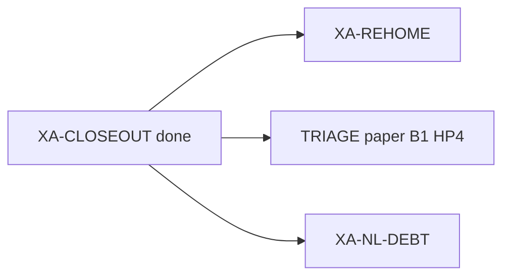

# Next steps — after XA-CLOSEOUT VERIFY PASS

**date:** 2026-07-10  
**task_id:** `260710_epic-audit_xtrax-rewire`  
**branch:** `audit/xtrax-rewire-xa`  
**closeout memo:** `.praxia/docs/research/260710_xtrax-rewire-epic-closeout-audit.md`  
**invariants:** `.praxia/loop_priorities.toml`

## Where we are

| Leaf | Status | Gate |
|------|--------|------|
| XA-SYNC | **completed** | AC2 PASS (Titanix `dfa001bf`, gate_pass=1) |
| XA-HYGIENE | **completed** | commits on branch (no push/PR yet) |
| XA-CI | **completed** | GitHub-faithful suite exit 0 — 570 passed |
| XA-DRIFT | **completed** | AC4 + freeze → `loop_priorities.toml` |
| XA-CLOSEOUT | **completed** | VERIFY PASS (AC5–AC8) |
| XA-EPIC | **completed** | inter-epic audit closed |
| XA-NL-DEBT | **ready** | NL vs dense tile assert — do not reopen XR-BUCKET |
| XA-REHOME | **ready** | cheap API-drift re-admit (replica-exchange, cell_list) |

## Immediate

1. **XA-REHOME** — unmark `slow` only for cheap API-drift (`tests/pt/test_replica_exchange.py`, `tests/test_cell_list.py`); keep heavy/OpenMM/long-MD deselected; GitHub-faithful suite must stay green.
2. **TRIAGE** — human picks next epic slug (paper / B1-full / HP4). AC1∧AC3∧AC5 hold; call out bathos `outcome` quirk and no merge to `main` yet.
3. **Land branch** — push/PR when human requests (invariant: no autonomous push/merge to main).

## Frozen invariants (pinned)

See `.praxia/loop_priorities.toml`: `default_ci`, no autonomous push/merge, EnsemblePlan dt=fs / gamma=ps⁻¹, vacuum γ policy, `exception_*` on bundle energy path.
