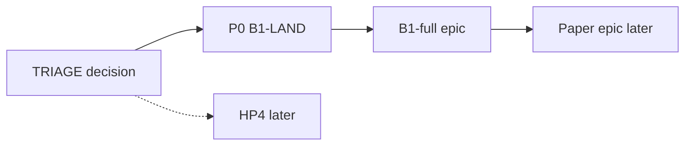

# TRIAGE — next epic after xtrax-rewire audit

**date:** 2026-07-10  
**audit:** `260710_epic-audit_xtrax-rewire` (VERIFY PASS)  
**closeout:** [`.praxia/docs/research/260710_xtrax-rewire-epic-closeout-audit.md`](../research/260710_xtrax-rewire-epic-closeout-audit.md)  
**branch:** `audit/xtrax-rewire-xa`  
**invariants:** [`.praxia/loop_priorities.toml`](../../loop_priorities.toml)

## Gate check (AC8)

| Prerequisite | Status |
|--------------|--------|
| AC1 CI green | PASS (591 passed after XA-REHOME) |
| AC3 Hygiene | PASS (commits on branch; push/PR deferred) |
| AC5 Closeout memo | PASS |
| AC2 bathos quirk | Call out: cite JSON / `gate_pass`, not `outcome` alone |

## Decision (locked)

**Next epic: B1-full** — Claim 1 heterogeneous init-bound throughput (`260528_b1-full`).

| Candidate | Verdict | Why |
|-----------|---------|-----|
| **B1-full** | **accept** | XR-KILL-FORK AC8 lifted paper/**B1-full**; prereg + path-fix specs exist; produces Claim-1 numbers without manuscript vapor |
| Paper | **defer** | Branch not on `main`; bathos `outcome=unknown` quirk — no numeric manuscript claims yet |
| HP4 | **defer** | Fitting follow-on; not on XR→Claim-1 critical path |

**P0 before paper (recommended before B1 cluster spend):** land `audit/xtrax-rewire-xa` via push + PR (human; honor `no_autonomous_push_or_merge_to_main`).

## Binding specs

- Prereg (protocol + success criteria): [`.praxia/docs/specs/260528_b1-preregistration.md`](../specs/260528_b1-preregistration.md)
- Path fix (protein EnsemblePlan unblock): [`.praxia/docs/specs/260706_b1-core-md-path-fix.md`](../specs/260706_b1-core-md-path-fix.md) — largely unblocked by XR-VACUUM-DT / A2A3 / PROT / exception_*

## Cadence (from prereg — do not amend here)

| Leaf | Cadence | Tracking |
|------|---------|----------|
| B1-SMOKE | B=4 mixed bundles | pytest / CI |
| B1-FULL | B=64 (4×16), 100 ps, `bth run` | bathos campaign; not pytest |

## Callouts for the next epic

1. Land branch before citing XR/OMM-WATER numbers in paper.
2. Cite Titanix water via `gate_pass` / JSON fields (`dfa001bf`), not bathos `outcome`.
3. Honor VACUUM-DT + `exception_*` invariants in `loop_priorities.toml`.
4. `XA-NL-DEBT` stays ready debt — not on B1 critical path; do not reopen XR-BUCKET without silent-drop repro.
