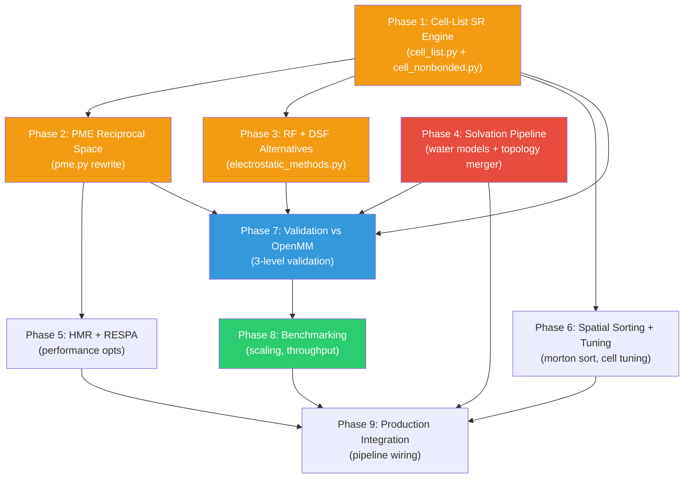

# Explicit Solvent: Implementation, Validation & Benchmarking Plan

## Context

Extend FlashMD from dense implicit-solvent (Generalized Born) to sparse explicit-solvent MD, preserving JAX/XLA massive-batching performance. Work happens on the **isolated worktree** at `/home/maarxaru/projects/noised_cb_explicit` on branch `feat/explicit-solvent`.

### Existing Infrastructure

| Module | Status | What's There |
|--------|--------|-------------|
| `settle.py` | ✅ Complete | SETTLE position + RATTLE velocity, **already parameterized** (`r_OH`, `r_HH` args) |
| `solvation.py` | ✅ Complete | `solvate()`, `add_ions()`, `load_tip3p_box()`, water tiling, dedup, clash pruning |
| `pbc.py` | ✅ Complete | `create_periodic_space()`, `minimum_image_distance()`, `wrap_positions()` |
| `flash_nonbonded.py` | ✅ Complete (implicit) | Dense T×T tiled GB+LJ+Coulomb — the "Flash" model to extend |
| `padding.py` | ✅ Complete (implicit) | `PaddedSystem`, `pad_protein`, bucketing, collation |
| `batched_energy.py` | ✅ Complete (implicit) | `single_padded_energy`, `single_padded_force`, custom VJP LJ |
| `batched_simulate.py` | ✅ Complete (implicit) | BAOAB Langevin, FIRE minimizer, `lax.scan` loops |
| `pme.py` | ⚠️ Scaffold only | Wraps `jax_md.energy.coulomb_recip_pme` — needs full rewrite |

### Reference Documents

- [explicit_solvent_architecture.md](file:///home/marielle/projects/noised_cb/docs/design/explicit_solvent_architecture.md) — 1400-line architecture doc
- [gpu_optimization_strategies.md](file:///home/marielle/projects/noised_cb/docs/explicit_impl_notes/gpu_optimization_strategies.md)
- [phase4_solvation_synthesis.md](file:///home/marielle/projects/noised_cb/docs/nlm_queries/phase4_solvation_synthesis.md) — NLM research grounding (9 queries)

---

## Phase Roadmap



> **Phase 4 is ACTIVE.** P1 can run in parallel.

---

# Phase 4: Solvation Pipeline — Detailed Design

**Goal**: Support TIP3P and OPC3 water models with correct force field parameters, topology merging, and solvation-specific equilibration protocols.

**Grounding**: All parameter decisions sourced from [NLM synthesis report](file:///home/marielle/projects/noised_cb/docs/nlm_queries/phase4_solvation_synthesis.md).

---

## 4.1 Water Model Registry

### [NEW] `../prolix/physics/water_models.py`

Central parameter registry for water models. All constants in AMBER units (Å, kcal/mol, e).

```python
from enum import Enum
from dataclasses import dataclass

class WaterModelType(Enum):
    TIP3P = "tip3p"
    OPC3 = "opc3"

@dataclass(frozen=True)
class WaterModelParams:
    """Complete parameter set for a 3-site water model."""
    name: str
    # Charges
    charge_O: float    # e
    charge_H: float    # e
    # LJ (oxygen only — H has no LJ in AMBER)
    sigma_O: float     # Å
    epsilon_O: float   # kcal/mol
    # Geometry (for SETTLE constraints)
    r_OH: float        # Å — O-H bond length
    r_HH: float        # Å — H-H distance
    theta_HOH: float   # degrees — H-O-H angle
    # Clash radius for solvation box pruning
    water_radius: float  # Å — VdW radius of O (sigma * 2^(-1/6) / 2)
```

**Parameter values** (from NLM Q1-Q2, verified against OpenMM XML):

| Parameter | TIP3P | OPC3 | Source |
|-----------|-------|------|--------|
| `charge_O` | -0.834 | -0.8952 | Jorgensen 1983 / Izadi 2016 |
| `charge_H` | +0.417 | +0.4476 | |
| `sigma_O` | 3.15061 | 3.16655 | **Must verify from AMBER XML** |
| `epsilon_O` | 0.1521 | 0.1553 | **Must verify from AMBER XML** |
| `r_OH` | 0.9572 | 0.9782 | NLM Q1 confirmed |
| `r_HH` | 1.5139 | 1.5533 | Computed from geometry |
| `theta_HOH` | 104.52° | 109.47° | NLM Q1 confirmed |
| `water_radius` | 1.768 | ~1.776 | sigma × 0.56123 |

> [!IMPORTANT]
> **Open verification needed**: OPC3 LJ σ/ε values flagged as external knowledge by NLM. Must extract from `amber14/opc3.xml` or Izadi & Onufriev 2016 paper before implementation.

~80 LOC

---

## 4.2 Ion Parameter Registry

### [NEW] `../prolix/physics/ion_params.py`

Model-specific ion parameters. Critical: OPC3 uses Li/Merz, NOT Joung-Cheatham.

```python
@dataclass(frozen=True)
class IonParams:
    """LJ parameters for monovalent ion."""
    name: str
    charge: float      # e
    sigma: float       # Å
    epsilon: float     # kcal/mol
    mass: float        # amu

# Registry keyed by (WaterModelType, ion_name)
ION_REGISTRY: dict[tuple[WaterModelType, str], IonParams]
```

**Sources for parameter values**:

| Ion | Water Model | Parameter Set | Reference |
|-----|------------|---------------|-----------|
| Na⁺ | TIP3P | Joung-Cheatham | JPCB 2008, `frcmod.ionsjc_tip3p` |
| Cl⁻ | TIP3P | Joung-Cheatham | JPCB 2008, `frcmod.ionsjc_tip3p` |
| Na⁺ | OPC3 | **Li/Merz** | Sengupta et al., JCIM 2021 |
| Cl⁻ | OPC3 | **Li/Merz** | Sengupta et al., JCIM 2021 |

> [!WARNING]
> Using Joung-Cheatham ions with OPC3 will give incorrect bulk ion behavior. The Li/Merz parameterization is explicitly developed for OPC3.

**Action**: Extract exact σ/ε from AMBER `frcmod` files or Sengupta 2021 Table 2.

~60 LOC

---

## 4.3 OPC3 Water Box Generation

### Task: Generate `../prolix/data/water_boxes/opc3.npz`

Pre-equilibrate a box of OPC3 water using OpenMM:

```python
# Script: scripts/prep/generate_opc3_waterbox.py
from openmm.app import ForceField, Modeller
ff = ForceField('amber14/protein.ff14SB.xml', 'amber14/opc3.xml')
modeller = Modeller(Topology(), [])
modeller.addSolvent(ff, model='opc3', boxSize=Vec3(3,3,3)*nanometers)
# Run 100 ps NPT → write coordinates to .npz
```

Must verify the `.npz` uses OPC3 geometry (r_OH=0.9782, θ=109.47°) and not TIP3P.

~150 LOC script

---

## 4.4 Solvation Module Updates

### [MODIFY] `../prolix/physics/solvation.py`

| Change | Details |
|--------|---------|
| `load_water_box(model: WaterModelType)` | Dispatch to TIP3P or OPC3 `.npz` file based on enum |
| `_prune_solute_clashes()` | Accept `water_radius` param instead of hardcoded `TIP3P_WATER_RADIUS` |
| `solvate()` | Accept `water_model: WaterModelType = WaterModelType.TIP3P` parameter |
| `add_ions()` | Accept `water_model` to select correct ion parameters from registry |

**Current issue**: `_prune_solute_clashes` hardcodes `TIP3P_WATER_RADIUS = 1.768` (line 19, 197). OPC3 has slightly different σ → different clash radius.

~50 LOC changes

---

## 4.5 Topology Merger — The Core Phase 4 Work

### [NEW] `../prolix/physics/topology_merger.py`

Merges protein `Protein` topology with water molecules and ions into a single unified topology suitable for `PaddedSystem`. This is the most complex new code in Phase 4.

#### Responsibilities

1. **Water bonds/angles** (for minimization):
   - O-H₁ bond: `(k_bond, r_OH)` — standard harmonic
   - O-H₂ bond: `(k_bond, r_OH)` — standard harmonic
   - H₁-O-H₂ angle: `(k_angle, theta_HOH)` — standard harmonic
   - **These ARE evaluated during minimization** but **skipped during dynamics** (SETTLE handles geometry) — per NLM Q3

2. **Water exclusions** (always active):
   - All 3 intramolecular pairs fully excluded: O-H₁ (1-2), O-H₂ (1-2), H₁-H₂ (1-3)
   - Scale factors: `excl_scale_vdw = 0.0`, `excl_scale_elec = 0.0`
   - No 1-4 pairs in 3-site water
   - **No protein-water cross-exclusions** (no covalent bonds between them)

3. **Ion handling**:
   - Single-atom residue, no bonds/angles/dihedrals
   - LJ + Coulomb via nonbonded only
   - No exclusions (no intramolecular pairs)

4. **Index offset management**:
   - Protein atoms: indices `[0, N_protein)`
   - Water atoms: indices `[N_protein, N_protein + 3*N_waters)`
   - Ion atoms: indices `[N_protein + 3*N_waters, N_total)`

```python
@dataclass
class SolvatedTopology:
    """Complete topology for protein + water + ions."""
    # Positions
    positions: Array       # (N_total, 3)
    box_size: Array        # (3,)
    
    # Per-atom properties (concatenated: protein | waters | ions)
    charges: Array         # (N_total,)
    sigmas: Array          # (N_total,)
    epsilons: Array        # (N_total,)
    masses: Array          # (N_total,)
    elements: list[str]    # length N_total
    atom_names: list[str]  # length N_total
    
    # Merged bonded terms (protein + water bonds/angles)
    bonds: Array           # (N_bonds_total, 2)
    bond_params: Array     # (N_bonds_total, 2) — [r0, k]
    angles: Array          # (N_angles_total, 3)
    angle_params: Array    # (N_angles_total, 2)
    
    # Protein-only terms (water has no dihedrals/impropers/CMAPs)
    proper_dihedrals: Array
    dihedral_params: Array
    impropers: Array
    improper_params: Array
    cmap_torsions: Array | None
    cmap_coeffs: Array | None
    
    # Exclusions (sparse — protein exclusions + water intramolecular pairs)
    exclusion_pairs: list[tuple[int, int, float, float]]  # (i, j, vdw_scale, elec_scale)
    
    # Metadata
    n_protein_atoms: int
    n_waters: int
    n_ions: int
    water_model: WaterModelType
    water_indices: Array   # (N_waters, 3) — [O, H1, H2] per water
```

#### Key function

```python
def merge_topology(
    protein: Protein,
    water_positions: Array,
    ion_positions: Array,
    ion_types: list[str],  # ["NA", "NA", "CL", "CL", ...]
    water_model: WaterModelType = WaterModelType.TIP3P,
    box_size: Array | None = None,
) -> SolvatedTopology:
    """Merge protein, water, and ions into a single solvated topology."""
```

~350 LOC

---

## 4.6 PaddedSystem Extensions

### [MODIFY] `../prolix/padding.py`

Add `None`-defaulted fields for explicit solvent metadata (backward compatible):

```python
class PaddedSystem(eqx.Module):
    # ... existing fields ...
    
    # Explicit solvent metadata (None for implicit solvent — backward compatible)
    box_size: Array | None = None           # (3,) periodic box dimensions
    water_indices: Array | None = None      # (N_waters, 3) int — [O, H1, H2]
    water_mask: Array | None = None         # (N_padded,) bool — True for water atoms
    ion_mask: Array | None = None           # (N_padded,) bool — True for ion atoms
    n_waters: int = 0                       # Number of water molecules
    settle_r_OH: float = 0.9572             # SETTLE geometry (model-specific)
    settle_r_HH: float = 1.5139             # SETTLE geometry (model-specific)
```

### [NEW] `pad_solvated_system()` function

```python
def pad_solvated_system(
    topology: SolvatedTopology,
    target_atoms: int,
    target_bonds: int | None = None,
    # ... other targets ...
) -> PaddedSystem:
    """Pad a solvated system — analogous to pad_protein but with water/ion handling."""
```

This function:
1. Calls existing `pad_array()` for all per-atom arrays (positions, charges, etc.)
2. Concatenates protein + water bonds/angles into bonded arrays
3. Builds exclusion arrays including water intramolecular pairs
4. Sets `water_indices`, `water_mask`, `ion_mask`, `settle_r_OH/r_HH`
5. Uses bucket sizes from ATOM_BUCKETS (extended to 65536 for solvated systems)

~200 LOC

---

## 4.7 SETTLE Integration

### [MODIFY] `../prolix/batched_simulate.py`

The SETTLE module is already parameterized (`settle_positions(r_OH=..., r_HH=...)`). The integrator just needs to:

1. Check `sys.water_indices is not None`
2. Pass `sys.settle_r_OH`, `sys.settle_r_HH` to `settle_positions()` and `settle_velocities()`

```python
# In BAOAB integrator step:
if sys.water_indices is not None:
    positions = settle_positions(
        positions, old_positions, sys.water_indices,
        r_OH=sys.settle_r_OH, r_HH=sys.settle_r_HH,
    )
```

~20 LOC changes

---

## 4.8 Explicit Solvent Equilibration Protocol

### Differences from Implicit Solvent (NLM Q7, Q9)

| Stage | Implicit (current) | Explicit (new) |
|-------|-------------------|----------------|
| Minimization 1 | FIRE, no restraints | FIRE with **500 kcal/mol/Ų restraints on protein heavy atoms** (solvent relaxation) |
| Minimization 2-4 | N/A | Step down restraints: 125 → 25 → 0 kcal/mol/Ų |
| NVT Heating | Not staged | **50K → 300K** over 100-300 ps, Langevin γ=1.0 ps⁻¹ |
| NPT Density Eq | Not needed | **1 atm**, release remaining restraints, 1-2 ns |
| COM Removal | Not needed | Apply periodically to prevent flying ice cube |

> [!IMPORTANT]
> **Why restraints are critical for explicit solvent**: Packed water molecules have artificial starting orientations. Their unphysical electrostatic forces will tear the protein apart during initial minimization unless the protein is frozen. In implicit solvent, the "solvent" is a mathematical continuum with no such artifacts.

### Implementation

This is a **Phase 9 deliverable** (production integration), but the `PaddedSystem` must carry all necessary metadata now. The staged equilibration code will use:
- `sys.is_heavy` mask for protein heavy-atom restraints
- `sys.water_mask` to identify which atoms are solvent
- Spring constant schedule as `lax.scan`-amenable parameter

---

## 4.9 Verification Plan

### 4.9a Parameter Extraction Verification

Before writing code, extract and verify all parameters:

- [ ] Extract OPC3 LJ σ/ε from OpenMM `amber14/opc3.xml`
- [ ] Extract Li/Merz Na⁺/Cl⁻ σ/ε from `amber14/opc3.xml` (packaged together)
- [ ] Verify OPC3 r_HH = 2 × 0.9782 × sin(109.47°/2) = 1.5533 Å against OpenMM SETTLE
- [ ] Cross-check TIP3P parameters against `amber14/tip3p.xml` (sanity check)

### 4.9b Topology Merger Unit Tests

```python
# tests/test_topology_merger.py
def test_water_bonds_present_in_merged():
    """Water O-H bonds and H-O-H angles must be in bonded arrays."""

def test_water_exclusions_complete():
    """All 3 intramolecular water pairs fully excluded."""

def test_no_cross_exclusions():
    """No protein-water cross-exclusions exist."""

def test_ion_no_bonded_terms():
    """Ions contribute zero bonds/angles/dihedrals."""

def test_index_offset_correctness():
    """Water atom indices correctly offset by N_protein."""
```

### 4.9c OpenMM Single-Point Energy Comparison

Use the same solvated system in both FlashMD and OpenMM:

```python
# scripts/validation/compare_solvated_energy.py
# 1. Build solvated system in OpenMM with ff14SB + tip3p/opc3
# 2. Extract parameters and coordinates
# 3. Build PaddedSystem from same coordinates
# 4. Compare bonded energies (bonds, angles — should match to <0.001 kcal/mol)
# 5. Compare LJ + Coulomb (when SR engine is ready — Phase 7)
```

| Component | Target Agreement |
|-----------|-----------------|
| Water bond energy | < 0.001 kcal/mol |
| Water angle energy | < 0.001 kcal/mol |
| Total bonded (protein + water) | < 0.01 kcal/mol |
| LJ (deferred to Phase 7) | < 0.1 kcal/mol |
| Coulomb (deferred to Phase 7) | < 0.1 kcal/mol |

### 4.9d Water Model Validation Metrics (Phase 7 forward-looking)

From NLM Q8:

| Property | TIP3P | OPC3 | Experiment | Tolerance |
|----------|-------|------|------------|-----------|
| Density (g/cm³) | 0.97-0.99 | ~0.999 | 0.997 | ±2% |
| Diffusion (10⁻⁵ cm²/s) | 5.1-5.8 | ~2.4 | 2.3 | ±5-10% |
| NVE drift (kBT/ns/DOF) | — | — | — | ≤ 0.02 |

---

## User Review Required

> [!IMPORTANT]
> **Parameter verification**: OPC3 LJ σ/ε values are from external knowledge (not confirmed by NLM notebook). I plan to extract these directly from OpenMM's `amber14/opc3.xml` before coding. Is this approach acceptable, or should we additionally cross-check against the Izadi 2016 paper?

> [!IMPORTANT]
> **Water bond force constants**: NLM confirmed water bonds are in the topology for minimization. The standard AMBER harmonic O-H bond force constant is ~553 kcal/mol/Ų and H-O-H angle constant is ~100 kcal/mol/rad². Should I extract these from OpenMM XML as well, or use standard literature values? (These are only used during minimization — SETTLE overrides during dynamics.)

> [!NOTE]
> **Scope boundary**: This Phase 4 plan covers topology and parameter setup. The actual energy evaluation of solvated systems requires Phase 1 (cell-list SR engine) or the existing dense kernel. Should Phase 4 validation use the dense kernel (N² — will be slow for large solvated systems but correct) or wait for Phase 1?

---

## Summary of New/Modified Files

| Action | File | ~LOC | Description |
|--------|------|------|-------------|
| **NEW** | `../prolix/physics/water_models.py` | 80 | Water model enum + parameter registry |
| **NEW** | `../prolix/physics/ion_params.py` | 60 | Ion parameter registry (per water model) |
| **NEW** | `../prolix/physics/topology_merger.py` | 350 | Merge protein + water + ions into unified topology |
| **NEW** | `scripts/prep/generate_opc3_waterbox.py` | 150 | Generate OPC3 .npz via OpenMM |
| **MODIFY** | `../prolix/physics/solvation.py` | +50 | Multi-model dispatch, parameterized clash radii |
| **MODIFY** | `../prolix/padding.py` | +200 | `pad_solvated_system()`, new PaddedSystem fields |
| **MODIFY** | `../prolix/batched_simulate.py` | +20 | SETTLE model-specific parameters |
| **NEW** | `tests/test_topology_merger.py` | 150 | Topology merger unit tests |
| **NEW** | `tests/test_water_models.py` | 80 | Water model parameter tests |
| **Total** | | **~1140** | |

---

# Phases 1-3 and 5-9 (Preserved from Original Roadmap)

<details>
<summary>Phase 1: Cell-List Short-Range Engine (PARALLEL with Phase 4)</summary>

**Goal**: Replace dense N² evaluation with cell-list tiled short-range kernel.

**Decision**: Grid-shift half-shell (Option B) first, `lax.scan` fallback (Option A).

**New Files**: `cell_list.py` (~250 LOC), `cell_nonbonded.py` (~400 LOC)

**Key tasks**:
- Cell-list builder with ghost atom sanitization
- Grid-shift half-shell SR kernel (13 `jnp.roll` iterations)
- Two-layer exclusion architecture
- Validation: single-point LJ vs dense FlashMD kernel

</details>

<details>
<summary>Phase 2: PME Reciprocal Space</summary>

**Goal**: Custom SPME with `custom_vjp` analytical forces.

**Key decisions**: 
- Analytical forces via `jax.custom_vjp`
- `jnp.fft.rfftn` / `irfftn` (halves Z-dimension)
- Grid dimensions factorize into 2,3,5,7
- Morton-sort before B-spline spreading

</details>

<details>
<summary>Phase 3: RF + DSF Alternatives</summary>

**Goal**: Pluggable Tier 2/3 electrostatics (no grids).
- Reaction Field, DSF, unified `ElectrostaticMethod` enum

</details>

<details>
<summary>Phase 5: HMR + RESPA + MC Barostat</summary>

**Goal**: 2× timestep (4 fs via HMR) + RESPA every 2 steps + NPT capability.
- All optional config settings
- MC barostat for density convergence

</details>

<details>
<summary>Phase 6: Spatial Sorting + Tuning</summary>

**Goal**: Morton Z-order sorting, cell overflow detection, benchmark sorted vs unsorted.

</details>

<details>
<summary>Phase 7: Validation vs OpenMM</summary>

**Goal**: 3-level validation: single-point → 100 ps NVT → 10 ns production.
- Kahan verification gate
- O-O RDF, density, diffusion validation

</details>

<details>
<summary>Phase 8: Benchmarking (engaging cluster)</summary>

**All benchmarks on engaging cluster** via SLURM `mit_preemptable` partition.
- Preemptable-safe via `jax.experimental.io_callback`
- A100/H100/H200 GPU targets

</details>

<details>
<summary>Phase 9: Production Integration</summary>

- Full config schema (water model, ion conc, electrostatic tier, box padding, HMR, RESPA)
- Staged equilibration: NVT heating → NPT density eq
- Trajectory I/O with optional solvent stripping

</details>

---

## Open Questions (from Original Plan — Resolved)

> [!NOTE]
> **All original questions resolved (2026-03-30).** See Oracle Critique Resolution below.

## Oracle Critique Resolution

> | # | Severity | Resolution |
> |---|----------|------------|
> | 1 | **Critical** | ✅ PaddedSystem uses `None`-default fields |
> | 2 | **Critical** | ✅ Two-layer exclusion architecture |
> | 3 | Warning | ✅ Ghost atom sanitization contract |
> | 4 | Warning | ⚠️ PME LOC acknowledged |
> | 5 | Warning | ✅ MC Barostat in Phase 5b |
> | 6 | Suggestion | ✅ Kahan verification in Phase 7 |

## Verification Plan

### Automated Tests
- `just test-grep topology_merger` — unit tests for topology merger
- `just test-grep water_models` — parameter registry tests
- `scripts/validation/compare_solvated_energy.py` — OpenMM parity

### Manual Verification
- Visual inspection of solvated system in VMD/PyMOL
- Parameter cross-check against OpenMM XML files
