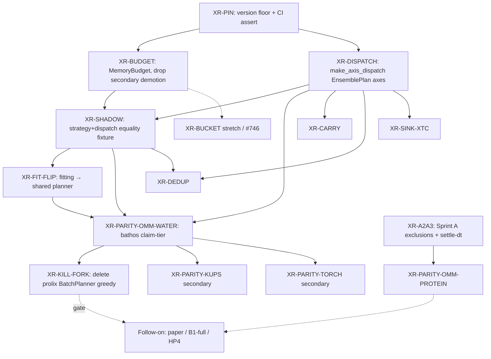

# Epic: Prolix × xtrax 0.4 Rewire + Parity Gates

## Winner (from contemplex e7f1c1ef)

**Hybrid pin-first + water-parity-gated cut** (revised after adversarial critique):

1. Pin a single xtrax floor.
2. Adopt joint `MemoryBudget` under the adapter (delete secondary demotion).
3. Shadow equality (strategy objects + runtime dispatch) between fitting and MD planners.
4. Flip fitting onto the shared path.
5. OpenMM TIP3P water confirmatory parity (bathos claim-tier).
6. Kill the prolix `BatchPlanner` fork.
7. `make_axis_dispatch` hard-gated into shadow/water (not optional).

Sprint A A2/A3 stays a **sibling** physics track; it gates protein OpenMM parity only — not fork kill.

Paper / B1-full / HP4 remain a **follow-on epic** after `XR-KILL-FORK`.

## Acceptance Criteria (epic-level; leaves get GWT)

| ID | Given | When | Then |
|----|-------|------|------|
| AC1 | CI / lockfile | import xtrax | `__version__` meets documented floor; main and worktree agree on policy |
| AC2 | Adapter | plan under budget | uses `MemoryBudget` + `lowered_memory_estimate` / `device_memory_budget`; no host `while estimate_memory` demotion loop |
| AC3 | Fixed fixture axes | shadow test runs | fitting plan decisions equal MD plan decisions on **strategy type** and `batch_size`; runtime `make_axis_dispatch` agrees |
| AC4 | Fitting entrypoint | `make_fitting_planner` | does not call prolix greedy `.plan()` |
| AC5 | TIP3P NVT fixture | bathos confirmatory campaign | OpenMM ΔE/ΔF/T within sidecar gates; residual outcome = rewire falsified |
| AC6 | Post-kill tree | `rg` under `src/prolix/tiling` | no `prolix budget demotion` / greedy planner loop; no competing `BatchPlanner.plan` |
| AC7 | V7 | joint-budget cases | rewritten to xtrax semantics (not deleted) |
| AC8 | Paper epic | start checklist | blocked until AC6 |

## Decision Log

| Option | Verdict | Rationale |
|--------|---------|-----------|
| Kill-fork-now (one-cut) | reject | Breaks V7/adapter/fitting contracts day one; EnsembleMDPlanner already on adapter |
| Pure Strangler (no kill-date) | reject as winner | Dual authority can persist indefinitely (probe C) |
| Hybrid + water kill-date | accept (revised) | Explicit falsifiable "rewire done"; strangler start for reversibility |
| FIT-FLIP before BUDGET | reject | Bakes dual-demotion into second consumer |
| BUDGET → SHADOW → FIT-FLIP → WATER → KILL | accept | Adversarial fix |
| MolecularBundle as StageBundle | defer | Orthogonal blast radius — StageBundle is Optional-callable slots, not an MD host→device data contract |
| Adopt xtrax ZarrStagingSink for MD traj | reject | Wrong format for MD; compose XTC (via proxide) with xtrax sink protocol instead |
| CarrySpec on time / replica axes | accept (promote) | MD is carry-bearing scan; planner should declare Scan via CarrySpec rather than ad-hoc lax.scan |
| DedupGather for duplicate topologies | accept (promote) | Hetero ensembles / multi-seed / conformer batches often share topology — Dedup amortizes body K≪N |
| kUPS / TorchMD parity | secondary | After OpenMM water; not on kill critical path |
| Sprint A on tiling critical path | reject | Physics ≠ tiling; sibling only |

## Assumptions

| ID | Assumption | Risk if false |
|----|------------|---------------|
| A1 | OpenMM water + strategy shadow catch bad rewires | Physics-only gates miss tile-size bugs → mitigate via AC3 |
| A2 | `lowered_memory_estimate` usable on CI CPU and cluster GPU | Device skew → pin estimator policy in XR-BUDGET |
| A3 | Worktree can move from PyPI 0.3 pin to agreed floor | Cutover friction → XR-PIN owns policy |
| A4 | V7 can be rewritten not deleted | Loss of demotion oracle → AC7 |

## TBDs

| ID | Item | Owner when promoted |
|----|------|---------------------|
| T1 | Exact xtrax version floor (path-dep vs `>=0.4.0a5,<0.5`) | **RESOLVED 2026-07-09:** one PyPI pin `xtrax>=0.4.0a5,<0.5` everywhere |
| T2 | OMM-WATER numeric tolerances + fixture hash | XR-PARITY-OMM-WATER sidecar |
| T3 | AxisSpec field mapping table (`axis_index`/`doc` ↔ `role`/`bucket_boundaries`) | XR-SHADOW / XR-KILL-FORK |
| T4 | Whether XR-BUCKET (#746) is stretch in-epic or post-kill | backlog triage |

## Pre-mortem Record

Failure mode (6 mo): kill declared after water+shadow, but shadow compared ints only; renamed secondary demotion returned; hand-rolled estimator disagreed with XLA `memory_analysis`; V7 deleted; paper started on half-rewire; A2 never landed so protein stayed "blocked."

Mitigations encoded as AC2–AC8 and revised DAG edges.

## Backlog DAG (proposed)

### Leaf summaries (promote to backlog)

| ID | Depends on | Deliverable |
|----|------------|-------------|
| **XR-PIN** | — | Single dep policy; `xtrax.__version__` CI floor; align main path-dep vs worktree |
| **XR-BUDGET** | PIN | `MemoryBudget` in `xtrax_adapter`; remove secondary `while`; estimator = xtrax natives |
| **XR-DISPATCH** | PIN | All EnsemblePlan axes via `make_axis_dispatch`; retire prolix `safe_map` on that path |
| **XR-SHADOW** | BUDGET, DISPATCH | Pytest: fitting↔MD strategy equality + dispatch agreement |
| **XR-FIT-FLIP** | SHADOW | `run/spec.py` / `make_fitting_planner` → shared path |
| **XR-PARITY-OMM-WATER** | FIT, DISPATCH, SHADOW | Confirmatory bathos campaign + claim.toml vs OpenMM TIP3P |
| **XR-KILL-FORK** | WATER | Delete prolix greedy planner; thin re-exports only; V7 rewritten |
| **XR-A2A3** | — (parallel) | Sprint A A2 exclusions + A3 settle-dt |
| **XR-PARITY-OMM-PROTEIN** | A2A3, KILL (soft) | Protein OpenMM parity after physics path fixed |
| **XR-PARITY-KUPS / TORCH** | WATER | Secondary sidecars |
| **XR-BUCKET** | BUDGET (stretch) | Host `bucketize` / #746 |

## Sink / Carry / Dedup (revised 2026-07-09)

**Why Zarr was deferred (and stays rejected for MD traj):** brainstorm deferred
"Zarr sinks" as optional. That was the wrong framing. MD trajectories should
**not** land in `ZarrStagingSink`. Proxide already has `XtcWriter` (Rust) and
XTC parse parity; prolix already depends on proxide. Correct leaf:
**XR-SINK-XTC** — compose xtrax `SinkSpec` / `AxisBoundary` Tap-Sink protocol
with a proxide XTC writer (host `io_callback`), not adopt xtrax's Zarr
implementation.

**Why Carry/Dedup were deferred (and should not stay deferred):** "no MD
caller yet" was true as a *wiring* fact, not a *value* fact.
- **CarrySpec** maps directly onto MD: step axis = `Scan(transition, init=state)`
  with carry = integrator state. EnsemblePlan already scans; declaring
  `CarrySpec` lets `BatchPlanner` pre-demote to Scan instead of ad-hoc
  `lax.scan` outside the plan.
- **DedupGather** maps onto Claim-1-adjacent batches: many seeds/temps on the
  same topology → unique K ≪ N. Fitting `N_CONFORMERS` / multi-replica
  ensembles are the first callers.

| ID | Depends on | Notes |
|----|------------|-------|
| **XR-CARRY** | XR-DISPATCH | Declare CarrySpec for MD step (and optional replica) axes; wire Scan via make_axis_dispatch |
| **XR-DEDUP** | XR-DISPATCH, XR-SHADOW | DedupSpec for duplicate-topology ensemble axes; host unique_indices before JIT |
| **XR-SINK-XTC** | XR-DISPATCH | Proxide XTC writer + xtrax sink/boundary composition; **not** ZarrStagingSink |
| StageBundle | — | Still deferred |

Place CARRY/DEDUP after DISPATCH (need iterator path real); SINK-XTC can
parallel WATER once DISPATCH applies iterators. None gate XR-KILL-FORK.

## Out of scope (follow-on)

- Claim-1 B1-full throughput vs OpenMM
- HP4 ANI-1x → §7.1 figure
- NPT long-traj / Phase 6–7
- MolecularBundle as xtrax StageBundle
- Adopting xtrax `ZarrStagingSink` for production MD trajectories

## Next step

Promote leaf items from staging to backlog, then route through `spec_driven_dev` starting at `spec_challenge` per leaf (or a thin umbrella challenge citing this epic).
