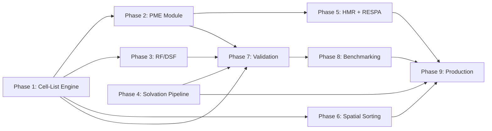

# Explicit Solvent Architecture for FlashMD

> **Status**: Design Document (Draft)
> **Date**: 2026-03-22
> **Scope**: Extending FlashMD from dense implicit-solvent (Generalized Born) to
> sparse explicit-solvent MD, preserving JAX/XLA massive-batching performance.

---

## 1. Motivation: The Dense→Sparse Crossover

FlashMD currently evaluates implicit solvent (Generalized Born) using dense
$O(N_{prot}^2)$ pairwise interactions. This works well for small proteins but
becomes computationally wasteful as system size grows, because the cost of
explicit solvent with cutoffs scales as $O(N_{tot} \cdot k)$ where $k$ is the
roughly constant number of neighbors within the cutoff sphere.

### Worked Example: A Typical Drug Target

Consider a protein with $N_{prot} = 4{,}000$ atoms. To solvate it explicitly,
we add ~12,000 TIP3P water molecules (36,000 atoms), bringing the total system
to $N_{tot} \approx 40{,}000$.

**Implicit (Dense GB)**

Every protein atom must be evaluated against every other. GB requires two
passes — Born radii descreening and then pairwise forces:

$$\text{Pair evaluations} \approx \frac{N_{prot}^2}{2} \times 2 \approx 16{,}000{,}000$$

**Explicit (9 Å Cutoff)**

At liquid water density, a 9 Å sphere contains ~300 atoms on average. The
number of short-range pair evaluations is:

$$\text{Pair evaluations} \approx \frac{1}{2} \times N_{tot} \times k = \frac{1}{2}(40{,}000 \times 300) = 6{,}000{,}000$$

### The Crossover Point

| $N_{prot}$ | Dense GB Pairs | Explicit (9 Å) Pairs | Winner |
|------------|---------------|----------------------|--------|
| 500        | 500,000       | 2,175,000            | GB     |
| 1,000      | 2,000,000     | 3,450,000            | GB     |
| **1,500**  | **4,500,000** | **4,725,000**        | **≈ Tie** |
| 2,000      | 8,000,000     | 6,000,000            | Explicit |
| 4,000      | 32,000,000    | 6,000,000            | Explicit |

**For any protein larger than ~1,500 atoms, explicit solvent requires fewer
short-range FLOPs than dense GB.** Our current systems (1k–4k atoms) straddle
this crossover, and the larger ones are firmly in "explicit wins" territory.

### Beyond FLOPs: Physics Motivation

Switching from implicit to explicit yields foundational improvements in
biophysical accuracy:

- **Hydrophobic collapse** driven by entropic water rearrangement (impossible
  to capture with GB's mean-field dielectric)
- **Bridging waters** that mediate critical hydrogen bonds
- **Correct salt bridge dynamics** with explicit ion screening
- **Sidechain conformational equilibria** sensitive to local water structure
- **Protein–protein interfaces** where GB's effective Born radii approximation
  breaks down

---

## 2. XLA Hardware Considerations

Translating the algorithmic advantage of explicit solvent into JAX/XLA hardware
performance requires understanding the GPU bottleneck shift from compute to
memory bandwidth.

### 2.1 Dense Tiling (Current FlashMD) — Why It's Fast

The current GB implementation tiles protein atoms into $T \times T$ dense
blocks. From the GPU's perspective, this is essentially a matrix multiplication:

- **Contiguous memory reads**: atoms are laid out sequentially in memory
- **Near-100% L2 cache hits**: streaming blocks fit in SRAM
- **Maximum arithmetic intensity**: every loaded byte does useful FLOP work

### 2.2 Sparse Gather (Traditional Neighbor Lists) — The Pitfall

Standard explicit-solvent MD uses neighbor lists with indirect indexing:
`positions[neighbor_indices]`. This compiles to **gather** instructions that
request scattered, non-contiguous memory locations.

On GPU:
- L2 cache miss rates spike — each gather hits a different cache line
- The math units stall, waiting for floats to arrive from HBM
- Effective bandwidth drops well below peak

**This is the fundamental reason naive neighbor-list ports to JAX underperform:
they shift the bottleneck from compute (which GPUs have in abundance) to memory
bandwidth (which is physically limited).**

### 2.3 Static Shape Requirement: The Padding Tax

XLA requires all tensor dimensions to be statically known at compile time.
Because water diffuses, atom A might have 280 neighbors while atom B has 315.
To `vmap` this, every neighbor list must be padded to a global `max_neighbors`
limit across all systems and all atoms.

The wasted computation on padding zeros is the "padding tax." It's manageable
(typically 10–20% overhead) but must be accounted for in memory budgets.

### 2.4 Blackwell: What Helps, What Doesn't

| Feature | Helps Explicit Solvent? | Notes |
|---------|------------------------|-------|
| FP32 TFLOPS (massive) | ✅ Yes | More compute for pairwise evaluations |
| HBM3e bandwidth (GB/s) | ✅ Yes — the primary bottleneck | Every MB/s matters for gathers |
| L2 cache size | ✅ Yes | Larger cache mitigates scatter impact |
| Tensor cores | ⚠️ Indirectly | Energy reduction kernels could exploit these |
| NVLink (multi-GPU) | ❌ Not at B=1500 | Single-GPU is sufficient at this batch size |

---

## 3. Electrostatic Methods — Tiered Support

The system will support three electrostatic methods as pluggable tiers. All
three share the same short-range infrastructure (cell-list tiling, cutoff LJ).
They differ only in how they handle Coulomb interactions beyond the cutoff.

### 3a. PME — Tier 1 (Gold Standard)

**Smooth Particle Mesh Ewald (SPME)** is the industry-standard method used by
OpenMM, GROMACS, AMBER, and NAMD. It provides correct long-range electrostatics
to machine precision.

#### Physics

The Ewald decomposition splits the Coulomb potential into two convergent sums:

$$V_{Coulomb} = V_{direct}(r < r_c) + V_{reciprocal}(\text{FFT on periodic grid}) - V_{self} - V_{exclusions}$$

- **Direct space**: erfc-damped Coulomb within cutoff, evaluated as pairwise
  interactions alongside LJ (same neighbor infrastructure)
- **Reciprocal space**: charges are spread onto a 3D grid via B-spline
  interpolation, transformed by FFT, multiplied by the Ewald influence
  function, and inverse-FFT'd to yield long-range forces
- **Self-energy**: analytical correction for the self-interaction artifact
- **Exclusions**: subtract direct-space contributions for bonded pairs (1–2,
  1–3, and scaled 1–4 interactions)

#### Algorithm: 6 Steps

```
1. Spread charges → 3D grid          (scatter_add, B-spline interpolation)
2. Forward FFT                        (jnp.fft.rfftn)
3. Multiply by influence function     (element-wise, precomputed)
4. Inverse FFT                        (jnp.fft.irfftn)
5. Interpolate forces ← grid          (gather, B-spline)
6. Self-energy + exclusion corrections (analytical)
```

#### JAX Feasibility

Every operation is a standard JAX primitive with static shapes:

```python
def pme_reciprocal(positions, charges, grid_shape, influence_fn):
    """All static shapes, fully JIT-able and vmappable."""
    # Step 1: Spread charges (B-spline order 4 → each atom touches 4^3 grid pts)
    charge_grid = bspline_spread(positions, charges, grid_shape)

    # Step 2-3: Forward FFT + influence function
    k_grid = jnp.fft.rfftn(charge_grid)
    k_grid = k_grid * influence_fn  # precomputed, shape = grid_shape rfft output

    # Step 4: Inverse FFT
    potential_grid = jnp.fft.irfftn(k_grid, s=grid_shape)

    # Step 5: Interpolate forces back to atoms
    forces = bspline_interpolate(positions, potential_grid)

    # Step 6: corrections applied separately
    return forces
```

Key observations:
- The PME grid has **fixed, static shape** determined by box size (constant
  in NVT). XLA handles this perfectly.
- `jnp.fft.rfftn` compiles to **cuFFT batched calls** — NVIDIA's most
  optimized FFT path.
- `scatter_add` for charge spreading: each replica has its own grid, so there
  is **zero inter-replica contention**. Intra-replica contention is identical
  to what OpenMM handles on GPU.
- PBC is **inherent** in the Ewald decomposition — the FFT on a periodic grid
  automatically accounts for all periodic images.

#### Memory Budget (B=1500 replicas)

For a ~50 Å box with 1 Å grid spacing:

| Component | Per Replica | B=1500 Total |
|-----------|-------------|-------------|
| Real charge grid ($50^3$, f32) | 500 KB | 750 MB |
| Complex k-space ($50 \times 50 \times 26$, c64) | 520 KB | 780 MB |
| Influence function (shared) | 520 KB | 520 KB |
| **Total PME overhead** | **~1 MB** | **~1.5 GB** |

On a 96 GB GPU, this is ~1.6% of available memory. Negligible.

#### Compute Overhead

PME adds approximately **20–30%** per-step cost over cutoff-only:

| Component | Relative Cost |
|-----------|--------------|
| Short-range (LJ + direct Coulomb) | 1.00× |
| B-spline charge spreading | ~0.05× |
| Forward + inverse FFT | ~0.15–0.25× |
| Force interpolation | ~0.05× |
| **Total with PME** | **~1.25–1.35×** |

#### When to Use

- General-purpose MD where electrostatic accuracy matters
- Sidechain conformational studies
- Free energy calculations
- Any system where long-range charge–charge interactions (>12 Å) influence
  the observable of interest
- Systems with net charges or significant charge separation

#### Ewald Parameter Selection

The Ewald splitting parameter $\alpha$ and grid spacing must be chosen
consistently:

- **$\alpha$**: controls the direct/reciprocal split. Larger $\alpha$ makes
  direct space converge faster (smaller cutoff) but requires finer grids.
  Typical: $\alpha = 0.34$ Å$^{-1}$ for $r_c = 9$ Å (same as OpenMM default).
- **Grid spacing**: ~1 Å per grid point is standard. A 50 Å box → $50^3$ grid.
- **B-spline order**: 4 (cubic) is standard; 6 gives marginal accuracy gain
  at higher cost.

---

### 3b. Reaction Field — Tier 2 (Fast + Validated)

**Reaction Field (RF)** corrects the Coulomb interaction by assuming a uniform
dielectric continuum exists beyond the cutoff radius. It has been used
extensively in GROMACS for production biomolecular simulations.

#### Physics

Inside the cutoff sphere, the electrostatic interaction is modified by a
reaction field term that accounts for the polarization of the dielectric medium
beyond $r_c$:

$$V_{RF}(r) = q_i q_j \left[\frac{1}{r} + \frac{\varepsilon_{RF} - 1}{2\varepsilon_{RF} + 1} \cdot \frac{r^2}{r_c^3} - \frac{3\varepsilon_{RF}}{2\varepsilon_{RF} + 1} \cdot \frac{1}{r_c}\right]$$

where $\varepsilon_{RF}$ is the dielectric constant of the surrounding medium
(~78 for water at 300 K). The potential goes continuously to zero at $r_c$.

#### Implementation

```python
def reaction_field_coulomb(r, qi, qj, rc, eps_rf=78.0):
    """Reaction field corrected Coulomb. All pairwise, no grid."""
    krf = (eps_rf - 1.0) / (2.0 * eps_rf + 1.0) / rc**3
    crf = 3.0 * eps_rf / (2.0 * eps_rf + 1.0) / rc
    return qi * qj * (1.0 / r + krf * r**2 - crf)
```

This is a simple polynomial correction applied to every Coulomb pair within the
cutoff. No grids, no FFTs, no scatter operations.

#### Accuracy

With $r_c = 14$ Å and $\varepsilon_{RF} = 78$:

- Bulk water properties: within ~2% of PME
- Protein RMSD/Rg: within ~3% of PME over 10 ns
- Sidechain rotamers: generally good, but charged residue populations can
  deviate by ~5–10% for surface-exposed pairs separated by >14 Å
- Ion distributions: qualitatively correct but quantitatively less accurate
  than PME for long-range ion correlations

#### Limitations

- Assumes isotropic dielectric beyond cutoff — breaks down at interfaces
  (protein surface, membrane)
- Charged groups separated by more than $r_c$ see no electrostatic interaction
- Not suitable for free energy calculations requiring rigorous electrostatics
- Systems with net charge require careful neutralization

#### When to Use

- Production sampling where throughput matters more than exact long-range
  electrostatics
- Benchmarking and prototyping before deploying PME
- Systems dominated by short-range interactions (well-folded, compact proteins)
- When PME overhead (~25%) is unacceptable for a particular batch/trajectory
  tradeoff

---

### 3c. Wolf/DSF — Tier 3 (Fastest, Screening/Scoring)

**Damped Shifted Force (DSF)** (Fennell & Gezelter, 2006) is a purely pairwise,
cutoff-based Coulomb method that eliminates the force discontinuity at the
cutoff through charge neutralization and damping.

#### Physics

The DSF method ensures that:
1. The potential energy is exactly zero at $r_c$ (shifted)
2. The force is exactly zero at $r_c$ (shifted force — no discontinuity)
3. The cutoff sphere is charge-neutral (Wolf's key insight)

$$V_{DSF}(r) = q_i q_j \left[\frac{\text{erfc}(\alpha r)}{r} - \frac{\text{erfc}(\alpha r_c)}{r_c} + \left(\frac{\text{erfc}(\alpha r_c)}{r_c^2} + \frac{2\alpha}{\sqrt{\pi}} \cdot \frac{e^{-\alpha^2 r_c^2}}{r_c}\right)(r - r_c)\right]$$

with $\alpha \approx 0.2$ Å$^{-1}$ and $r_c = 12$ Å as typical parameters.

#### Implementation

```python
def dsf_coulomb(r, qi, qj, rc, alpha=0.2):
    """Damped Shifted Force Coulomb. Purely pairwise."""
    erfc_ar = jax.scipy.special.erfc(alpha * r)
    erfc_arc = jax.scipy.special.erfc(alpha * rc)
    exp_arc2 = jnp.exp(-alpha**2 * rc**2)

    A = erfc_arc / rc**2 + 2.0 * alpha / jnp.sqrt(jnp.pi) * exp_arc2 / rc

    return qi * qj * (erfc_ar / r - erfc_arc / rc + A * (r - rc))
```

#### Accuracy

With $\alpha = 0.2$ Å$^{-1}$, $r_c = 12$ Å:

- Bulk water RDFs: good agreement with PME
- Diffusion coefficients: within ~5% of PME
- Dielectric constant: within ~5–10% of PME
- **Protein sidechain conformations**: adequate for scoring, but charged
  residue rotamer populations can deviate significantly
- **Salt bridges**: long-range charge–charge interactions beyond 12 Å are
  completely absent

#### Limitations

- No long-range electrostatics — charge interactions beyond cutoff are zero
- Charged biomolecular systems can show systematic artifacts
- Not a replacement for PME in production equilibrium sampling
- Limited literature validation for protein conformational analysis

#### When to Use

- Contrastive scoring runs where systematic errors cancel between states
- Rapid screening of large numbers of conformations
- Prototyping and debugging the explicit solvent pipeline
- Cases where PME and RF overhead is unacceptable and electrostatic fidelity
  is secondary

---

### Electrostatic Tier Comparison

| Property | PME (Tier 1) | RF (Tier 2) | DSF (Tier 3) |
|----------|-------------|-------------|--------------|
| Long-range accuracy | Exact | Approximate (dielectric) | None |
| Per-step overhead vs cutoff | +25% | +0% | +0% |
| Grid/FFT required | Yes ($50^3$) | No | No |
| Memory overhead (B=1500) | ~1.5 GB | 0 | 0 |
| PBC handling | Inherent (Ewald) | Minimum image | Minimum image |
| Net charge support | ✅ (with correction) | ⚠️ (needs neutralization) | ⚠️ |
| Sidechain rotamers | ✅ Correct | ⚠️ Mostly correct | ❌ May deviate |
| Free energy calculations | ✅ | ❌ | ❌ |
| Implementation complexity | ~400 LOC | ~20 LOC | ~30 LOC |
| Purely pairwise | No (grid step) | Yes | Yes |

---

## 4. Short-Range Architecture: Cell-List Tiling

The short-range engine (LJ + direct-space Coulomb for PME, or full Coulomb for
RF/DSF) is shared across all tiers. To maintain FlashMD's tensor-native
execution model, we replace traditional atom-indexed neighbor lists with an
**Eulerian cell-list tiling** approach.

### 4.1 Cell Decomposition

Divide the simulation box into a regular 3D grid of cells with edge length
$l_{cell}$, chosen so that $l_{cell} \geq r_{cutoff}$. For a 9 Å cutoff,
$l_{cell} = 4.5$ Å (interactions computed between each cell and its 26
neighbors + self).

For a 50 Å box: $\lceil 50 / 4.5 \rceil = 12$ cells per dimension →
$12^3 = 1{,}728$ cells total.

### 4.2 Fixed-Size Cell Padding

Each cell is padded to a strict `max_atoms_per_cell` limit (e.g., 32 atoms).
At liquid water density (~33 molecules/nm³), a 4.5 Å cube contains on average:

$$\rho \times V = 33 \times (0.45)^3 \approx 3 \text{ molecules} \approx 9 \text{ atoms (TIP3P)}$$

Padding to 32 gives comfortable headroom for density fluctuations and protein
interior voids. Atoms beyond the limit trigger a cell overflow (resize and
recompile, which should be rare in equilibrium).

### 4.3 Dense Block Interactions

Instead of computing atom-by-atom with indirect indexing, compute interactions
as dense $32 \times 32$ matrices between neighboring cell pairs:

```python
def cell_pair_energy(cell_a, cell_b, mask_a, mask_b, box):
    """Dense 32×32 interaction between two cells.

    cell_a: (32, 3) positions
    cell_b: (32, 3) positions
    mask_a: (32,) boolean validity
    mask_b: (32,) boolean validity
    """
    # (32, 32, 3) displacement vectors
    dr = cell_a[:, None, :] - cell_b[None, :, :]
    dr = apply_mic(dr, box)  # minimum image convention

    # (32, 32) distances
    r2 = jnp.sum(dr**2, axis=-1)
    r = jnp.sqrt(r2 + 1e-12)  # epsilon for gradient safety

    # Mask: both atoms valid AND within cutoff
    pair_mask = mask_a[:, None] & mask_b[None, :]
    pair_mask = pair_mask & (r < cutoff) & (r > 0.5)  # exclude self

    # Dense evaluation — LJ + Coulomb (method-dependent)
    energy = compute_pair_energy(r, pair_mask, ...)
    return jnp.sum(energy * pair_mask)
```

### 4.4 Why This Preserves the "Flash" Model

| Property | FlashMD Dense (current) | Cell-List Tiling | Atom Neighbor List |
|----------|------------------------|------------------|--------------------|
| Memory access | Contiguous blocks | Contiguous blocks | Scattered gathers |
| L2 cache hits | ~100% | ~90%+ | ~40–60% |
| XLA compilation | Dense matmul | Dense matmul | Gather/scatter |
| Padding overhead | Atom-level | Cell-level (~10%) | Atom-level |
| Shape | Static | Static | Static (padded) |

The key insight: **XLA handles Eulerian data structures (fixed grids) far better
than Lagrangian ones (atom-indexed lists).** By treating 3D space as a grid of
fixed-size cells, we convert the explicit-solvent problem back into a
dense-tensor problem that matches FlashMD's existing execution model.

### 4.5 Interaction Stencil

For $l_{cell} = r_{cutoff}$, each cell interacts with itself and its 26
neighbors (the 3D Moore neighborhood). This gives 27 cell-pair kernel launches
per cell, but symmetry reduces this to ~14 unique pairs.

For cells at the box boundary, PBC wraps the stencil to the opposite face —
handled trivially by modular arithmetic on cell indices.

---

## 5. Spatial Sorting Optimization

Even with cell-list tiling, the assignment of atoms to cells can result in
sub-optimal memory layout. **Spatial sorting** reorders atoms in memory so that
atoms physically close in 3D space are also close in the 1D array.

### 5.1 Z-Order (Morton) Curve Sorting

Every $N_{sort}$ steps (e.g., every 20 steps):

1. Compute the Morton code for each atom based on its 3D cell coordinates
2. `jnp.argsort` the atoms by Morton code
3. Reorder all arrays (positions, velocities, charges, types) accordingly
4. Rebuild cell assignments (or let the next cell-list build pick up the new
   order)

The Morton code interleaves the bits of the x, y, z cell indices, creating a
1D curve that preserves 3D spatial locality.

### 5.2 Expected Benefit

Spatial sorting is a **secondary optimization**. Its primary benefit is
improving cache coherence for the cell-list tiling:

- When atoms within a cell are contiguous in memory, loading a cell's data
  pulls a single cache line instead of scattered fetches
- Expected improvement: **5–15%** speedup on the short-range kernel, depending
  on system size and initial atom ordering
- More impactful for larger systems (>50k atoms) where cache pressure is higher

### 5.3 JAX Considerations

`jnp.argsort` is JIT-able but not free — it's $O(N \log N)$. Running it every
20 steps amortizes the cost. The reordering itself is a permutation (gather)
applied to all atom arrays, which is a single O(N) operation.

---

## 6. Batch Size & Memory Budget

### 6.1 Per-Replica Memory Estimate

For $N_{tot} = 40{,}000$ atoms (4k protein + 12k waters × 3 atoms):

| Component | Bytes | Notes |
|-----------|-------|-------|
| Positions ($N \times 3$, f32) | 480 KB | |
| Velocities ($N \times 3$, f32) | 480 KB | |
| Forces ($N \times 3$, f32) | 480 KB | |
| Charges ($N$, f32) | 160 KB | |
| LJ parameters ($N \times 2$, f32) | 320 KB | |
| Cell-list indices | ~200 KB | Cell assignments + masks |
| PME grid ($50^3$, f32) | 500 KB | Only for Tier 1 |
| PME k-space ($50 \times 50 \times 26$, c64) | 520 KB | Only for Tier 1 |
| **Total per replica** | **~3.1 MB** | With PME |
| **Total per replica** | **~2.1 MB** | Without PME |

### 6.2 Achievable Batch Sizes

| GPU | VRAM | B (with PME) | B (RF/DSF) |
|-----|------|-------------|-----------|
| RTX 6000 (96 GB) | ~80 GB usable | ~2,500 | ~3,800 |
| H200 (141 GB) | ~120 GB usable | ~3,800 | ~5,700 |
| B200 (192 GB) | ~160 GB usable | ~5,100 | ~7,600 |

> **Note**: These are theoretical maxima. JIT compilation overhead, XLA working
> memory, and cuFFT scratch space will reduce effective batch sizes. Practical
> limits are likely **60–70%** of the numbers above.

### 6.3 Natural Alignment with GPU Saturation

At B=1500–2500, we hit the GPU compute-saturation sweet spot:

- **Arithmetic intensity** is high — enough parallelism to saturate math units
- **L2 cache** isn't thrashed — working set fits within Blackwell's 96 MB L2
- **Trajectory quality** improves — individual replicas can run longer (ns-scale)
  instead of the sub-nanosecond trajectories forced by B=30,000

This is the strategic synergy: **explicit solvent naturally forces the batch
size into the physically optimal regime.**

---

## 7. Water Model Selection

### 7.1 Options

| Model | Sites | Charges | Dielectric | Notes |
|-------|-------|---------|------------|-------|
| TIP3P | 3 | O + 2H | ~82 (too high) | Cheapest, widely used, poor dynamics |
| SPC/E | 3 | O + 2H | ~71 | Better dynamics, slightly more expensive |
| OPC3  | 3 | O + 2H | ~78 | Optimized for biomolecular simulations, same cost as TIP3P |
| TIP4P-Ew | 4 | M + 2H | ~63 | Virtual site, 33% more expensive |
| OPC   | 4 | M + 2H | ~78 | Best accuracy, 33% more expensive |

### 7.2 Recommendation

For the FlashMD explicit solvent pipeline:

**Primary: OPC3** — 3-site model with accuracy comparable to 4-site models.
Same computational cost as TIP3P (no virtual sites). Excellent dielectric
properties. Compatible with AMBER force fields.

**Fallback: TIP3P** — for maximum compatibility with existing reference data
and force field parameterizations. Use when comparing directly against OpenMM
TIP3P reference trajectories.

### 7.3 Virtual Site Models (TIP4P, OPC)

4-site models add a massless virtual site (M) that carries the oxygen charge.
This requires:
- Computing virtual site position from O and H coordinates each step
- Redistributing forces from virtual site back to real atoms
- 33% increase in pairwise evaluations

Not recommended for initial implementation. Can be added as a later extension
once the 3-site pipeline is validated.

---

## 8. Validation Strategy

### 8.1 Reference System

Select one system from the current WS-E set (e.g., a ~2000-atom protein) and
prepare it for both implicit and explicit solvent simulation. This system serves
as the validation benchmark throughout development.

### 8.2 OpenMM Reference Trajectories

Generate reference trajectories using OpenMM with identical force field
parameters:

```python
# OpenMM reference configurations
configs = [
    {"electrostatics": "PME",  "cutoff": 12.0, "steps": 500_000},
    {"electrostatics": "RF",   "cutoff": 14.0, "steps": 500_000},
    {"electrostatics": "DSF",  "cutoff": 12.0, "steps": 500_000},
]
```

> **Note**: OpenMM doesn't natively support DSF — this reference may need to
> be generated via a custom force or validated against published benchmarks.

### 8.3 Validation Metrics

For each FlashMD electrostatic tier vs. OpenMM PME reference:

| Metric | Target Agreement | Method |
|--------|-----------------|--------|
| Total energy drift | < 0.1 kcal/mol/ns | Time series analysis |
| RDF (O–O, O–H) | Visual overlap | First solvation shell |
| Protein RMSD | Within 0.5 Å | Heavy-atom backbone |
| Radius of gyration | Within 3% | Cα Rg |
| Contact map correlation | > 0.95 | Native contact matrix |
| Sidechain χ₁ rotamers | Within 5% populations | Ramachandran-style analysis |
| Salt bridge occupancy | Within 10% | Distance-based criterion |

### 8.4 Single-Point Energy Validation

Before trajectory validation, verify that a **single static conformation**
produces matching energies between FlashMD and OpenMM:

- LJ energy (should agree to < 0.01 kcal/mol)
- Direct Coulomb energy (should agree to < 0.1 kcal/mol)
- PME reciprocal energy (should agree to < 1.0 kcal/mol)
- Total energy (should agree to < 1.0 kcal/mol)

This catches parameterization bugs before expensive trajectory runs.

---

## 9. Implementation Roadmap

### Existing Infrastructure Inventory

Before building, we should recognize what already exists in prolix:

| Module | Status | Contents |
|--------|--------|----------|
| [`pme.py`](file:///home/maarxaru/projects/noised_cb/../prolix/src/../prolix/physics/pme.py) | Scaffold only | Wraps `jax_md.energy.coulomb_recip_pme` — needs full rewrite with custom SPME |
| [`settle.py`](file:///home/maarxaru/projects/noised_cb/../prolix/src/../prolix/physics/settle.py) | ✅ Complete | Full SETTLE position + RATTLE velocity constraints for rigid TIP3P water |
| [`solvation.py`](file:///home/maarxaru/projects/noised_cb/../prolix/src/../prolix/physics/solvation.py) | ✅ Complete | `solvate()`, `add_ions()`, `load_tip3p_box()`, water tiling, clash pruning |
| [`pbc.py`](file:///home/maarxaru/projects/noised_cb/../prolix/src/../prolix/physics/pbc.py) | ✅ Complete | `create_periodic_space()`, `minimum_image_distance()`, `wrap_positions()` |
| [`flash_nonbonded.py`](file:///home/maarxaru/projects/noised_cb/../prolix/src/../prolix/physics/flash_nonbonded.py) | ✅ Complete (implicit) | Dense T×T tiled GB+LJ+Coulomb — the "Flash" architecture to adapt |
| [`padding.py`](file:///home/maarxaru/projects/noised_cb/../prolix/src/../prolix/padding.py) | ✅ Complete (implicit) | `PaddedSystem` dataclass, `pad_protein`, `bucket_proteins`, `collate_batch` |
| [`batched_energy.py`](file:///home/maarxaru/projects/noised_cb/../prolix/src/../prolix/batched_energy.py) | ✅ Complete (implicit) | `single_padded_energy`, `single_padded_force`, FlashMD dispatch, custom VJP LJ |
| [`batched_simulate.py`](file:///home/maarxaru/projects/noised_cb/../prolix/src/../prolix/batched_simulate.py) | ✅ Complete (implicit) | Full BAOAB Langevin integrators, FIRE minimizer, `lax.scan` loops |
| [`constants.py`](file:///home/maarxaru/projects/noised_cb/../prolix/src/../prolix/constants.py) | ✅ Complete | `masses_from_elements()`, element masses, `BOLTZMANN_KCAL` |

---

### Phase 1: Cell-List Short-Range Engine

**Goal**: Replace dense $N^2$ evaluation with cell-list tiled short-range
kernel for LJ + cutoff Coulomb + direct-space Ewald.

#### New Files

- [ ] `../prolix/physics/cell_list.py` — Cell decomposition, atom assignment,
      fixed-padding cell builder
- [ ] `../prolix/physics/cell_nonbonded.py` — Dense $32 \times 32$ cell-pair
      interaction kernel (LJ + Coulomb with cutoff, analogous to
      `flash_nonbonded.py`)

#### Modifications

| File | Change | Rationale |
|------|--------|-----------|
| [PaddedSystem](file:///home/maarxaru/projects/noised_cb/../prolix/src/../prolix/padding.py#L21-L81) | Add `box_size: Array` field, optional `cell_list_data` field | Explicit solvent systems need PBC box dimensions |
| [pad_protein](file:///home/maarxaru/projects/noised_cb/../prolix/src/../prolix/padding.py#L122-L347) | Accept `box_size` parameter; store in `PaddedSystem` | Forward box dimensions through the padding pipeline |
| [ATOM_BUCKETS](file:///home/maarxaru/projects/noised_cb/../prolix/src/../prolix/padding.py#L19) | Add larger buckets (65536+) for solvated systems of ~40k atoms | Current max bucket (65536) may need extension |
| [single_padded_force](file:///home/maarxaru/projects/noised_cb/../prolix/src/../prolix/batched_energy.py#L419-L527) | Add `use_cell_list` path alongside `use_flash` | Route to cell-list kernel for explicit solvent |
| [flash_nonbonded_forces](file:///home/maarxaru/projects/noised_cb/../prolix/src/../prolix/physics/flash_nonbonded.py#L429-L501) | Refactor to abstract the "tiling strategy" — dense vs cell-list | Shared exclusion correction can be reused |

#### Tasks

- [ ] Cell-list builder: assign atoms to 3D grid cells with fixed padding
- [ ] Dense $32 \times 32$ cell-pair interaction kernel with safe padding
      (sigma=1.0 pattern from Section 11.5)
- [ ] 27-cell stencil iteration (with PBC wrapping via modular arithmetic)
- [ ] Cutoff LJ evaluation (same soft-core Beutler formula as
      [`_lj_energy_masked`](file:///home/maarxaru/projects/noised_cb/../prolix/src/../prolix/batched_energy.py#L178-L236))
- [ ] Erfc-damped direct Coulomb for Ewald direct-space component
- [ ] Sparse exclusion correction (reuse
      [`_sparse_exclusion_energy`](file:///home/maarxaru/projects/noised_cb/../prolix/src/../prolix/physics/flash_nonbonded.py#L343-L422))
- [ ] Validate: single-point LJ energy against current dense FlashMD kernel
      on same protein (must agree to < 0.01 kcal/mol)
- [ ] Benchmark: cell-list vs. dense at N=4000 (protein only) and N=40,000
      (solvated)

**Dependencies**: None — builds on existing force evaluation patterns.

---

### Phase 2: PME Reciprocal Space Module

**Goal**: Custom SPME implementation with `custom_vjp` analytical forces.

#### Modifications

| File | Change | Rationale |
|------|--------|-----------|
| [pme.py](file:///home/maarxaru/projects/noised_cb/../prolix/src/../prolix/physics/pme.py) | **Full rewrite** — replace `jax_md.energy.coulomb_recip_pme` wrapper with custom SPME (B-spline spread, rFFT, influence function, iFFT, force interpolation, `custom_vjp`) | Current 147 LOC scaffold delegates to jax-md; need full control for `custom_vjp` and batched cuFFT |
| [PaddedSystem](file:///home/maarxaru/projects/noised_cb/../prolix/src/../prolix/padding.py#L21-L81) | Add optional `pme_grid_shape: tuple` and `pme_influence_fn: Array` fields | PME grid shape and influence function are system constants |
| [single_padded_force](file:///home/maarxaru/projects/noised_cb/../prolix/src/../prolix/batched_energy.py#L419-L527) | Integrate PME reciprocal forces into force dispatch | PME reciprocal adds to direct-space + bonded forces |

#### Tasks

- [ ] B-spline 1D evaluation function (order 4) — vectorized over all atoms
- [ ] Tensor-product charge spreading via `einsum` (Section 10.2)
- [ ] `jnp.fft.rfftn` / `irfftn` wrapper with precomputed influence function
- [ ] Analytical force interpolation from potential grid
- [ ] `jax.custom_vjp` wrapper to avoid grid checkpointing (Section 10.1)
- [ ] Self-energy correction: $E_{self} = -\frac{\alpha}{\sqrt{\pi}} \sum_i q_i^2$
- [ ] Bonded exclusion corrections (subtract direct-space Ewald for 1–2, 1–3,
      scaled 1–4 pairs — extend
      [`_sparse_exclusion_energy`](file:///home/maarxaru/projects/noised_cb/../prolix/src/../prolix/physics/flash_nonbonded.py#L343-L422)
      to include erfc-damped Coulomb)
- [ ] Ewald parameter selection function ($\alpha$, grid spacing from
      box size and tolerance)
- [ ] `vmap` over batch dimension — verify batched cuFFT execution

**Estimated size**: ~400 LOC total rewrite of `pme.py`.

**Dependencies**: Phase 1 (short-range engine provides direct-space Coulomb).

---

### Phase 3: RF and DSF Alternatives

**Goal**: Pluggable Tier 2 and Tier 3 electrostatics.

#### New Files

- [ ] `../prolix/physics/electrostatic_methods.py` — `ElectrostaticMethod` enum
      + RF and DSF implementations + method dispatch

#### Modifications

| File | Change | Rationale |
|------|--------|-----------|
| [cell_nonbonded.py] (Phase 1) | Add `electrostatic_method` parameter to cell-pair kernel | Coulomb evaluation varies by tier |
| [config.py](file:///home/maarxaru/projects/noised_cb/src/noised_cb/config.py) | Add `electrostatic_method` field to experiment config | Config-driven tier selection |

#### Tasks

- [ ] Reaction Field implementation: polynomial correction within cutoff
- [ ] DSF implementation: erfc-damped shifted force
- [ ] Unified dispatch: `ElectrostaticMethod.PME | RF | DSF`
- [ ] Config-driven selection via YAML experiment configs
- [ ] Validate RF against OpenMM reaction-field reference (see Phase 7)
- [ ] Validate DSF against Fennell & Gezelter 2006 Table II benchmarks

**Estimated size**: ~100 LOC.

**Dependencies**: Phase 1 (cell-list kernel provides pairwise infrastructure).

---

### Phase 4: Solvation Pipeline Enhancement

**Goal**: Extend existing solvation infrastructure for production use.

The solvation pipeline [already exists](file:///home/maarxaru/projects/noised_cb/../prolix/src/../prolix/physics/solvation.py)
with `solvate()`, `add_ions()`, and `load_tip3p_box()`. This phase extends it.

#### Modifications

| File | Change | Rationale |
|------|--------|-----------|
| [solvation.py](file:///home/maarxaru/projects/noised_cb/../prolix/src/../prolix/physics/solvation.py#L209-L272) | Add OPC3 water box support to `solvate()` | OPC3 is our primary water model |
| [solvation.py](file:///home/maarxaru/projects/noised_cb/../prolix/src/../prolix/physics/solvation.py#L275-L452) | Extend `add_ions()` with proper AMBER ion parameters (charge, sigma, epsilon) | Currently returns positions only; needs FF params |
| [padding.py](file:///home/maarxaru/projects/noised_cb/../prolix/src/../prolix/padding.py#L122-L347) | `pad_protein` → `pad_system` generalization handling protein + water + ion | Current padding assumes protein-only topology |
| [settle.py](file:///home/maarxaru/projects/noised_cb/../prolix/src/../prolix/physics/settle.py#L35-L116) | Wire into the main integrator loop (currently standalone) | SETTLE + RATTLE exists but isn't integrated into `batched_simulate.py` main loops |

#### New Files

- [ ] `../prolix/data/water_boxes/opc3.npz` — Pre-equilibrated OPC3 water box

#### Tasks

- [ ] Generate or source OPC3 water box via OpenMM
- [ ] Topology merger: combine protein `Protein` with water/ion topology →
      single `PaddedSystem` with correct bonds, angles, exclusions
- [ ] Parameter assignment for OPC3 water (charges: O=-0.89517, H=+0.44758;
      sigma/epsilon from ff14SB)
- [ ] Na⁺/Cl⁻ ion parameters from AMBER Joung-Cheatham
- [ ] Integration test: fully solvated system → `PaddedSystem` → energy eval

**Dependencies**: Can proceed in parallel with Phases 2–3.

---

### Phase 5: HMR + RESPA Integration

**Goal**: Add performance optimization settings to prolix.

#### Modifications

| File | Change | Rationale |
|------|--------|-----------|
| [constants.py](file:///home/maarxaru/projects/noised_cb/../prolix/src/../prolix/constants.py) | Add `apply_hmr()` function (Section 11.2) | HMR as topology-level mass repartitioning |
| [padding.py](file:///home/maarxaru/projects/noised_cb/../prolix/src/../prolix/padding.py#L162-L173) | Call `apply_hmr()` after mass derivation if config flag is set | HMR modifies masses before padding |
| [batched_simulate.py](file:///home/maarxaru/projects/noised_cb/../prolix/src/../prolix/batched_simulate.py) | Add RESPA multi-time stepping option inside `lax.scan` loop; add `cached_pme_forces` to `SimState` | Evaluate PME every N steps instead of every step |
| [config.py](file:///home/maarxaru/projects/noised_cb/src/noised_cb/config.py) | Add `hmr_enabled: bool`, `hmr_scale: float`, `respa_pme_interval: int` settings | Config-driven optimization settings |

#### Tasks

- [ ] `apply_hmr()` in `constants.py` (~30 LOC, pure Python)
- [ ] Config flag propagation through `pad_protein` → mass array
- [ ] RESPA: `lax.cond(step % n == 0, ...)` PME force evaluation
- [ ] Verify energy conservation with HMR (4 fs) on a test system
- [ ] Verify RESPA stability at `n_respa=2` and `n_respa=3`

**Dependencies**: Phase 2 (PME module for RESPA testing).

---

### Phase 6: Spatial Sorting + Performance Tuning

**Goal**: Optimize memory access patterns and overall throughput.

#### New Files

- [ ] `../prolix/physics/spatial_sort.py` — Morton code computation, Z-order sort

#### Tasks

- [ ] Morton code computation from cell indices
- [ ] Periodic re-sorting every N steps inside `lax.scan`
- [ ] Cell overflow detection and dynamic resize handling
- [ ] Benchmark: sorted vs. unsorted at N=40,000 and N=100,000
- [ ] Profile memory bandwidth utilization (target >60% of peak)
- [ ] Tune `max_atoms_per_cell` (expected: 32, validate against density stats)

**Dependencies**: Phase 1 (cell-list infrastructure).

---

### Phase 7: Validation Against OpenMM

**Goal**: Rigorous validation of FlashMD explicit solvent against OpenMM
reference at three levels: single-point energy, short trajectory, and
production trajectory.

#### 7.1 Reference System Preparation

Select one WS-E system (~2000 atoms) and prepare identically for both engines:

```python
# scripts/validation/prepare_reference.py
from openmm.app import PDBFile, ForceField, Modeller, PME
from openmm import unit

# Load protein + solvate identically in OpenMM
pdb = PDBFile('reference_protein.pdb')
ff = ForceField('amber14/protein.ff14SB.xml', 'amber14/tip3p.xml')
modeller = Modeller(pdb.topology, pdb.positions)
modeller.addSolvent(ff, model='tip3p', padding=10.0*unit.angstrom)
modeller.addIons(ff, positiveIon='Na+', negativeIon='Cl-',
                 ionicStrength=0.15*unit.molar)

# Save the solvated system for both engines
system_omm = ff.createSystem(
    modeller.topology,
    nonbondedMethod=PME,
    nonbondedCutoff=0.9*unit.nanometer,
    constraints=HBonds,
)
```

Export positions, topology, and parameters in a shared format that both
OpenMM and FlashMD can consume. Store in `data/validation/`.

#### 7.2 Level 1: Single-Point Energy Agreement

Freeze positions. Compute energy decomposition in both engines:

| Component | OpenMM Source | FlashMD Source | Target Agreement |
|-----------|--------------|----------------|-----------------|
| Bond energy | `HarmonicBondForce` | `_bond_energy_masked` | < 0.001 kcal/mol |
| Angle energy | `HarmonicAngleForce` | `_angle_energy_masked` | < 0.001 kcal/mol |
| Dihedral energy | `PeriodicTorsionForce` | `_dihedral_energy_masked` | < 0.01 kcal/mol |
| LJ energy | `NonbondedForce` (vdW) | Cell-list LJ kernel | < 0.1 kcal/mol |
| Direct Coulomb | `NonbondedForce` (direct) | Cell-list erfc-damped | < 0.1 kcal/mol |
| PME reciprocal | `NonbondedForce` (recip) | Custom SPME | < 1.0 kcal/mol |
| **Total** | **Sum** | **Sum** | **< 1.0 kcal/mol** |

```python
# scripts/validation/single_point_compare.py
# Runs both engines on identical frozen coordinates
# Outputs decomposed energy table
```

#### 7.3 Level 2: Short Trajectory (100 ps)

Run 100 ps NVT at 300 K in both engines. Compare:

| Metric | Method | Target |
|--------|--------|--------|
| Energy drift | Linear fit to E(t) | < 0.1 kcal/mol/ns |
| Temperature | Mean ± std | Within 1 K of target |
| O–O RDF | `g(r)` from oxygen positions | Visual overlap with OpenMM |
| Protein RMSD | Backbone heavy atoms vs t=0 | Within 0.5 Å of OpenMM trajectory |
| Rg time series | Cα radius of gyration | Within 3% of OpenMM mean |

```python
# scripts/validation/short_trajectory_compare.py
# Runs 100ps in both engines, produces comparison plots
```

#### 7.4 Level 3: Production Validation (10 ns)

Full production comparison on the reference system:

| Metric | Method | Target |
|--------|--------|--------|
| Contact map correlation | Native contact matrix vs OpenMM | > 0.95 |
| Sidechain χ₁ rotamer populations | Per-residue histogram | Within 5% of OpenMM |
| Salt bridge occupancy | Distance-based (< 4.0 Å) | Within 10% of OpenMM |
| H-bond lifetime | Geometric + distance criterion | Qualitative agreement |
| Water residence time | First shell around protein | Within 20% of OpenMM |

#### 7.5 Cross-Tier Validation

Run the short trajectory (100 ps) with all three electrostatic tiers on
the same system. Compare each against the PME reference:

| Metric | RF vs PME | DSF vs PME | Notes |
|--------|-----------|------------|-------|
| RMSD | < 1.0 Å | < 2.0 Å | Larger tolerance for DSF |
| Energy distribution | 90% overlap | 75% overlap | Distribution not mean |
| Salt bridge occupancy | Within 15% | Within 30% | DSF truncates long-range |
| Rotamer populations | Within 10% | Within 20% | Charged residues most sensitive |

---

### Phase 8: Benchmarking

**Goal**: Characterize performance across system sizes, batch sizes, and
electrostatic tiers to validate the architecture's scaling claims.

#### 8.1 Timing Benchmarks

For each configuration, measure:
- JIT compilation time (first call)
- Per-step wall time (cached, 100-step average)
- Memory usage (peak GPU VRAM from `jax.profiler`)

Benchmark matrix:

| System | N_atoms | Batch Size | Tier | GPU |
|--------|---------|-----------|------|-----|
| Protein only | 4,000 | 1,500 | Dense GB (baseline) | H200 |
| Solvated | 40,000 | 500 | PME | H200 |
| Solvated | 40,000 | 500 | RF | H200 |
| Solvated | 40,000 | 500 | DSF | H200 |
| Solvated | 40,000 | 1,000 | PME | H200 |
| Solvated | 40,000 | 1,500 | PME | B200 |

#### 8.2 Scaling Analysis

- **Strong scaling**: Fix system (40k atoms, B=500), vary tile size T and
  cell padding. Identify optimal `max_atoms_per_cell`.
- **Weak scaling**: Fix atoms-per-replica (40k), increase B. Plot
  step-time vs B to find the compute-saturation knee.
- **RESPA speedup**: Compare wall time per ns with and without RESPA
  (n=2, n=3) at same system/batch.
- **HMR speedup**: Compare wall time per ns at dt=2fs vs dt=4fs (with HMR).

#### 8.3 Key Target Metrics

| Metric | Target | Notes |
|--------|--------|-------|
| ns/day per replica (explicit PME, B=500) | > 50 ns/day | On H200 |
| ns/day per replica (explicit RF, B=500) | > 65 ns/day | No FFT overhead |
| Aggregate ensemble sampling (PME, B=500) | > 25 μs/day | 500 × 50 ns/day |
| Peak memory utilization | > 80% of VRAM | Batch size fills GPU |
| Cell-list rebuild frequency | Every 15–25 steps | Verlet skin = 1.0 Å |

#### 8.4 Profiling Methodology

```python
# scripts/benchmarks/explicit_solvent_bench.py
import jax
import jax.numpy as jnp
from time import time

# Warmup (JIT compile)
_ = step_fn(state)
jax.block_until_ready(_)

# Timed run
start = time()
for _ in range(100):
    state = step_fn(state)
jax.block_until_ready(state.positions)
elapsed = time() - start

ms_per_step = elapsed / 100 * 1000
ns_per_day = (dt_ps * 1e-3) * (86400 / (elapsed / 100))
```

Results written to `outputs/benchmarks/explicit_solvent_timing.json`.

---

### Phase 9: Production Integration

**Goal**: Wire explicit solvent into the FlashMD production pipeline.

#### Modifications

| File | Change | Rationale |
|------|--------|-----------|
| [run_batched_pipeline.py](file:///home/maarxaru/projects/noised_cb/scripts) (scripts/) | Add explicit solvent path: solvation → equilibration → production | End-to-end pipeline integration |
| [frame_generation.py](file:///home/maarxaru/projects/noised_cb/src/noised_cb/frame_generation.py) | Add solvent stripping option for output frames | Downstream scoring doesn't need water coordinates |
| [config.py](file:///home/maarxaru/projects/noised_cb/src/noised_cb/config.py) | Full config schema for explicit solvent: water model, ion concentration, electrostatic tier, box padding, HMR, RESPA | Config-driven pipeline |
| [batched_simulate.py](file:///home/maarxaru/projects/noised_cb/../prolix/src/../prolix/batched_simulate.py) | Wire SETTLE into main BAOAB loop; add cell-list rebuild inside `lax.scan` | Production integrator needs water constraints + periodic rebuilds |

#### Tasks

- [ ] Config schema design and validation
- [ ] Solvation prep → PaddedSystem pipeline
- [ ] Equilibration protocol: NVT heating (50 K → 300 K) + NPT density
      equilibration (1 atm, 1 ns) before production NVT
- [ ] Trajectory I/O: save frames with optional solvent stripping
- [ ] Validate full pipeline on 3+ WS-E benchmark systems

**Dependencies**: All preceding phases.

---

### Phase Dependency Graph



Phases 1, 4 can start immediately in parallel.
Phases 2, 3 depend on Phase 1.
Phase 5 depends on Phase 2.
Phases 7, 8 are validation gates before Phase 9.

---

## 10. PME Implementation Nuances for JAX

### 10.1 Avoid Reverse-Mode Autodiff Through PME

> [!CAUTION]
> Do NOT use `jax.grad(pme_energy_fn)` to compute PME forces. This will
> checkpoint the entire 3D charge grid, B-spline weight tensors, and FFT
> intermediates in the VJP tape — instantly bottlenecking memory bandwidth.

In the implicit-solvent FlashMD, forces are computed elegantly via
`jax.grad(energy_fn)`. This works because the dense pairwise energy has small
intermediates. PME is different: the forward pass creates large 3D grids that
XLA's reverse-mode must stash for backpropagation.

**Solution: Analytical PME forces with `jax.custom_vjp`**

The PME reciprocal-space force is analytically derivable — it's the gradient of
the B-spline interpolation of the potential grid. Implement this directly:

```python
@jax.custom_vjp
def pme_energy_and_forces(positions, charges, grid_shape, influence_fn):
    """Forward: compute energy. Backward: analytical force, no grid stash."""
    charge_grid = bspline_spread(positions, charges, grid_shape)
    k_grid = jnp.fft.rfftn(charge_grid) * influence_fn
    potential_grid = jnp.fft.irfftn(k_grid, s=grid_shape)

    # Energy: 0.5 * sum(charge_grid * potential_grid)
    energy = 0.5 * jnp.sum(charge_grid * potential_grid)

    # Forces: analytical derivative of B-spline interpolation
    forces = bspline_force_interpolation(positions, potential_grid, charges)

    return energy, forces
```

By wrapping in `custom_vjp`, XLA discards the forward grids immediately after
computing forces. The backward pass uses only the precomputed analytical forces
— no grid checkpointing.

This mirrors our existing lesson from the GB pipeline: analytical gradients
bypass XLA's VJP memory overhead entirely.

### 10.2 Vectorized B-Spline Spreading via Tensor Products

Each atom's charge is spread onto a $4 \times 4 \times 4$ local grid patch
(64 points for 4th-order B-splines). Do not implement this as a loop over
atoms or grid points.

**Tensor product approach:**

```python
def compute_bspline_weights(fractional_coords, order=4):
    """Vectorized B-spline weights for all atoms simultaneously.

    fractional_coords: (N, 3) fractional grid coordinates
    Returns: w_x, w_y, w_z each of shape (N, 4)
    """
    # Compute 1D spline weights independently for each axis
    w_x = bspline_1d(fractional_coords[:, 0], order)  # (N, 4)
    w_y = bspline_1d(fractional_coords[:, 1], order)  # (N, 4)
    w_z = bspline_1d(fractional_coords[:, 2], order)  # (N, 4)
    return w_x, w_y, w_z


def spread_charges(positions, charges, grid_shape, box):
    """Spread charges onto PME grid using vectorized tensor products."""
    frac = positions / box * jnp.array(grid_shape)
    w_x, w_y, w_z = compute_bspline_weights(frac)

    # Outer product: (N, 4, 4, 4) interpolation weights
    weights_3d = jnp.einsum('ni,nj,nk->nijk', w_x, w_y, w_z)

    # Scale by charges: (N, 64) flattened payload
    payload = (charges[:, None, None, None] * weights_3d).reshape(-1, 64)

    # Single scatter_add with (N, 64) updates
    # grid_indices: (N, 64) precomputed target grid indices
    grid = jnp.zeros(grid_shape).at[grid_indices].add(payload.ravel())
    return grid
```

XLA fuses the `einsum` into a single efficient kernel. The critical insight is
that 1D B-spline evaluation along each axis is independent, and the 3D weights
are their outer product — no explicit 3D loop needed.

---

## 11. Performance Optimization Strategies

These strategies target clock-time sampling speed (ns/day) and are applicable
to the explicit solvent architecture once the core engine is operational.

### 11.1 Multi-Time Stepping (r-RESPA)

**Principle**: Long-range electrostatics fluctuate slowly compared to short-range
forces. Evaluate them less frequently with proportionally larger impulses.

**Implementation in `lax.scan`:**

```python
def integration_step(carry, step_idx):
    state = carry

    # Short-range forces: every step (2 fs)
    f_short = cell_list_forces(state.positions, ...)

    # Long-range PME: every N_respa steps (e.g., every 2 steps = 4 fs)
    f_long = jax.lax.cond(
        step_idx % n_respa == 0,
        lambda s: pme_reciprocal_forces(s.positions, ...),
        lambda s: s.cached_pme_forces,  # reuse previous PME forces
        state,
    )

    # Combined force with RESPA impulse scaling
    f_total = f_short + f_long
    state = velocity_verlet_step(state, f_total, dt)
    state = state._replace(cached_pme_forces=f_long)

    return state, observables
```

**Impact**: With `n_respa = 2`, PME overhead drops from ~25% to ~12.5% per
effective step. With `n_respa = 3`, it drops to ~8%.

> [!NOTE]
> `jax.lax.cond` traces both branches at compile time (both appear in the XLA
> HLO). At runtime, only one branch executes. This means higher compilation
> time but no runtime penalty for the non-taken branch. The cached PME forces
> must be stored in the scan carry state.

**Stability constraint**: RESPA with PME requires that the direct/reciprocal
split parameter $\alpha$ cleanly separates force timescales. With $\alpha = 0.34$
and $r_c = 9$ Å, the reciprocal forces are smooth enough for 2–3× slower
evaluation. Going beyond 3× risks resonance instabilities.

### 11.2 Hydrogen Mass Repartitioning (HMR)

**Principle**: Transfer mass from heavy atoms to bonded hydrogens, slowing
high-frequency H vibrations and enabling a larger timestep (4 fs instead of
2 fs) without altering the thermodynamics of the heavy-atom scaffold.

Standard hydrogen mass: 1.008 Da → repartitioned to ~3.024 Da, with the
difference subtracted from the bonded heavy atom.

> [!IMPORTANT]
> **HMR is a topology-level setting in prolix, NOT hardcoded in the engine.**
> It should be implemented as part of `SimulationConfig` or the system
> preparation pipeline, modifying `sys.masses` before simulation begins.

**prolix integration point:**

The prolix integrator already accepts per-atom `mass` arrays via
`SimState.mass` (shape `(B, N)` or `(N,)`). HMR requires no changes to the
integrator or force evaluation — only to the mass array construction during
system preparation:

```python
def apply_hmr(masses, bonds, elements, scale_factor=3.0):
    """Repartition hydrogen masses. Topology-level operation.

    Args:
        masses: (N,) original atomic masses.
        bonds: (M, 2) bond pair indices.
        elements: (N,) element symbols.
        scale_factor: target H mass (Da). Default 3.0.

    Returns:
        (N,) repartitioned masses.
    """
    new_masses = masses.copy()
    for i, j in bonds:
        if elements[i] == 'H':
            delta = scale_factor - new_masses[i]
            new_masses[i] += delta
            new_masses[j] -= delta
        elif elements[j] == 'H':
            delta = scale_factor - new_masses[j]
            new_masses[j] += delta
            new_masses[i] -= delta
    return new_masses
```

This runs **once** at setup time (pure Python, not JIT'd). The resulting mass
array flows through the existing prolix pipeline unchanged. Must be coupled with
SHAKE/RATTLE constraints on H-containing bonds.

**Combined with RESPA**: HMR (4 fs base) + RESPA (PME every 2 steps) means
FFTs execute every 8 fs of simulation time — a 4× reduction in PME cost
relative to naive 2 fs integration.

### 11.3 Mixed Precision Integration

**Principle**: Compute forces in fast float32 but integrate coordinates in
float64 to prevent accumulation of rounding errors over millions of steps.

In MD, each timestep adds a tiny velocity increment ($v \cdot dt \approx 10^{-4}$
Å) to large absolute coordinates (~50 Å). Float32 has ~7 decimal digits of
precision, so after ~10,000 steps the least significant bits of the coordinate
update are lost to rounding. Over nanoseconds, this causes energy drift.

**Implementation:**

```python
# Forces: computed in float32 (dense cell-list tiling, PME grids)
forces = compute_all_forces_f32(positions_f32, ...)

# Integration: promote to float64 for coordinate update
positions_f64 = positions_f32.astype(jnp.float64)
velocities_f64 = velocities_f32.astype(jnp.float64)

positions_f64 += velocities_f64 * dt + 0.5 * (forces / mass).astype(jnp.float64) * dt**2
velocities_f64 += 0.5 * (forces_old + forces).astype(jnp.float64) / mass * dt

# Demote back to float32 for next force evaluation
positions_f32 = positions_f64.astype(jnp.float32)
```

> [!WARNING]
> **JAX float64 requires `JAX_ENABLE_X64=True`**, which is a global flag.
> There is a risk that XLA fails to keep float32 and float64 pipelines
> cleanly separated, potentially promoting intermediate force calculations
> to float64 and halving GPU throughput. This MUST be benchmarked carefully.
>
> An alternative is fixed-point integer coordinates (storing positions as
> `int64` fractions of the box length), which avoids the global X64 flag
> entirely. However, this adds significant implementation complexity.

**Note on Tensor Cores**: The claim that dense $32 \times 32$ cell-pair
evaluations can leverage Tensor Cores is **only partially correct**. Tensor
Cores accelerate matrix multiply-accumulate (GEMM) operations, but pairwise
force evaluation involves nonlinear distance-dependent potentials ($1/r$,
$1/r^6$, $1/r^{12}$) that cannot be expressed as matrix multiplications.
The distance *computation* ($\Delta x^2 + \Delta y^2 + \Delta z^2$) could
in principle exploit Tensor Cores, but the force evaluation cannot.

### 11.4 Lazy Cell-List Rebuilds (Verlet Skin)

**Principle**: Expand the interaction cutoff by a "skin" distance. Only rebuild
the cell-list assignment when an atom has moved more than half the skin distance
since the last rebuild.

```python
skin = 1.0  # Å — effective cutoff becomes r_cut + skin
r_effective = r_cutoff + skin

def check_rebuild(positions, reference_positions, skin):
    """Check if any atom exceeded half the skin distance."""
    max_displacement = jnp.max(jnp.linalg.norm(
        positions - reference_positions, axis=-1
    ))
    return max_displacement > 0.5 * skin
```

In `lax.scan`, use `lax.cond` to predicate the rebuild:

```python
cell_data = jax.lax.cond(
    check_rebuild(positions, ref_positions, skin),
    lambda: (rebuild_cell_list(positions, ...), positions),  # rebuild + update ref
    lambda: (current_cell_data, ref_positions),              # reuse
)
```

**Impact**: Typical rebuild frequency is every 10–20 steps, reducing cell-list
construction overhead by ~90%. The slightly larger cutoff adds ~10% more pairs
per evaluation, but this is overwhelmingly offset by avoiding the rebuild.

> [!NOTE]
> Because `lax.cond` executes on-device without CPU synchronization, this
> is fully compatible with the JIT-compiled `lax.scan` loop. No host
> round-trips needed.

### 11.5 Safe Cell Padding Strategy

For cell-list tiling, empty slots in each cell must be filled with "padding
atoms" that contribute zero energy and zero force. The naive suggestion of
placing these at coordinates $(\infty, \infty, \infty)$ is **unsafe in JAX**:

> [!CAUTION]
> **IEEE 754 trap**: `0.0 * inf = NaN`. If a padding atom has `charge=0` and
> `epsilon=0`, but distance evaluates to infinity, then the energy computation
> produces `0 * inf = NaN`. Even worse, `jax.grad` through `inf` distances
> produces NaN gradients regardless of masking applied *after* the computation.
>
> We have hit this exact failure mode in the GB pipeline with padded atoms
> (see project lessons on sigma=0 overflow and NaN gradients at dist=0).

**Safe approach — the sigma=1.0 sanitization pattern:**

```python
def prepare_cell_padding(cell_positions, cell_mask, cell_center):
    """Fill padding slots with safe dummy atoms.

    - Position: cell center (finite, within cell bounds)
    - charge: 0.0  (zeroes Coulomb energy via multiplication)
    - epsilon: 0.0  (zeroes LJ energy via multiplication)
    - sigma: 1.0   (NOT 0.0 — prevents division-by-zero in (sigma/r)^n)
    """
    safe_positions = jnp.where(
        cell_mask[:, None], cell_positions, cell_center[None, :]
    )
    safe_sigma = jnp.where(cell_mask, sigma, 1.0)
    safe_charge = jnp.where(cell_mask, charge, 0.0)
    safe_epsilon = jnp.where(cell_mask, epsilon, 0.0)
    return safe_positions, safe_sigma, safe_charge, safe_epsilon
```

The key invariants:
- **sigma = 1.0** for padding: `(1.0 / r)^12` produces finite values, and
  `epsilon = 0` zeroes the product. No NaN.
- **Positions at cell center**: distances to real atoms are small but nonzero
  and finite. No inf arithmetic.
- **`jnp.where` BEFORE the expensive computation**: sanitize inputs, not
  outputs. This ensures the gradient tape never sees pathological values.

This pattern is proven in production — it's how we handle padded atoms in the
current dense GB pipeline.

### Performance Strategy Summary

| Strategy | Speedup | Implementation Cost | Dependencies |
|----------|---------|--------------------| -------------|
| RESPA (PME every 2 steps) | ~1.12× | Medium (~100 LOC) | PME module |
| HMR (4 fs timestep) | ~2.0× | Low (~30 LOC, topology only) | SHAKE/RATTLE in prolix |
| Mixed precision (f32 forces, f64 integration) | ~1.0× (prevents drift) | Medium | `JAX_ENABLE_X64` |
| Lazy cell-list rebuilds | ~1.05–1.10× | Low (~50 LOC) | Cell-list engine |
| Safe cell padding | Required for correctness | Low | Cell-list engine |
| **Combined (HMR + RESPA)** | **~2.25×** | | |

---

## References

1. Darden, T., York, D., & Pedersen, L. (1993). Particle mesh Ewald: An
   N·log(N) method for Ewald sums. *J. Chem. Phys.*, 98, 10089.
2. Essmann, U., et al. (1995). A smooth particle mesh Ewald method.
   *J. Chem. Phys.*, 103, 8577.
3. Fennell, C. J., & Gezelter, J. D. (2006). Is the Ewald summation still
   necessary? Pairwise alternatives to the accepted standard for long-range
   electrostatics. *J. Chem. Phys.*, 124, 234104.
4. Wolf, D., et al. (1999). Exact method for the simulation of Coulombic
   systems by spherically truncated, pairwise r⁻¹ summation. *J. Chem. Phys.*,
   110, 8254.
5. Izadi, S., Anandakrishnan, R., & Onufriev, A. V. (2014). Building water
   models: A different approach. *J. Phys. Chem. Lett.*, 5, 3863. (OPC/OPC3)
6. Tironi, I. G., et al. (1995). A generalized reaction field method for
   molecular dynamics simulations. *J. Chem. Phys.*, 102, 5451.
