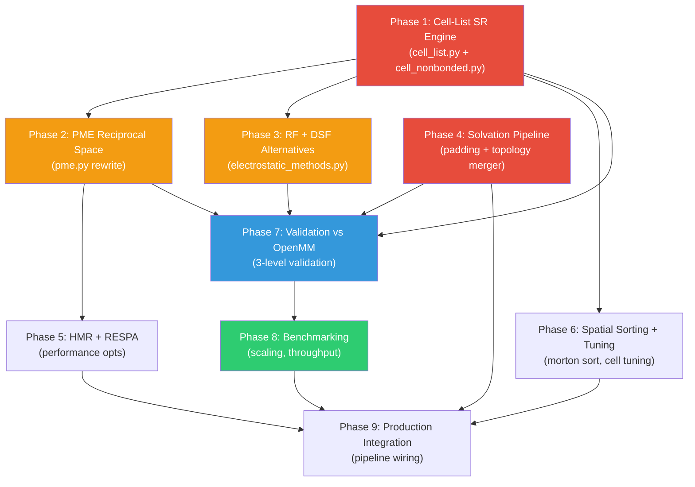

# Explicit Solvent: Implementation, Validation & Benchmarking Plan

## Context

Extend FlashMD from dense implicit-solvent (Generalized Born) to sparse explicit-solvent MD, preserving JAX/XLA massive-batching performance. Work happens on the **isolated worktree** at `/home/maarxaru/projects/noised_cb_explicit` on branch `feat/explicit-solvent` (currently empty, at `main` HEAD `408af68`).

### Existing Infrastructure

| Module | Status | What's There |
|--------|--------|-------------|
| `settle.py` | ✅ Complete | SETTLE position + RATTLE velocity constraints for rigid TIP3P |
| `solvation.py` | ✅ Complete | `solvate()`, `add_ions()`, `load_tip3p_box()`, water tiling |
| `pbc.py` | ✅ Complete | `create_periodic_space()`, `minimum_image_distance()`, `wrap_positions()` |
| `flash_nonbonded.py` | ✅ Complete (implicit) | Dense T×T tiled GB+LJ+Coulomb — the "Flash" model to extend |
| `padding.py` | ✅ Complete (implicit) | `PaddedSystem`, `pad_protein`, bucketing, collation |
| `batched_energy.py` | ✅ Complete (implicit) | `single_padded_energy`, `single_padded_force`, custom VJP LJ |
| `batched_simulate.py` | ✅ Complete (implicit) | BAOAB Langevin, FIRE minimizer, `lax.scan` loops |
| `pme.py` | ✅ Complete | Custom SPME (B-spline spreading, R2C FFT, `custom_vjp` reciprocal forces); see module docstring |

### Reference Design Document

[explicit_solvent_architecture.md](file:///home/marielle/projects/noised_cb/docs/design/explicit_solvent_architecture.md) — 1400-line architecture doc with all physics, memory budgets, and algorithm details.

### GPU Optimization Notes

[gpu_optimization_strategies.md](file:///home/marielle/projects/noised_cb/docs/explicit_impl_notes/gpu_optimization_strategies.md) — Grid-shift half-shell SR, ghost atom traps, Morton sorting, R2C FFT enforcement.

---

## Phase Roadmap



> **P1 and P4 can start in parallel immediately.** P1 is the critical path.

---

## Phase 1: Cell-List Short-Range Engine ⬤ CRITICAL PATH

**Goal**: Replace dense N² evaluation with cell-list tiled short-range kernel for LJ + cutoff Coulomb + direct-space Ewald.

### Decision Point: Stencil Strategy

> [!IMPORTANT]
> **Two competing approaches for the 27-cell stencil — must benchmark both:**
>
> **Option A: `lax.scan` over 27 shift vectors** (architecture doc default)
> - Pro: Lower peak memory (one cell-pair at a time)
> - Con: Serial loop kills warp utilization (see gpu_optimization_strategies.md §1)
>
> **Option B: Dense grid-shift half-shell** (`jnp.roll` + Newton's 3rd law)
> - Pro: 13 fully parallel tensor ops, no `scatter_add`, `jnp.roll` is free in XLA
> - Con: Higher peak memory — `(B, Nx, Ny, Nz, M, M)` intermediates per shift
>
> **Recommendation**: Implement Option B first (grid-shift). Fall back to Option A only if memory is prohibitive at target batch sizes.

### New Files

| File | Description | ~LOC |
|------|-------------|------|
| `../prolix/physics/cell_list.py` | Cell decomposition, atom→cell assignment, fixed-padding builder | ~250 |
| `../prolix/physics/cell_nonbonded.py` | Dense M×M cell-pair kernel (LJ + Coulomb), stencil iteration | ~400 |

### Modifications

> [!IMPORTANT]
> **Backward Compatibility (Oracle Critique #1)**: All new fields on `PaddedSystem`
> use `None`-defaults, following the existing `dense_excl_scale_vdw` pattern.
> Implicit solvent callers and serialized checkpoints are unaffected.

| File | Change |
|------|--------|
| `padding.py` → `PaddedSystem` | Add `None`-defaulted fields: `box_size: Array \| None = None`, `cell_occupancy: Array \| None = None`, `cell_offsets: Array \| None = None`, `water_mask: Array \| None = None` |
| `padding.py` → `pad_protein` | Accept optional `box_size` param, add larger buckets (40k–65k atoms) |
| `batched_energy.py` → `single_padded_force` | Add `use_cell_list` dispatch path |

### Tasks

- [ ] Cell-list builder: 3D grid cells with `cell_size >= r_cutoff`, fixed padding to `max_atoms_per_cell=32`
- [ ] Ghost atom sanitization as API contract in cell builder (see below)
- [ ] Grid-shift half-shell SR kernel (13 `jnp.roll` iterations) — Option B prototype
- [ ] `lax.scan` stencil kernel (27 iterations) — Option A prototype
- [ ] Minimum Image Convention applied to `dr` vectors
- [ ] Cutoff LJ with same Beutler soft-core as `_lj_energy_masked`
- [ ] Erfc-damped direct Coulomb (Ewald direct-space component)
- [ ] **Two-layer exclusion architecture** (Oracle Critique #2):
  - Layer 1: Cell-local exclusion mask — boolean mask within `(M, M)` cell-pair kernel, derived from `excl_indices` at cell-assignment time
  - Layer 2: Ewald exclusion correction — standalone `_ewald_exclusion_correction()` computing `q_i·q_j·[1/r - erfc(α·r)/r]` for 1-2/1-3 pairs + scaled 1-4. O(N × max_excl), runs once per step.
- [ ] **Validation**: single-point LJ energy vs dense FlashMD kernel on same protein (< 0.01 kcal/mol)
- [ ] **Benchmark**: Option A vs Option B stencil wall time (on **engaging cluster** GPU node)
- [ ] **Benchmark**: cell-list vs dense at N=4k and N=40k (on **engaging cluster** GPU node)

#### Ghost Atom Sanitization Contract (Oracle Critique #3)

The cell-list builder sanitizes ghosts **at assignment time**, not ad-hoc in kernels:
```python
# In cell_list.py build_cell_list():
safe_positions = jnp.where(atom_mask[:, None], positions, box_center)
safe_sigmas = jnp.where(atom_mask, sigmas, 1.0)
safe_epsilons = jnp.where(atom_mask, epsilons, 0.0)
```
This replaces the current `pad_protein()` convention of position=9999.0 / sigma=1e-6.

**Estimated effort**: ~750 LOC, ~4-5 dispatch sessions

---

## Phase 2: PME Reciprocal Space Module

**Goal**: Custom SPME with `custom_vjp` analytical forces. Full rewrite of `pme.py`.

### Key Decisions

> [!IMPORTANT]
> 1. **Analytical forces via `jax.custom_vjp`** — do NOT `jax.grad` through PME (checkpoints massive 3D grids)
> 2. **Use `jnp.fft.rfftn` / `irfftn`** — halves Z-dimension, ~50% FFT speedup
> 3. **Grid dimensions must factorize into 2,3,5,7** — prevent Bluestein fallback
> 4. **Morton-sort atoms before B-spline spreading** — 3-5× `scatter_add` throughput

### Tasks

- [ ] B-spline 1D evaluation (order 4), vectorized over all atoms
- [ ] Tensor-product charge spreading via `einsum('ni,nj,nk->nijk', w_x, w_y, w_z)`
- [ ] `rfftn` / `irfftn` wrapper with precomputed influence function
- [ ] Analytical force interpolation from potential grid
- [ ] `jax.custom_vjp` to avoid grid checkpointing
- [ ] Self-energy correction: $E_{self} = -\alpha/\sqrt{\pi} \sum_i q_i^2$
- [ ] Exclusion corrections (subtract direct-space Ewald for 1-2, 1-3, scaled 1-4)
- [ ] Ewald parameter selection ($\alpha$, grid spacing from box_size + tolerance)
- [ ] `vmap` over batch dimension — verify batched cuFFT execution
- [ ] `next_good_fft_size()` utility for grid dimension selection

**Estimated effort**: ~400 LOC rewrite, ~2-3 dispatch sessions

---

## Phase 3: RF and DSF Alternatives

**Goal**: Pluggable Tier 2/3 electrostatics. Purely pairwise, no grids.

### New File

`../prolix/physics/electrostatic_methods.py` — `ElectrostaticMethod` enum + RF + DSF

### Tasks

- [ ] Reaction Field: polynomial correction within cutoff (~20 LOC)
- [ ] DSF: erfc-damped shifted force (~30 LOC)
- [ ] Unified dispatch enum: `PME | RF | DSF`
- [ ] Wire into `cell_nonbonded.py` cell-pair kernel
- [ ] Config-driven selection in experiment YAML

**Estimated effort**: ~100 LOC, 1 dispatch session

---

## Phase 4: Solvation Pipeline Enhancement (PARALLEL with Phase 1)

**Goal**: Extend existing solvation infra for production quality.

### Tasks

- [ ] OPC3 water box generation via OpenMM → `../prolix/data/water_boxes/opc3.npz`
- [ ] Topology merger: protein `Protein` + water/ion → single `PaddedSystem` with correct bonds, angles, exclusions
- [ ] OPC3 parameters: O=-0.89517, H=+0.44758; sigma/epsilon from ff14SB
- [ ] Na⁺/Cl⁻ ion parameters from AMBER Joung-Cheatham
- [ ] Wire SETTLE into `batched_simulate.py` BAOAB loop
- [ ] Integration test: solvated system → `PaddedSystem` → energy eval

**Estimated effort**: ~300 LOC modifications, 2-3 dispatch sessions

---

## Phase 5: HMR + RESPA Integration

**Goal**: 2× timestep (4 fs via HMR) + 50% PME reduction (RESPA every 2 steps).

> [!NOTE]
> Both HMR and RESPA are **optional config settings** — the default pipeline
> uses 2 fs / no RESPA. Config-driven via experiment YAML.

### Tasks

- [ ] `apply_hmr()` in `constants.py` (~30 LOC, pure Python)
- [ ] Config flags: `hmr: bool = False`, `respa_n: int = 1` in experiment YAML
- [ ] Config flag propagation through `pad_protein`
- [ ] RESPA: `lax.cond(step % n == 0, ...)` PME force caching in `SimState`
- [ ] Energy conservation verification with HMR (4 fs dt)
- [ ] RESPA stability at n=2 and n=3

**Combined impact (when enabled)**: HMR (2×) + RESPA (1.12×) ≈ **2.25× speedup**

---

## Phase 5b: Monte Carlo Barostat (Oracle Critique #5)

**Goal**: Enable NPT equilibration for density convergence.

> [!NOTE]
> **Optional** — NVT is the default. Barostat enabled via `ensemble: NPT` in config.

### Tasks

- [ ] MC barostat: propose ΔV → rescale positions + box → accept/reject by ΔE + PV work
- [ ] PME influence function recalculation on box rescale (precompute for range of box sizes)
- [ ] Cell-list grid dimension update on box rescale
- [ ] Config: `barostat_interval: int = 25`, `target_pressure: float = 1.0` (atm)
- [ ] Validation: density convergence to ~1.0 g/cm³ for pure water box

**Estimated effort**: ~150 LOC, 1-2 dispatch sessions

---

## Phase 6: Spatial Sorting + Performance Tuning

**Goal**: Optimize memory access via Morton Z-order sorting.

### Tasks

- [ ] Morton code computation from cell indices
- [ ] Periodic re-sorting every N steps inside `lax.scan`
- [ ] Cell overflow detection + dynamic resize
- [ ] Benchmark sorted vs unsorted at N=40k and N=100k
- [ ] Profile memory bandwidth utilization (target >60% of peak)
- [ ] Tune `max_atoms_per_cell` (validate 32 against density stats)

---

## Phase 7: Validation Against OpenMM

**Goal**: 3-level validation: single-point → short trajectory → production.

### Level 1: Single-Point Energy (Phase 1–3 gate)

| Component | Target Agreement |
|-----------|-----------------|
| Bond/Angle energy | < 0.001 kcal/mol |
| Dihedral energy | < 0.01 kcal/mol |
| LJ energy | < 0.1 kcal/mol |
| Direct Coulomb | < 0.1 kcal/mol |
| PME reciprocal | < 1.0 kcal/mol |
| **Total** | **< 1.0 kcal/mol** |

### Level 2: Short Trajectory (100 ps NVT)

| Metric | Target |
|--------|--------|
| Energy drift | < 0.1 kcal/mol/ns |
| Temperature | Within 1 K of 300 K |
| O-O RDF | Visual overlap |
| Protein RMSD | Within 0.5 Å of OpenMM |
| Rg | Within 3% of OpenMM mean |

#### Kahan Verification Gate (Oracle Critique #6)

Run a **10,000-step NVE** simulation (no thermostat) and compare energy drift:
1. Standard float32 integrator
2. Manual Kahan compensated summation
3. Int64 accumulation (if cell-relative not yet active)

Inspect XLA HLO: `jax.make_jaxpr(integrator_step)` → check for compensated
add patterns. If XLA does NOT emit Kahan for the explicit path, enable
manual Kahan and document why.

### Level 3: Production (10 ns) — final gate

| Metric | Target |
|--------|--------|
| Contact map correlation | > 0.95 |
| Sidechain χ₁ rotamers | Within 5% |
| Salt bridge occupancy | Within 10% |

### Cross-Tier Validation

Run all 3 electrostatic tiers on same system, compare against PME reference.

---

## Phase 8: Benchmarking

> [!IMPORTANT]
> **All GPU benchmarks run on the engaging cluster** via SLURM jobs targeting
> the **`mit_preemptable`** partition. Local worktree is for unit tests only.
>
> Cluster worktree: `/home/maarxaru/projects/noised_cb_explicit`

### SLURM Configuration

```bash
#SBATCH --partition=mit_preemptable
#SBATCH --gres=gpu:1
#SBATCH --constraint=a100|h100|h200   # specify GPU type per benchmark
#SBATCH --time=04:00:00
#SBATCH --signal=B:USR1@120           # signal 2 min before preemption
```

### Preemptable-Safe Checkpointing

All benchmark scripts must be **preemptable-safe**: use `jax.experimental.io_callback`
inside `lax.scan` to checkpoint simulation state asynchronously without blocking
GPU execution. On preemption signal (`SIGUSR1`), the host-side callback flushes
final state to disk. On restart, the script resumes from the last checkpoint.

```python
# Inside lax.scan body:
def _checkpoint_callback(step, state):
    """Async checkpoint — does NOT block GPU (io_callback has no return feeding trace)."""
    jnp.save(f"checkpoint_{step}.npz", state)

jax.experimental.io_callback(
    _checkpoint_callback, None,  # no return → async
    step, state,
)
```

This pattern is validated on the implicit solvent path — `io_callback` runs
asynchronously on the host while the GPU continues the next `lax.scan` iteration.

**Benchmark matrix:**

| System | N_atoms | Batch | Tier | GPU | Partition |
|--------|---------|-------|------|-----|-----------|
| Protein only | 4,000 | 1,500 | Dense GB (baseline) | A100 | mit_preemptable |
| Solvated | 40,000 | 500 | PME | H100 | mit_preemptable |
| Solvated | 40,000 | 500 | RF | H100 | mit_preemptable |
| Solvated | 40,000 | 500 | DSF | H100 | mit_preemptable |
| Solvated | 40,000 | 1,000 | PME | H200 | mit_preemptable |

**Scaling studies (all on engaging cluster):**

- Strong scaling: fix system, vary tile size + cell padding
- Weak scaling: fix atoms/replica, increase B → find compute-saturation knee
- RESPA speedup: wall time/ns with and without (optional setting)
- HMR speedup: 2fs vs 4fs (optional setting)
- **Stencil comparison**: grid-shift vs `lax.scan` at N=40k (Phase 1 decision gate)

**Key targets:**

| Metric | Target |
|--------|--------|
| ns/day/replica (PME, B=500) | > 50 |
| ns/day/replica (RF, B=500) | > 65 |
| Aggregate ensemble (PME, B=500) | > 25 μs/day |
| Peak VRAM utilization | > 80% |

---

## Phase 9: Production Integration

Wire everything into `run_batched_pipeline.py`:

- [ ] Full config schema for explicit solvent (water model, ion conc, electrostatic tier, box padding, HMR, RESPA)
- [ ] Solvation prep → `PaddedSystem` pipeline
- [ ] Equilibration: NVT heating (50K→300K) + NPT density eq (1 atm, 1 ns)
- [ ] Trajectory I/O with optional solvent stripping
- [ ] Validate full pipeline on 3+ WS-E benchmark systems

---

## Worktree Setup

> [!IMPORTANT]
> The worktree exists on the cluster at `/home/maarxaru/projects/noised_cb_explicit` on branch `feat/explicit-solvent`, currently at `main` HEAD (no explicit-solvent commits yet).
>
> **A local worktree should be created for development:**
> ```bash
> git worktree add ../noised_cb_explicit feat/explicit-solvent
> cd ../noised_cb_explicit && git submodule update --init --recursive
> ```

## Open Questions

> [!NOTE]
> **All three questions resolved (2026-03-30):**
>
> 1. **Grid-shift vs lax.scan stencil**: ✅ **Prototype both, benchmark to choose.** The grid-shift `(B, Nx, Ny, Nz, M, M)` intermediate may be ~26 GB/shift at B=500. If prohibitive, batch-dimension tiling or `lax.scan` fallback.
>
> 2. **Energy drift strategy**: ✅ **Cell-relative coords first** (Flash synergy — store `cell_index: int32` + `local_offset: float32`). Fallback: **int64 accumulation** (`int64` addition is 1-clock on ML GPUs, avoids `JAX_ENABLE_X64`). XLA compiles to Kahan on implicit path (validated) — **must verify same for explicit path** (if not, add manual Kahan). **Avoid general `float64` mixed precision** (halves bandwidth, disables Tensor Cores).
>
> 3. **Worktree**: ✅ **Local worktree for small tests** (unit tests, single-system validation). **Engaging cluster for GPU benchmarks** (multi-replica, scaling studies, stencil benchmark).

## Oracle Critique Resolution

> Critique verdict: **REVISE** (2 critical, 4 warnings). See [oracle_critique_explicit_solvent.json](./oracle_critique_explicit_solvent.json).
>
> | # | Severity | Resolution |
> |---|----------|------------|
> | 1 | **Critical** | ✅ PaddedSystem uses `None`-default fields (Phase 1 Modifications section) |
> | 2 | **Critical** | ✅ Two-layer exclusion architecture designed (Phase 1 Tasks) |
> | 3 | Warning | ✅ Ghost atom sanitization contract documented (Phase 1 Tasks) |
> | 4 | Warning | ✅ PME uses `custom_vjp` from the start (user confirmed original decision) |
> | 5 | Warning | ✅ Phase 5b: MC Barostat added to roadmap |
> | 6 | Suggestion | ✅ Kahan verification added to Phase 7 Level 2 gates |

## Verification Plan

### Automated Tests
- Single-point energy parity scripts: `scripts/validation/single_point_compare.py`
- Short trajectory comparison: `scripts/validation/short_trajectory_compare.py`
- `just test` for unit tests on cell-list, PME, RF/DSF kernels
- Benchmark scripts: `scripts/benchmarks/explicit_solvent_bench.py`

### Manual Verification
- Visual inspection of O-O RDF plots vs OpenMM reference
- XLA HLO profile to confirm `jnp.roll` fusion in grid-shift kernel
- `ncu` profiler for L2 cache hit rates (Morton sorting validation)
